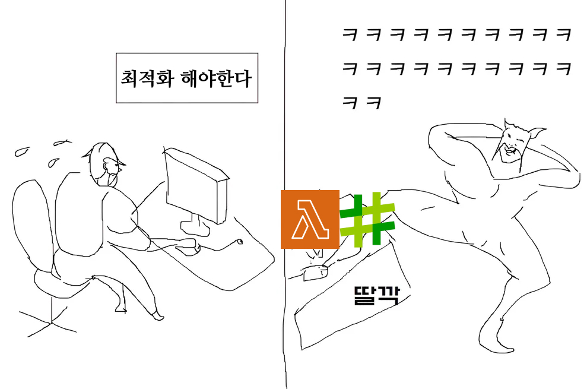
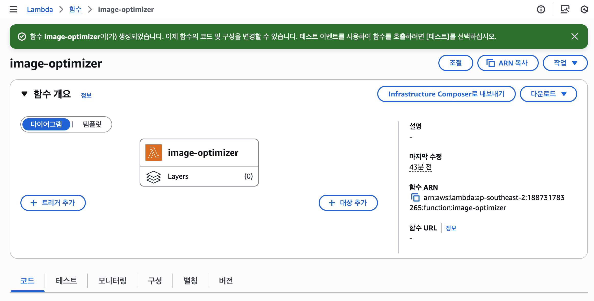
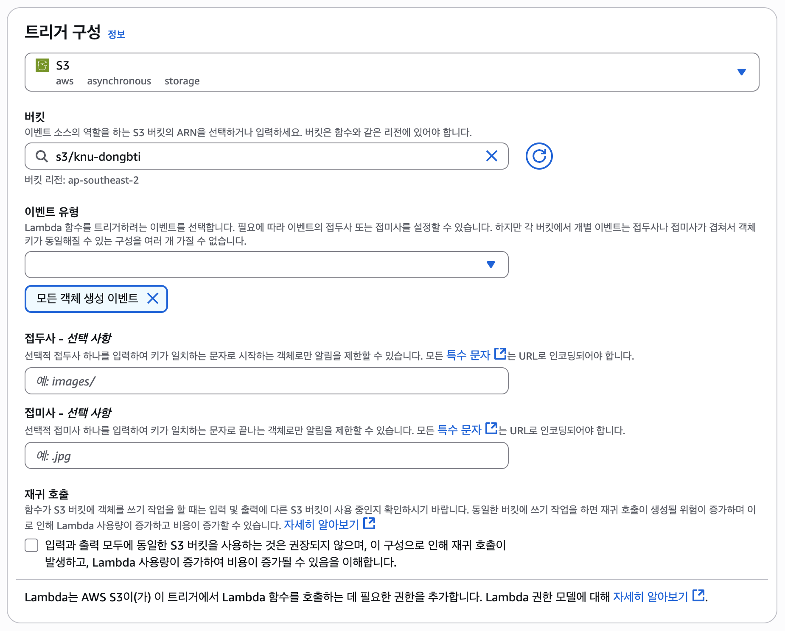

:::info
이 글은 [응~ 이미지 키워봐~ 최적화 하면 그만이야 🤡 (pt1. 이미지 포맷)](../Web/image-format.md) 글의 속편입니다.  
지난 글에서 이미지 포맷 선택이 얼마나 중요한지 살펴봤다면,  
이번 글에서는 **AWS Lambda와 S3 이벤트를 활용해 업로드 시점에서 자동으로 이미지 최적화**하는 방법을 다룹니다.
:::

## 🖼️ 이미지 최적화 작업 '딸깍' 하면 자동으로 다 해주는거 없나?

디자인학과 졸업전시 웹사이트를 만들면서, 이미지 때문에 꽤나 고생을 했습니다.
학생들이 주는 작품 사진은 대부분 몇 MB가 넘는 고화질의 원본이었고, 저는 그걸 웹에 맞게 리사이즈해서 올려야 했습니다.

처음에는 로컬에서 일일이 줄여 업로드했지만, 작품 수가 수십 개, 이미지가 수백 장을 넘어가자 상황은 달라졌습니다.
리사이즈 작업만으로도 반나절이 날아가고, 썸네일·포맷별 파일까지 관리하려니 점점 감당하기 힘들어졌습니다.

> 아.. 이거 언제 다하냐...  
> "이미지 최적화 작업 '딸깍' 하면 자동으로 다 해주는거 없나?"

## ⚙️ AWS Lambda & S3 트리거로 이미지 최적화 자동화하기

AWS Lambda 와 S3 트리거를 활용하면 이미지가 S3 버킷에 업로드될 때마다 자동으로 최적화 작업을 수행할 수 있습니다.  

:::info AWS Lambda? 서버리스?
AWS Lambda는 서버를 직접 관리하지 않고도 코드를 실행할 수 있는 서버리스 컴퓨팅 서비스입니다.  
서버리스란 서버 인프라 관리를 신경쓰지 않고, 코드 작성과 비즈니스 로직에 집중할 수 있는 클라우드 컴퓨팅 모델을 의미합니다.  
:::

이 과정에서 [Sharp](https://sharp.pixelplumbing.com/) 라이브러리를 사용하면 JPEG, PNG, WebP 등 다양한 포맷의 이미지를 효율적으로 변환하고 저장할 수 있습니다.

> Lambda는 빠르게 스케일 업해야 하고 수요가 없을 때는 0으로 스케일 다운해야 하는 애플리케이션 시나리오에 이상적인 컴퓨팅 서비스입니다. 예를 들어 Lambda를 다음에 사용할 수 있습니다.  
> ...  
> 파일 처리: 업로드 후 Amazon Simple Storage Service(S3)를 사용하여 Lambda 데이터 처리를 실시간으로 트리거합니다.  
> [AWS Lambda 소개](https://docs.aws.amazon.com/ko_kr/lambda/latest/dg/welcome.html)

공식 문서에도 나와있듯이, AWS Lambda 를 사용하면 S3에 파일이 업로드될 때마다 자동으로 이미지 최적화 작업을 트리거할 수 있습니다.

### 1️⃣ Lambda 함수 생성 및 설정

우선 이미지를 저장할 S3 버킷을 생성합니다  
(버킷 생성 방법은 생략합니다. [공식 문서](https://docs.aws.amazon.com/ko_kr/AmazonS3/latest/userguide/create-bucket-overview.html)를 참고하세요)

그 다음, AWS Lambda 콘솔에서 새 Lambda 함수를 생성합니다.

아래쪽에 `구성` > `트리거` > `트리거 추가` 를 클릭해 S3 트리거를 설정합니다.

## Presigned URL 로 이미지 업로드 시점에 Lambda 트리거하기

AWS Lambda
Magic link 형태의 로그인

Lambda 에서 node_modules 사용할때
레이어에 추가해야함

레이어 추가방법
Lambda > 추가리소스 > 계층 > 계층생성
계층이름지정하고 zip 파일 업로드
node_modules 는
nodejs/node_modules 에 넣고
zip layer.zip nodejs -r
레이어에 추가하고 람다에서 해당 레이어선택
계층 추가 > 사용자 지정 계층 > 아까 추가한 레이어 선택

람다에서 ses 나 S3 같은 aws 서비스 사용하기 위해서 iam 에 권한 넣어줘야함
Iam 사용자 권한을 넣는게 아니라
람다함수 > 구성 > 실행역할 > 편집 에서 기존역할에 사용하는 aws 리소스 넣기

S3 no-cache 정책

Lambda 동작원리
서버리스랑 일반서버 차이점
