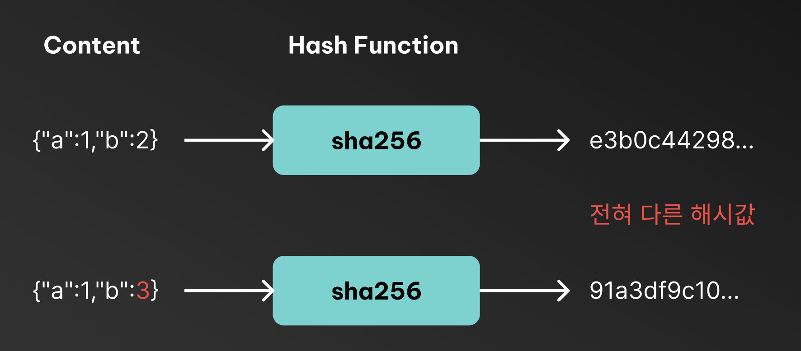
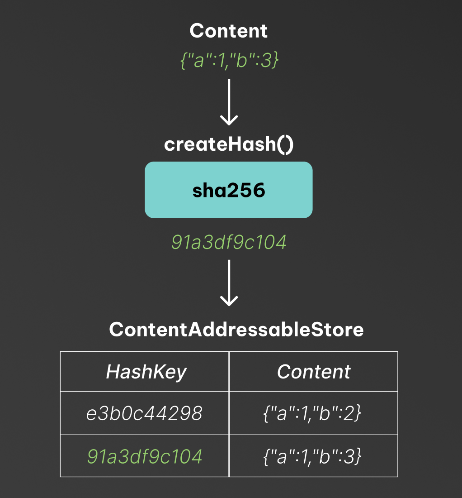
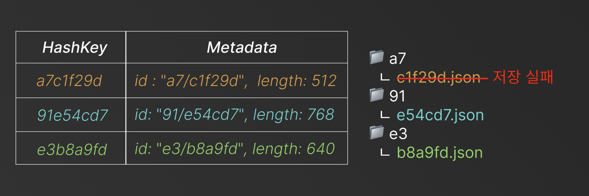

우리는 파일을 찾거나 저장할때 보통 `파일 이름` 이나 `경로(path)` 를 사용합니다.

- 예: `/home/user/documents/report.pdf`
- 예: `s3://my-bucket/images/photo.jpg`

이런 방식은 본질적으로 "이 파일이 어디에 있냐?" 에 대한 주소입니다. <br>
반대로, CAS(Content Addressable Store)는 파일의 **내용**을 기준으로 주소를 만듭니다. <br>

> $Address(key) = H(Content)$ <br>
> 즉, 어디에 있냐? 가 아니라 무슨 내용인가? 로 파일을 찾습니다.

## Content Addressable Store 의 핵심 아이디어

CAS는 간단히 말해서 내용기반 식별입니다 <br>
여기서, CAS 가 주는 불변성이 매우 중요합니다

<center>

</center>

### 1️⃣ 동일내용 = 동일 키 (Deduplication)

같은 바이트라면 해시값도 동일합니다. <br>
따라서 동일 데이터를 여러번 저장해도 중복 저장이 자연스럽게 방지됩니다 (Deduplication)

### 2️⃣ 키가 맞으면 내용이 맞는다 (Integrity, 무결성)

데이터를 가져온 뒤, 다시 해시를 계산해서 키와 비교하면 <br>
데이터가 손상되거나 변조되었는지를 쉽게 확인할 수 있습니다.

### 3️⃣ 내용이 바뀌면 키도 바뀐다 (Immutability, 불변성)

좋은 해시함수라면 아주 작은 변화에도 완전히 다른 해시값이 나옵니다. <br>
그래서 CAS 는 수정(update) 가 아니라 사실상 새로운 데이터 추가로 동작합니다

## Content Addressable Store 를 구성하는 자료구조들

Content Addressable Store 자체는 하나의 개념이지만, <br>
실제 구현은 여러 자료구조들의 조합으로 이루어집니다. <br>

### 1️⃣ 해시 함수 (Hash Function) 와 해시 맵 (Hash Map)

가장 기본이 되는 자료구조는 해시 함수와 해시 맵입니다

```ts
function createHash(content: Content): HashKey;

const contentAddressableStore = new Map<HashKey, Content>();
```

<center>

</center>

이것만으로도 CAS 의 기본 기능은 구현할 수 있습니다 <br>

1. Deduplication : 동일 내용은 동일 해시이므로 중복 저장 방지 <br>
2. Integrity : 해시값 비교로 데이터 무결성 검증 가능 <br>
3. Immutability : 내용 변경시 새로운 해시 키가 생성됨

하지만, Git 과 같이 큰 파일, 디렉토리 구조, 버전 관리 등을 지원하려면 추가적인 자료구조들이 필요합니다

### 2️⃣ 해시 맵 (Hash Map) + Disk Indexing

메모리 기반 HashMap 은 용량에 한계가 있으므로, <br>
대규모 저장을 위해서는 디스크 기반의 구조가 추가됩니다.

대표적인 인덱싱 구조는

> 1. B-Tree 계열 (전통적인 Relational DBMS) <br>
> 2. LSM-Tree 계열 (LevelDB, RocksDB 등 NoSQL DBMS)

가 있습니다.

<center>

</center>

해시맵의 키로 Content 의 해시값을 사용하고, <br>
값으로는 직접적인 Content (Byte) 를 저장하는것이 아닌, 메타데이터를 저장합니다 <br>

메타데이터에는 `fieldId` (어떤 파일이 저장되었는지), `offset` (파일 내 어디서 시작하는지), `length` (얼마나 읽어야 하는지), `checksum` (무결성 검증용) 등이 포함됩니다 <br>

Git 의 경우 Blob 객체 (파일단위) 를 저장하고, `.git/objects/e3b0c44298...` 와 같은 경로로 관리합니다. 그리고 이 경로가 Blob 객체의 해시값이 됩니다.

<br/>

#### 🤔 Prefix Sharding - 해시 앞부분으로 디렉토리 쪼개기

해시를 파일명으로 바로 쓰면, 하나의 디렉토리에 파일이 너무 많아지며 성능이 저하될 수 있습니다.
그래서 흔이 해시 prefix 로 디렉토리를 쪼개는 방식을 사용합니다.

```text
ab12cd... -> ab/12cd...
```

<br/>

#### 🤔 Chunking - 큰 파일을 잘게 쪼개서 저장하기

대형 파일을 통째로 해시하면, 작은 수정에도 전체가 새 객체가 됩니다 <br>
그래서 보통은 파일을 Chunk 단위로 쪼개서 각각 CAS 에 저장하는 방식을 사용합니다

<br/>

Chunking 과 Prefix Sharding 을 함께 사용하면 다음과 같은 구조가 됩니다


## Hash Tree 를 이용한 내용 무결성 검증

Content Addressable Store 는 데이터를 `내용 기반 주소` 로 식별하기 때문에, <br>
해당 주소가 가리키는 내용이 실제로 그 내용이 맞는지 `검증`하지 않으면 안됩니다 <br>

여기서 `검증`이 필요한 이유는 크게 두 가지로 나뉩니다.

### 😵 저장 과정의 일관성 (Consistency)

예를들어 데이터를 저장할때, metadata 는 메모리 (해시 맵) 에 저장됐지만, content 는 디스크 (BlobStorage) 에 저장이 안된 경우가 있을 수 있습니다 <br>

<center>

</center>

이런 경우 CAS 는 `주소 - 내용` 매핑이 깨지게 됩니다. <br>
이 문제는 트랜잭션, Write Ahead Log (WAL) 등으로 해결할 수 있습니다.

<br/>

### 😵 내용 무결성 (Integrity)

전송, 저장, 복원 과정에서 내용이 손상 또는 변조 될 수 있습니다. <br>
따라서 내용이 실제로 그 내용이 맞는지 검증하는 과정이 필요합니다 <br>

:::details 🤔 이런 무결성은 애플리케이션 레벨이 아니라 밑의 네트워크, 스토리지 프로토콜에서 처리하는거 아닌가요?

맞습니다. 일반적으로 네트워크 프로토콜 (예: TCP, TLS) 에서 비트가 깨지는 건 TCP나 TLS레벨에서 검증합니다. <br>
다만, 각 레이어는 서로 다른 수준의 무결성을 담당합니다

#### 1. 전송 무결성 (TCP/TLS 에서 전송 중 비트 손상 방지)

TCP 는 Checksum 을 두고 TLS 는 MAC(Message Authentication Code) 을 사용해서 <br>
패킷 전달 중 손상/오염을 감지합니다.

하지만, <br/>
❌ 데이터가 “원본과 동일한지”는 보장하지 않음 <br/>
❌ 저장 후 복원 시점까지는 보장하지 않음<br/>
❌ 공격자가 다른 payload를 넣는 건 검출 못함 (TLS 제외)<br/>

#### 2. 저장 무결성 (스토리지 레이어에서 저장된 데이터의 무결성 검증)

일부 파일시스템, 스토리지 (예: ZFS, btrfs)는 저장시 블록 단위로 Checksum 을 계산해서 <br>
읽을 때마다 무결성을 검증하는 기능을 제공합니다.

하지만, <br/>
❌ 파일 내용 자체에 대한 Checksum을 저장하지 않고 블록 단위로만 검증함 <br/>
:::

<br/>

### 해시 트리 (Merkle Tree) 로 내용 무결성 검증하기

해시트리 (Merkle Tree) 는 트리구조로 해시값을 저장하는 자료구조입니다. <br>

- 리프 노드는 실제 데이터 블록의 해시값을 저장하고, <br>
- 내부 노드는 자식 노드들의 해시값을 조합하여 해시값을 계산합니다 <br>


#### 🤔 Merkle Tree 로 무결성 검증이 어떻게 이루어질까 ?

예를들어 클라이언트가 `Leaf2` 의 내용이 올바른지 검증하고 싶다고 해봅시다.

일반적인 방식이라면 전체 파일을 받아 전체 해시를 계산해야합니다. <br>
하지만 Merkle Tree 를 사용하면 전체 데이터를 받을 필요가 없습니다.

1. 클라이언트는 `Leaf2` 의 내용과 `Leaf2` 의 해시 (`91e54cd7`) 를 받습니다.
2. 서버는 `Leaf2` 와 관련된 Sibiling Node 의 해시 (`Leaf1`, `hashB`)만 추가로 보냅니다

즉, 전체 트리를 보내는 것이 아니라, `검증 경로(proof path)` 만 전달합니다.

<br/>

이제 클라이언트는 다음과 같이 검증합니다.

```ts
if (H(Leaf1, Leaf2) == hashA && H(hashA, hashB) == rootHash) {
    // 무결성 검증 성공
}
```

Merkle Tree 는 부분 데이터 검증이 가능하기 때문에, <br>

- 일부 데이터 만으로 전체 무결성을 증명할 수 있고,
- 손상된 chunk 만 재요청 (부분 다운로드)하여 복원할 수 있으며,
- 수정된 chunk 만 새로 저장해서 저장 공간을 절약할 수 있습니다

### 결론

Content Addressable Store (CAS) 는 단순히 데이터를 저장하는 방식이 아니라, <br>
`내용 기반 식별을 통해 데이터의 중복을 제거하고, e2e 무결성을 보장하며, 구조적 버전 관리를 가능하게 하는 저장 모델` 입니다.

실제로 다음 시스템들은 모두 CAS 를 기반으로 동작합니다

> Git — commit = Merkle DAG <br>
> Docker / OCI Registry — layer = content hash<br>
> IPFS — 파일 시스템 = Merkle DAG<br>
> Bazel / Nix — 빌드 캐시 = content hashing<br>
> Ethereum — 상태 트리 = Merkle Patricia Tree

이들은 모두

> "내용이 같으면 같은 객체, 다르면 다른 객체"

라는 CAS 의 철학을 응용해서

1. 재현 가능성(Reproducibility)
2. 분산 검증(Verification)
3. 무결성(Integrity)
4. 중복 제거(Deduplication)
5. 캐시 효율(Cache locality)

을 얻습니다.
