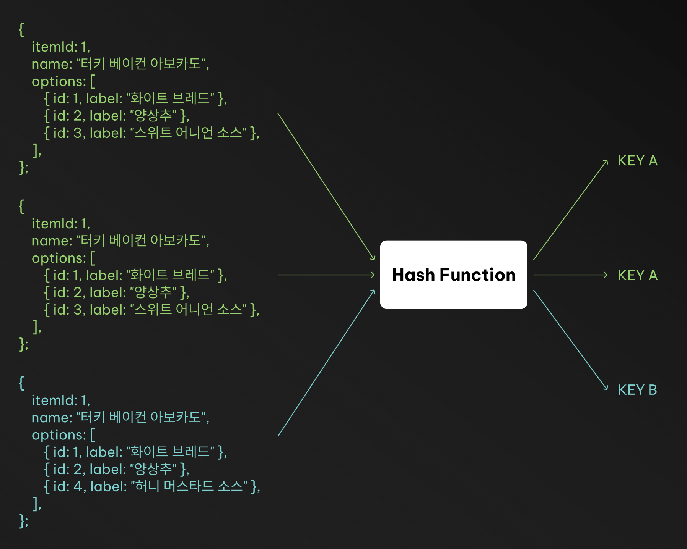

장바구니 기능을 만들다 보면 이런 로직을 자주 만나게 됩니다.

> 1. 추가하려는 상품이 이미 장바구니에 있는 경우 <br/>
>    a. 해당 상품의 옵션또한 동일하다면 수량을 증가시킨다 <br/>
>    b. 해당 상품의 옵션이 다르다면 새로운 항목으로 추가한다
> 2. 추가하려는 상품이 장바구니에 없는 경우<br/>
>    a. 새로운 항목으로 추가한다

문제는 `같음` 을 정의하는게 쉽지 않다는 것입니다.
옵션의 순서가 다르거나, JSON 필드의 순서가 달라지면 사실상 같은 조합도 다른 항목으로 인식될 수 있습니다.

결국 `같은 입력은 같은 결과여야 한다` 라는 멱등성(idempotency) 원칙을 적용해야 합니다.

> 같은입력 = 장바구니의 상품ID + 옵션 조합 <br/>
> 같은결과 = 장바구니 항목의 고유키

## 멱등성(idempotency) 이란?

먼저 멱등성이 무엇인지 살펴보겠습니다. <br/>
멱등(Idempotent) 하다는 것은 어떤 연산을 여러 번 수행하더라도 결과가 동일한 것을 의미합니다.

$$f(f(x)) = f(x)$$

이 수식이 참이라면 함수 $f$ 는 멱등하다고 할 수 있습니다.

예를들어, 다음과 같은 함수는 멱등합니다.

```ts
function updateName(user, name) {
    user.name = name;
    return user;
}
```

이 함수는 몇 번을 실행하더라도 결과가 동일합니다.

```ts
updateName({ name: "Alpha" }, "Bravo"); // {name: "Bravo"}
updateName({ name: "Charlie" }, "Bravo"); // {name: "Bravo"}
updateName(updateName({ name: "Delta" }, "Bravo"), "Bravo"); // {name: "Bravo"}
```

반면, 다음과 같은 함수는 멱등하지 않습니다.

```ts
function increaseViewCount(article) {
    article.viewCount += 1;
    return article;
}
```

이 함수는 실행할 때마다 결과가 달라집니다.

```ts
increaseViewCount({ viewCount: 10 }); // {viewCount: 11}
increaseViewCount({ viewCount: 10 }); // {viewCount: 12}
```

:::details 🤨 순수함수랑 멱등함수랑 뭐가 다르나요
순수함수(Pure Function)와 멱등함수(Idempotent Function)는 서로 다른 개념입니다.

- 순수함수: 동일한 입력에 대해 항상 동일한 출력을 반환하며, 외부 상태를 변경하지 않는 (사이드 이펙트가 없는) 함수입니다.
- 멱등함수: 동일한 입력에 대해 여러 번 호출하더라도 결과가 동일한 함수입니다.

예를들어, `updateName` 함수는 순수함수이면서 멱등함수입니다. <br/>
반면, `increaseViewCount` 함수는 순수함수가 아니며 멱등함수도 아닙니다.

```ts
function pureButNotIdempotent(x) {
    return x * 2;
}
```

이 함수는 외부 상태 변화를 일으키지 않기 때문에 순수함수이지만, 멱등하지는 않습니다. <br/>
왜냐하면, 동일한 입력에 대해 항상 동일한 출력을 반환하지만, 여러 번 호출할 때마다 결과가 달라지기 때문입니다.
:::

## 장바구니 기능 살펴보기

예를들어, 샌드위치 주분 서비스 (서브웨이) 를 만든다고 해보겠습니다. <br/>
사용자는 동일 샌드위치를 주분하더라도, 커스터마이징 조합에 따라 다른 상품이 됩니다.

### 🥪 샌드위치 장바구니 로직의 기본 요구사항

> 1. 추가하려는 샌드위치가 이미 장바구니에 있는 경우 <br/>
>    a. 빵, 야채, 소스 등 모든 옵션이 동일하다면 수량을 1 증가시킨다 <br/>
>    b. 옵션이 하나라도 다르다면 새로운 항목으로 추가한다
> 2. 추가하려는 샌드위치가 장바구니에 없는 경우<br/>
>    a. 새로운 항목으로 추가한다

사용자가 다름과 같은 두 가지 주문을 추가했다고 가정해보겠습니다.

```ts
const cartItem1 = {
    itemId: 1,
    name: "터키 베이컨 아보카도",
    options: [
        { id: 1, label: "화이트 브레드" },
        { id: 2, label: "양상추" },
        { id: 3, label: "스위트 어니언 소스" },
    ],
};
const cartItem2 = {
    itemId: 1,
    name: "터키 베이컨 아보카도",
    options: [
        { id: 3, label: "스위트 어니언 소스" },
        { id: 1, label: "화이트 브레드" },
        { id: 2, label: "양상추" },
    ],
};
```

두 주문은 옵션의 순서만 다를 뿐, 사실상 동일한 조합입니다. <br/>
때문에, 장바구니의 상태를 변경할 때 마다 `itemId`, `options` 가 모두 동일한지 비교해야 합니다.

### 🤓 그래서 이게 멱등성이랑 뭔상관인데 ?

> 같은 샌드위치 조합이면 몇 번을 담아도 같은 장바구니 항목에 매핑되어야 한다

이 요구사항은 멱등성 원칙과 똑같습ㄴㅣ다! <br/>

> 같은 입력 = 샌드위치 id + 옵션 조합 <br/>
> 같은 결과 = 장바구니 항목의 고유키



### 1️⃣ 단순 순회하면서 비교하기

가장 직관적인 방법은 장바구니의 모든 항목을 순회하면서, `itemId` 와 `options` 가 동일한지 비교하는 것입니다.

```ts
function isEqualItems(item1: CartItem, item2: CartItem): boolean {
    if (item1.itemId !== item2.itemId) return false;
    if (item1.options.length !== item2.options.length) return false;

    const sortedOptions1 = [...item1.options].sort((a, b) => a.id - b.id);
    const sortedOptions2 = [...item2.options].sort((a, b) => a.id - b.id);

    for (let i = 0; i < sortedOptions1.length; i++) {
        if (sortedOptions1[i].id !== sortedOptions2[i].id) return false;
    }
    return true;
}
// 1회 비교 = O(k log k)
// 장바구니 탐색 = O(m k log k)
```

또는 [`lodash/isEqual`](https://lodash.com/docs/4.17.15#isEqual), [`es-toolkit/isEqual`](https://es-toolkit.dev/reference/compat/predicate/isEqual.html#isequal-lodash-compatibility) 같은 라이브러리를 사용해도 됩니다.

### 2️⃣ JSON.stringify 로 비교하기

또 다른 방법은 `JSON.stringify` 를 사용해 객체를 문자열로 변환한 뒤 비교하는 것입니다.

```ts
function isEqual(item1: CartItem, item2: CartItem): boolean {
    return JSON.stringify(item1) === JSON.stringify(item2);
}
```

하지만, 옵션의 순서가 다른 경우 다른 문자열로 변환되고, <br/>
`undefined` 는 직렬화에서 제외되고, `NaN`, `Infinity` 는 `null` 로 변환되고, `Date` 는 ISO 문자열로 변환되는 문제점이 있습니다.

따라서 비교전 정규화(normalization) 작업이 필요합니다.

```ts
function normalize(item: CartItem): string {
    // 옵션을 id 기준으로 정렬해서 순서 보장
    const sortedOptions = [...item.options].sort((a, b) => a.id - b.id);
    const normalizedItem = { ...item, options: sortedOptions };
    return JSON.stringify(normalizedItem);
}

function isEqual(item1: CartItem, item2: CartItem): boolean {
    return normalize(item1) === normalize(item2);
}
```

### 3️⃣ 해시 함수로 비교하기

마지막으로, 해시 함수를 사용해 객체를 고유한 해시값으로 변환한 뒤 비교하는 방법이 있습니다. <br/>
해시 함수는 입력값을 고정된 크기의 해시값으로 매핑하는 함수입니다. <br/>

- 동일한 입력값은 항상 동일한 해시값을 생성합니다.
- 서로 다른 입력값이 동일한 해시값을 생성할 확률은 매우 낮습니다.

이 방식을 사용하면 장바구니 항목을 하나의 멱등키(idempotency key) 로 만들어 장바구니 항목을 빠르게 조회할 수 있습니다.

```ts
async function createHashOfCartItem(item: CartItem) {
    const normalized = normalize(item);
    const encoder = new TextEncoder();
    const data = encoder.encode(normalized);
    const hashBuffer = await crypto.subtle.digest("SHA-256", data);
    const hashArray = Array.from(new Uint8Array(hashBuffer));
    return hashArray.map((b) => b.toString(16).padStart(2, "0")).join("");
}
```

> (Node.js 환경에서는 crypto.createHash('sha256') 으로 동일한 결과를 얻을 수 있습니다.)

- 장바구니 항목 비교 대신 해시 문자열 한 번 비교 $(O(1))$
- 옵션 순서가 바뀌어도 정규화(normalization)로 동일하게 처리
- 같은 샌드위치 조합은 항상 동일한 멱등키로 매핑

되어 장바구니 기능을 멱등하게 구현할 수 있습니다.

| 방법           | 비교 복잡도                             | 확장성 | 장점           | 단점           |
| -------------- | --------------------------------------- | ------ | -------------- | -------------- |
| 순회 비교      | $O(m · k log k)$                        | 낮음   | 간단함         | 느림           |
| JSON.stringify | $O(m · k)$                              | 중간   | 직관적         | 순서/타입 민감 |
| 정규화 + 해시  | $O(k log k)$ (1회 생성) / $O(1)$ (비교) | 높음   | 빠름, 재사용성 | 해시 생성비용  |

## 🧠 정리하며..

장바구니 기능을 멱등하게 구현하는 방법으로 해시 함수를 사용하는 방법을 살펴보았습니다. <br/>
사실 규모가 작다면 단순 순회 비교나 `lodash/isEqual` 같은 라이브러리를 사용하는 것도 충분합니다. <br/>
하지만 데이터 구조를 키로 관리하거나, 재요청/중복 요청을 안전하게 처리해야 하는 상황이라면 정규화된 해시 함수를 도입해 멱등성을 보장하는 것이 더 견고한 접근이라고 생각합니다

참고로, 멱등성은 HTTP 메서드 설계, 데이터베이스 트랜잭션 처리, TanstackQuery 의 쿼리키 설계 등 다양한 분야에서 활용되는 중요한 개념입니다. <br/>

## 참고자료

- [멱등성이 뭔가요? - 토스페이먼츠 개발자 센터](https://docs.tosspayments.com/blog/what-is-idempotency)
- [멱등법칙 - Wikipedia](https://ko.wikipedia.org/wiki/%EB%A9%B1%EB%93%B1%EB%B2%95%EC%B9%99)
- [해시 함수 - Wikipedia](https://ko.wikipedia.org/wiki/%ED%95%B4%EC%8B%9C_%ED%95%A8%EC%88%98)
