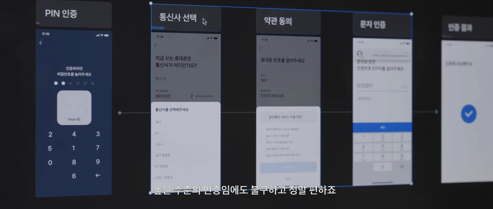
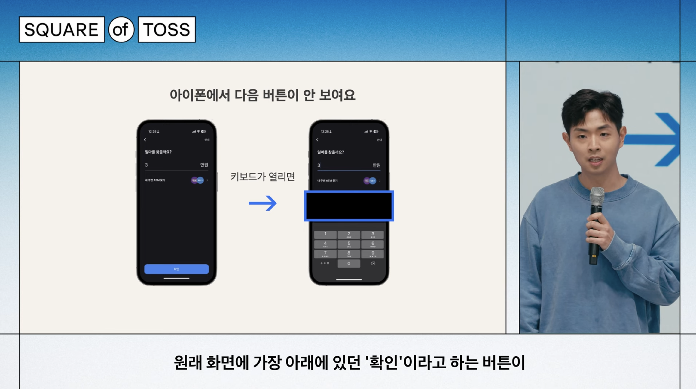
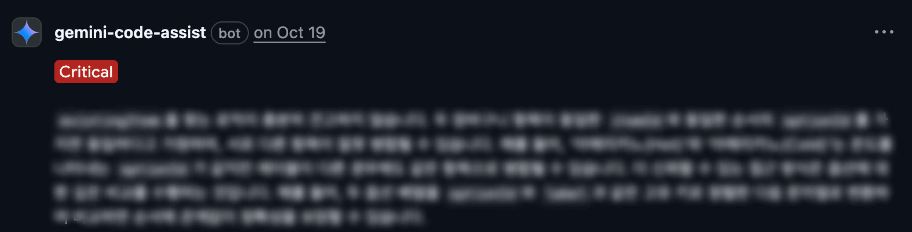
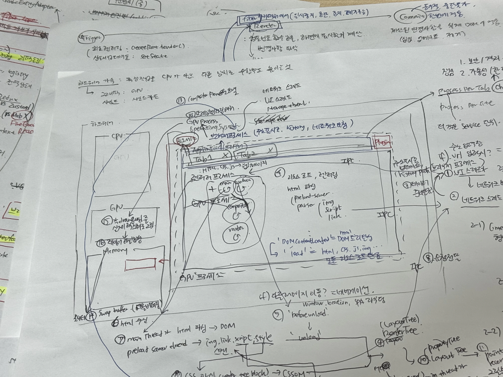
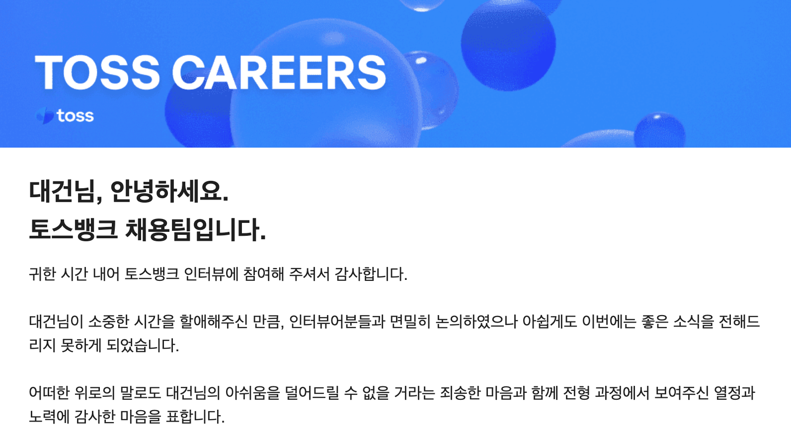

요즘들어 회고 글을 너무 자주쓰는 느낌이다..  
마치 죄많은 개발자처럼 면접이나 프로젝트가 끝날 때 마다 고해성사를 하러 오는 기분

하지만 이게반성문은 아니다  
실패를 통해서 더 단단해지고 성장하는 과정, 그게 바로 개발자의 종교라고 믿는다

그리고 요번 고해성사(?) 의 대상은 내가 정말 가고 싶었던 토스뱅크였다.

## 🎯 왜 토스뱅크였는가?

토스뱅크는 단순히 가기 어려운 회사가 아니라, 내가 되고 싶은 개발자의 모습이 담긴 회사였다

[대학 시절 창업을 도전했다가 실패한 경험](./roomfit-failure.md) 이 있었는데, 그 과정에서 토스 이승건 대표님의 영상을 보고 많은 깨달음을 얻었다

그 과정에서 토스가 추구하는 가치관과 개발 문화가 나와 잘 맞는다는 생각이 들었고, 언젠가 꼭 토스에서 일하고 싶다는 목표를 가지게 되었다  
특히 "사용자를 위해 불편을 부수는 집요함" 이라는 철학을 접했고, 내가 생각했던 개발자의 모습과도 일치했다.

> 겉은 부드러운 경험으로, 속은 견고한 구조로 다지는 프론트엔드 개발자

토스는 이걸 진짜 현실로 만들어낸 팀이라고 생각했다.

    
    

:::details [개발자를 성장시키는 토스의 개발 문화 3가지 | 박서진 토스 Head of Frontend | Square of Toss](https://www.youtube.com/watch?v=RzVABPt9f-g)

Go The Extra mile, 한 눈금 더 좋은

- 기존의 스탠다드 넘기
- 안전하게 해봤던 일에서 벗어나기

뇌에 힘을 빼고도 안전하게 할 수 있는일에서 벗어나, 기존의 스탠다드에서 벗어나, 실질적인 문제 해결을 위해 아무도 안해봤던 일에 도전하는것

:::

:::details [토스팀의 진짜 일하는 이야기ㅣTHE TEaM: 토스팀 워크스토리ㅣ토스](https://www.youtube.com/watch?v=B26O0mjIsUE)

래디컬 캔도어 : 직원 상호간에 솔직하고 건설적인 피드백을 주고받는 문화

:::

예를들어 금융권에서 당연했던 복잡하고 불편한 본인진증을 완전히 뒤바꿔놓은 원터치 인증이라던지, IOS 웹뷰에서 키보드가 뜨면 CTA 가 가려지는 문제를 그냥 두지 않고, 사용자를 위해 끝까지 해결하는 태도와 이 작은 배려가 큰 경험을 만든다는것을 아는 팀

또, 나는 지식공유를 중요하게 생각한다  
동아리 발표, 스터디 경험을 통해 서로 배우고 성장하는 기쁨을 느꼈다.  
토스의 [Frontend Fundamentals](https://frontend-fundamentals.com/) 와 같은 공유 문화 역시 내가 꿈꾸는 모습이었다.

## ✍️ 토스뱅크에 지원하다

이번에 내가 지원한 토스뱅크 전형은 서류 패스 전형이었기때문에, 서류를 내고나서 바로 과제 전형의 기회를 받을 수 있었다.

이력서 포트폴리오는 내가 무엇을 했는지 보다 왜 했고, 어떤 문제가 있어서 단계별로 해결한 과정을 중심으로 작성했다.

## 📝 토스뱅크 과제 전형

보안상 과제 내용에 대해 자세히 말할 수는 없지만, 과제에서도 똑같은 원칙을 적용했다.  

> 코드 한줄을 짜더라도 이유를 설명할 수 있어야 한다

UX, 유지보수성, 아키텍쳐 각각에서 개발자경험과 사용자 경험을 함께 고려하며, 라이브러리 도입이유와 어떤 훅, 컴포넌트를 왜분리했는지 고민하면서 과제를 진행했다.

근데,,, 여기서 사건이 하나 있었다.

### 🧨 Gemini와 함께한 최후의 5분

모든 레포에 Gemini Code Assist를 붙여놓은 상태였는데, PR을 제출하고 나니 얘가 갑자기 크리티컬한 문제가 있다고 소리를 지르는것이었다

하... 떨어졌구나

버그를 바로 고칠 수 있었던 것도 아니고, 그저 아쉬움을 남긴 채 제출을 마무리했다.

## ✉️ 합격 그리고 면접 준비

근데 며칠 뒤, 과제합격 메일이 도착했다  
현실을 잠깐 의심했다. 진짜?? 아니 이게 진짜라고?

진짜 하루종일 이렇게 기쁠 수가 없었다.

순간의 기쁨도 잠시, 면접준비를 위해서 내가 부족한 부분에 대해서 다시 점검했다

토스의 면접은 무시무시하고 악랄하다는 소문이 자자했고, 8~10depth 까지의 질문공세가 이어진다는 이야기도 들었다

너무가고싶은 마음에 면접보기 전까지 쥐죽은듯이 공부했다.  
근 몇달간 가장 집중을 많이하고 공부를 많이 했지 않나.. 싶다

## 😵 대망의 면접날 고해성사를 시작합니다

컨디션은 최고였다.. 아침에 일어났는데 상쾌하고 개운했다  
면접관님들도 너무 친절하셨고, 편안한 분위기에서 면접이 진행되었다

분위기는 편안했지만, 질문은 그 어디에도 편안함이 없었다.  
정말 소문대로 깊고, 날카롭고, 집요했다

## 1️⃣ 너무 기술적으로만 파고들었던 죄

면접 준비를 하면서 React 내부 동작, Fiber 구조, Lane 모델, Concurrency ... 이런 걸 정말 열심히 파고들었다.

문제는, **기술 자체에 너무 취해 있었다**는 점이다.

질문이 들어왔을 때, 사실은 간단히 개념과 결론만 말해도 되는 상황에서도

> "저 이거 깊게 공부했습니다!"

를 증명하고 싶어서, 내부 구현 이야기까지 장황하게 꺼낸 순간들이 있었다.

돌이켜보면, 면접관님들이 듣고 싶었던 건 "이걸 얼마나 알고있냐" 가 아니라,

> 실제로 어떤 상황에서 그 지식을 쓸 수 있는지  
> 사용자의 문제를 어떻게 해결할 수 있는지

였을 것이다.

:::info ✍️ NOTE
깊이보다 먼저, 맥락과 결론, 깊이는 그 다음에 꺼내도 늦지 않다
:::

## 2️⃣ 대화가 아닌, 질문 - 답변 구조로만 답했던 죄

면접관님들이 입장하시는 순간 들었던 생각:

> "와… 진짜 토스뱅크 프론트 개발자다... 미쳤다..."

이 압도감 때문에 그런지, 머리가 자동으로 **Q&A 모드**로 잠겨버렸다.

> "여기서는 이런 구조는 어떨까요?"  
> "이 방향성은 어떻게 생각하시나요?"

처럼 내 의견을 제안하면서 대화로 풀어갔으면 좋았는데,

실제로는

> 질문 → 답변 → 다음 질문

에 갇혀 있었던 느낌이 강했다.

특히,

> "비전공자에게 서버사이드 렌더링을 설명해보라"

는 질문에서, 웹의 역사, 정적 페이지, CSR, SSR, Hydration까지 내가 아는 걸 전부 꺼내버렸다.  
(그 분들은 아마 "아... 이렇게까지 자세히 말해달란 건 아니었는데..." 했을 듯)

사실 협업하는 동료라면, 내가 "이런 선택을 했고, 이런 대안도 고민했다"라고 함께 얘기하는 모습을 보여줬어야 했다.

:::info ✍️ NOTE
면접도 결국 같이 일할 사람과의 대화다.  
단답형 Q&A가 아니라, 함께 문제를 두고 얘기하는 자리가 되어야 한다
:::

## 3️⃣ 두괄식이 아닌, 장황한 설명으로 요점을 흐렸던 죄

면접 초반에는 나름 두괄식으로 잘 말하고 있었다.

> "결론부터 말씀드리면요, ~~ 입니다.  
> 그 이유는 첫째, 둘째..."

근데 긴장이 풀리기 시작하자  
내 평소 말버릇이 슬슬 올라왔다.

> "~해서 ~했고, 그래서 ~라고 생각했고... 결국에는 ~~입니다."

결론이 항상 뒤에 나오는 구조가 되어버렸다.

면접관님들도 이미 업무로 지친 상태에서  
장황한 서사를 다 듣고 나서야  
결론을 알게 되는 구조는 분명 피곤했을 것이다.

:::info ✍️ NOTE
면접에서의 배려는 말의 밀도가 아니라, 말의 명료함이다
:::

## 4️⃣ 후회 포인트를 제대로 꺼내지 못했던 죄

과제를 하면서

> "이 부분은 이렇게 했지만, 사실 구조적으로 더 개선 여지가 있다"  
> "시간이 더 있었다면 이런 방향으로 리팩터링했을 것 같다"

라는 '셀프 피드백 리스트'를 따로 정리해두었다.

나는 그게 "면접관님이 물어보시면 그때 말해야지" 카테고리라고 생각했다.

하지만 실제 면접에서는 그 질문이 나오지 않았고, 나도 굳이 끌어올리지 않았다.

지금 와서 보면, 이건 기회를 내가 스스로 내다버린 것 같다

:::info ✍️ NOTE
준비한 인사이트는 질문을 기다리지 말고, 내가 먼저 꺼내서 보여줘야 한다
:::

## 5️⃣ 내가 왜 토스뱅크에 가고싶은지 제대로 설명하지 못했던 죄

우습게도, 나는 기술 질문 대비는 정말 열심히 했는데

> "왜 토스뱅크인가요?"
> "왜 우리 팀에 오고 싶나요?"

같은 가장 기본적인 질문에는 오히려 답이 어눌했다.

물론 말하고 싶은 건 많았다.

> 토스의 집요한 사용자 경험 집착  
> 공유와 성장 문화를 좋아하는 이유  
> 내 가치관과 맞닿은 지점들

하지만 그걸 짧고 명확한 문장으로 정리해두지 못했다.

그래서 실제 면접에서는 머릿속에 있는 여러 생각들이 조금씩 섞여 나오는 느낌이었고,

> "아, 이 친구가 정말 우리 팀을 원하고 있구나"

라는 확신을 선명하게 남기진 못했을 것 같다.

:::info ✍️ NOTE
내가 왜 이 회사를 선택했는지, 이 팀에서 무엇을 이루고 싶은지를 문장으로 꼭 정리해보자
:::

## 6️⃣ 불필요한 메모이제이션을 남발한 죄

이번 면접에서 가장 크게 반성한 포인트다.

과제 코드에서 생각보다 많은 부분에 `useMemo`/`memo`를 걸어두었고, 그게 자연스럽게 질문으로 돌아왔다.

> "이 부분에 메모이제이션을 하신 이유가 있나요?"
> "평소에도 이렇게 사용하시나"

처음에는 "성능 최적화"라는 말로 시작했다가"
점점 대답이 이상한 방향으로 흘러갔다.

> 60fps 기준 16.67ms 프레임 타임이니까.. 연산 시간이 그걸 넘으면... 타임라인 찍어서 보고...  
> 아, 프로파일러도 있죠...

정작 실제 프로젝트에서 그렇게까지 측정하고 쓰진 않으면서, 너무 기술적인 말들로 포장하려다보니, 내 말과 실제 습관 사이에 괴리가 생겼다.

사실 내가 평소에 지키고 싶은 원칙은 이거였다.

> 1. 먼저 측정한다.  
> 2. 병목이 되는 부분을 찾는다. 
> 3. 정말 필요한 곳에만 메모이제이션을 쓴다.

하지만 그 자리에서는 "원칙"보다 "포장된 말"이 먼저 나갔다

이건 제일 크게 반성하는 부분이다.

:::info ✍️ NOTE
문제가 발생시에 원인을 찾은 뒤, 측정하고, 정말 필요한 곳에만 메모이제이션을 적용하자
:::

## 7️⃣ 평소 UX 나 화면 흐름에 대한 고민을 하지 않았던 죄

면접 중간에 특정 상황이 주어지고, 그에 대해 UX 적으로 어떻게 설계할지 물어보는 질문이 나왔다.

나는 순간적으로 살짝 멍해졌다.

물론 머리로는 "사용자 입장에서 어떻게 느낄까" 를 항상 고민한다고 생각했는데, 막상 구체적인 사례와 다른 서비스 레퍼런스를 곁들여 말하라 하니까 말문이 막힌 것이다.

예를 들어,

> "비슷한 상황에서 ~~ 앱은 이렇게 처리하더라"

처럼 내가 실제로 보고, 써보고, 느낀 UX 레퍼런스를 더 자신 있게 꺼냈으면 좋았을 것이다.

이건 앞으로의 아주 큰 과제로 남았다

:::info ✍️ NOTE
코드만 잘 짜는 프론트엔드가 아니라, 사용자 흐름을 설계할 수 있는 프론트엔드가 되기 위해서 더 많이 써보고, 더 많이 관찰하고, 더 많이 기록하자
:::

## 🥲 다음 기회를 기약하며..

뭐... 결국은 불합격했다.

하지만 이번 경험은 너무 소중한 경험이었고, 다음에는 이런 실수를 반복하지 않겠다는 다짐과, 조금 더 성장할 수 있는 계기가 되었던것 같다

두고보자 토스뱅크... 다음에는 꼭 붙을거다
