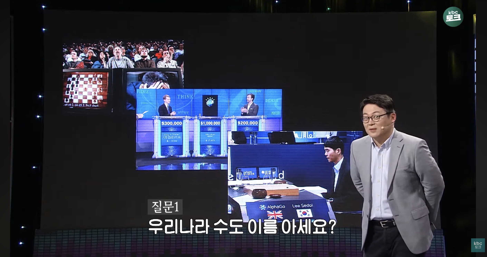
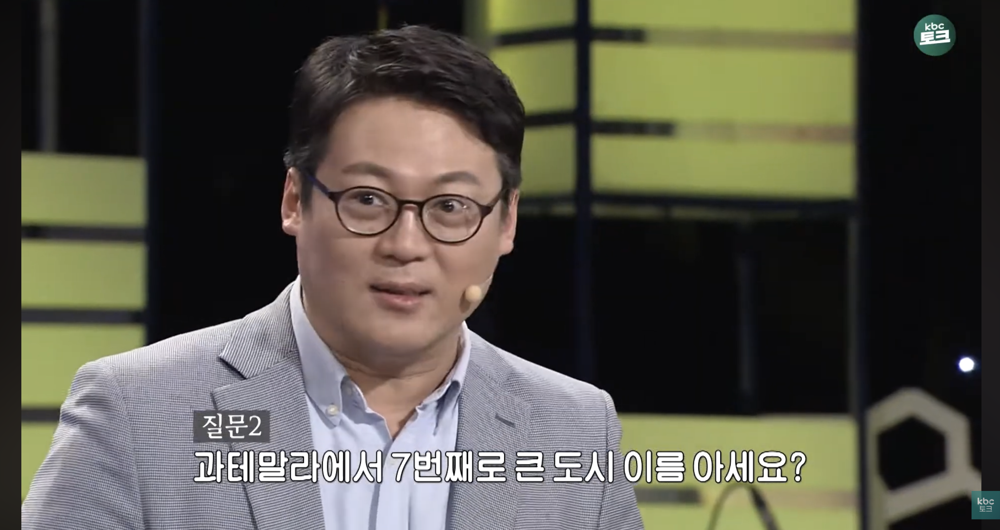
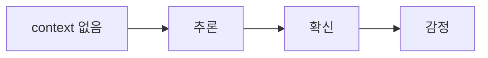

최근 회사에서 여러 의사결정 상황을 겪으면서 생각이 많아졌다.

이상적인 구조나 기술적인 관점에서 보면 납득이 잘 되지 않는 부분도 있었지만, <br/>
주변 상황이나 맥락까지 고려해보면 더 나은 선택일 수도 있겠다는 생각이 들었다.

그럼에도 불구하고 쉽게 받아들이기 어려운 순간들도 있었다.

- "이건 맞는 방향 같은데 왜 다르게 가지?"
- "내가 놓친 게 있나?"
- "다른 기준이 있는 건가?"

이런 질문들이 머릿속에 계속 맴돌았다

그런데 시니어분께서 맥락을 짚어주시면서 올바른 방향으로 나아갈 수 있었다

## 전환점

오늘 그 시니어분과 1대1로 저녁을 먹으면서 깊게 대화를 나누게 되었다 <br/>
신기하게도 이분은 나랑 성향이 거의 같았다

- 비논리적인 것을 보면 참지 못함
- 깊게 이해하는 것을 좋아함
- 원리를 끝까지 파고드는 스타일

겉으로는 굉장히 평온해 보이셨는데, 이야기를 들어보니 과거에는 나와 비슷하게 많이 부딪히셨다고 했다.

그리고 그 대화 속에서 한 문장을 들었다.

> 전체가 반려된 게 아니라 80%는 이미 채택된 상태였고,<br/>
> 나머지 20%는 문제라기보다 현재 context에 맞지 않았던 거예요

이 말이 굉장히 크게 와닿았다

나는 그동안 이렇게 해석하고 있었다

> 반려 = 틀림

하지만 실제 의미는 이거였다.

> 특정 context에서는 지금 맞지 않음

## 시니어의 경험

시니어분도 과거에는

- 납득되지 않는 결정에 강하게 반발하고
- "이건 아닌데"라는 생각이 들면 계속 부딪혔다고 했다

최근에도 비슷한 상황이 있었다고 했다. 하지만 시간이 지나고 나서 깨달았다고 한다.

> "기술적 / 논리적으로 맞는 판단이 항상 현재 최고의 판단은 아니다."

## 판단은 논리만으로 완성되지 않는다

나는 그동안 이렇게 생각했다

> 논리적으로 맞다 → 채택

하지만 실제 세계는 이렇게 동작한다.

> 논리 + 상황 + 조직 방향 + 리스크 + 타이밍 → 채택

즉, 논리는 의사결정의 일부일 뿐이다.

## context가 없으면 뇌는 자동으로 채운다

이게 오늘 가장 크게 와닿은 부분이다 <br/>
어떤 상황을 보면 나는 자동으로 해석을 붙였다

- "왜 저렇게 하지?"
- "이상한데?"
- "비논리적인데?"

하지만 이건 사실 분석이 아니라

> **Context 없는 상태에서 생성된 할루시네이션** 이었다


## 같은 사건도 context에 따라 완전히 달라진다

최근 내가 겪었던 일로 보면 더 명확하다

**상황 1 (context 없음)**

```text
내 이야기가 퍼졌다
→ "헛소문 퍼뜨리는 사람이다"
→ 분노
```

**상황 2 (context 있음)**

```text
힘들어 보인다고 조언을 구했다
→ "걱정해서 한 행동이었구나"
→ 감정 완화
```

둘의 표면적으로 보이는 사건은 같지만, 해석은 완전히 달라진다

<br/>

그리고 여기서 더 위험한 지점이 있다. <br/>
혼자서 context를 추론하다가 우연히 맞는 경우가 생기면,

```text
"내가 생각한 게 맞았네"
→ 자기 확신 강화
→ 다음에도 같은 방식으로 추론
→ 더 빠르고 강하게 판단
```

이렇게 **잘못된 추론 방식이 강화되는 악순환**에 빠질 수 있다 <br/>
즉, 문제는 틀린 추론뿐만 아니라, **가끔 맞는 추론이 오히려 더 위험하다**는 점이다

## 인간은 LLM처럼 오판한다

LLM은 context가 부족하면 그럴듯한 답을 만들어내는데, 인간도 똑같다.

> context 없음 → 뇌가 이야기 생성 → 감정 / 판단 확정

하지만 차이가 하나 있다

> 인간은 판단을 멈출 수 있다

## 인간 vs AI: "모른다고 말할 수 있는 능력" (= 메타인지)

이 깨달음을 더 명확하게 이해할 수 있는 비유가 있다

<div style="display: flex; justify-content: space-between;">


</div>

예를 들어 이런 질문이 있다

```text
"아프리카의 아주 깊은 곳에 있는 어떤 나라의 수도는 어디일까?"
```

이 질문에 대해

- 🤖 AI
    - 모르면 그럴듯한 수도 이름을 만들어내거나 (hallucination)
    - 저장된 모든 지식을 탐색한 후에야 모른다고 답한다.

- 👤 인간
    - 대부분 0.01초 만에 "모른다"고 판단한다 (메타인지)

이 차이가 핵심이다

> **인간의 진짜 지능은 아는 것이 아니라, 모르는 것을 아는 능력이다.**

문제는, 추론 영역에서 인간도 context가 부족하면 AI처럼 행동한다는 점이다.



그래서 중요한 것은 하나다.

> "내가 지금 알고 판단하는 건가, 아니면 추측하는 건가?"

이 질문 하나로 할루시네이션을 멈출 수 있다.

## 행동 변화

이번 경험을 통해 하나의 기준을 만들었다

### 1. 판단 전에 context 확인하기

"왜 저렇게 하지?" → "내가 모르는 context는 뭐지?"

### 2. 감정 리프레임

"기분이 나쁘다" → "정보가 부족하다"

### 3. 회사에서의 적용

"이건 틀린 방향인데?" → "이 선택을 한 이유는 무엇일까?"

- 비즈니스 상황
- 일정
- 리스크
- 조직 방향

이 요소들을 먼저 고려하기

## 결론

나는 그동안 세상을 "논리"로만 해석하고 있었다.

하지만 실제 세계는 다르다.

> **세상은 논리 + context + 인간으로 이루어져 있다.**

그리고 context 없이 내린 판단은 대부분 오판일 가능성이 높다.

## 한 줄 정리

> **논리는 틀릴 수 있다. context가 빠진 판단은 오판이다.**
