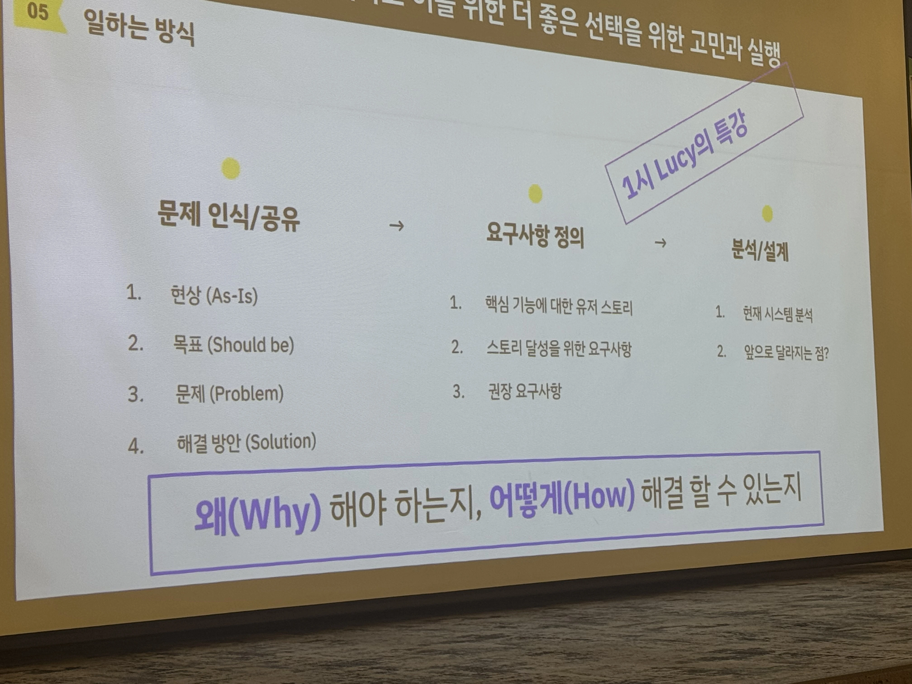
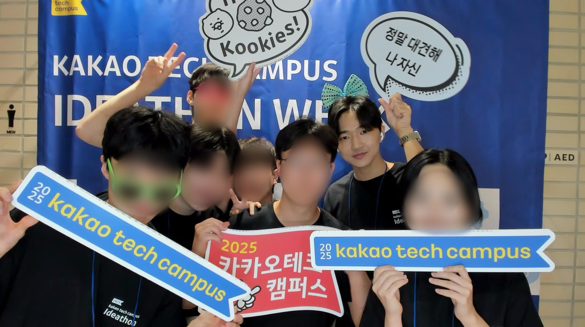

후기라고 읽고 회고라고 쓴다..  

## 🤯 졸업 학점 채우러 갔다가 뒤통수 쎄게 맞음

솔직히 말하면, 카카오 테크캠퍼스에 지원할때 제 목표는 단순햇습니다 
졸업을 위한 현장실습 대체 학점을 채워야 했고, 마침 카카오 테크캠퍼스가 그걸 채워줄 수 있었고, "어차피 할 거면 카카오 이름 달린 데서 하면 좋지" 정도의 마음가짐이었습니다

부트캠프에 대한 이미지도 솔직히 그렇게 좋진 않았습니다.  
부캠하면 기업에서 찍어낸 개발자 양성소 같은 느낌이 강했고, 부트캠프 출신 개발자 같은 낙인이 있을 거라 생각했습니다

그래도 한 가지 끌리는 점은 있었습니다.

> 현업자분들한테 직접 피드백을 받을 수 있따는 점  
> (학교 수업, 동아리, 사이드 프로젝트 열심히 해도 결국 진짜 현업자한테 내 코드를 리뷰받을 기회는 거의 없었기 때문에..)

그래서 이왕 하는거 기초도 다시 다시고 리액트도 첨부터 끝까지 다시 다잡아보자 라는 마음으로 시작하게 되었습니다.

그렇게 저는

> 1️⃣ 졸업 요건을 위한 학점 채우기  
> 2️⃣ 기초 다시 닦기 
> 3️⃣ 강제성 있는 루틴 만들기 

이 세가지를 목표로 삼고 카카오 테크캠퍼스 3기에 참여하게 되었습니다.

## 🤪 카카오 선물하기 클론코딩

여러 단계중에서 가장 기억에 남는건 2단계였습니다.  
카카오 선물하기를 리액트로 직접 구현하는 미션이었는데, 현업자 멘토님들께 PR 로 리뷰를 받는 경험이 가장 기억에 남습니다.

### 🧪 이때 아니면 언제해보냐 싶었던 실험적인 코드들

선물하기 클론 미션을 진행하면서 혼자 나름의 목표를 하나 정했습니다.

> 이때까지 안 써봤던 문법들을 최대한 활용해서 구현해보자

과제 요구사항들이 바로 라이브러리를 도입해서 해결하는것이 아니라  
순수 리액트와 자바스크립트로 해결하는 것이었기 때문에 평소에 잘 안쓰던 문법으로 풀어볼려고 했던 것 같습니다.

예를들어, `reflect-metadata` 로 데코레이터 기반의 유효성 검증 코드를 직접 구현해봤고,  
`generator` 를 활용해서 커서 기반 페이지네이션의 다음 데이터를 가져오는 코드를 작성해봤습니다.

실무에서 자주 쓰진 않을수 도 있는 망식인데 그렇기 때문에 오히려

> "이 문법은 어디에 쓸 수 있을까 ?"  
> "이걸 실무에 적용하려면 어떤 형태가 좋을까? "

생각이 확장되는 경험을 할 수 있었습니다.

단순히 정답을 맞추고 구현한는 과제가 아니라 사고 범위를 넓히는 연습에 가까웠습니다.

### 😩 현업자들한테 코드리뷰를 받을수있다고 ?

특히나, 현업 멘토님들과의 PR 리뷰 경험이 가장 기억에 남습니다.  

PR 을 올릴 때, 질문을 진짜 많이 적었고, 고민한 흔적 설계 이유같은걸 구구절절 다 써서 최대한 단물을 빨아먹어보자는 생각이 있어서..  
리뷰해주시는 멘토님들이 꽤 고생을 많이 하셨을 것 같습니다 ㅋㅋㅋ

:::details 💬 멘토님과 함께한 코드리뷰 PR 모음

- 1단계 미션
    - [경북대 FE 김대건 2단계 - 선물하기 메인페이지 UI 구현하기](https://github.com/next-step/react-gift-login/pull/127)
    - [경북대 FE 김대건 3단계 - 로그인 페이지 UI 만들기](https://github.com/next-step/react-gift-login/pull/148)

- 2단계 미션
    - [경북대 FE 김대건 - 0단계 기본 코드 준비](https://github.com/next-step/react-gift-order/pull/51)
    - [경북대 FE 김대건 - 1단계 로그인 기능 구현하기](https://github.com/next-step/react-gift-order/pull/104)
    - [경북대 FE 김대건 - 2단계 주문하기 페이지 구현하기](https://github.com/next-step/react-gift-order/pull/127)
    - [경북대 FE 김대건 - 3단계 단체 주문 기능 구현하기](https://github.com/next-step/react-gift-order/pull/227)

- 3단계 미션
    - [경북대 FE 김대건 - 1단계 선물하기 메인 API 구현하기](https://github.com/next-step/react-gift-product-list/pull/118)
    - [경북대 FE 김대건 - 2단계 로그인 주문하기 API 구현하기](https://github.com/next-step/react-gift-product-list/pull/146)
    - [경북대 FE 김대건 - 3단계 테마 상품 목록 페이지 구현하기](https://github.com/next-step/react-gift-product-list/pull/194)
    -

- 4단계 미션
    - [경북대 FE 김대건 - 1단계 React Query 적용하기](https://github.com/next-step/react-gift-product-detail/pull/106)
    - [경북대 FE 김대건 - 2단계 상품 상세 페이지 구현하기](https://github.com/next-step/react-gift-product-detail/pull/157)
    - [경북대 FE 김대건 - 3단계 테스트 코드 작성하기](https://github.com/next-step/react-gift-product-detail/pull/201)

:::

나중에 들은 TMI 가 있는데..  

제 PR 을 리뷰해주신 네 분이 같은 회사, 친한 동료셨고,  
3단계때 그 중 한분이 저희 팀 멘토가 되셨습니다 ㅋㅋㅋ  

그 멘토님말로는 "솔직히 쫌 피곤하긴했다.. PR 도 길고 질문도 엄청 많고.. 그래도 열정적인 모습은 되게 좋게 보였다"  
그리고 네분이서 제발 나는 멘토로 안됏으면 좋겟다 라고 얘기하셨다고 합니다 ㅋㅋㅋ  

이 얘기를 듣는데, 저는 너무 행복하더라구요..  
적어도 대충 하지 않았다는건 확실히 각인됐구나.. 좋은 피곤함을 드렸다면 그건 나름 성공이다 라는 생각이 들었습니다 ㅋㅋㅋ

2단계 코드 리뷰를 해주셨던 카카오 황선준멘토님, 박진영멘토님, 차재명멘토님, 박주현멘토님 다시한번 감사드립니다 ㅎㅎ

## 🤩 그래서 뭘 얻었는데 ?

멘토링을 통해 크게 세 가지를 얻을 수 있었던것 같습니다.

### 1. 질문을 통한 사고 확장

멘토님들이 던져주신 질문들이 진짜 재밌었습니다.  
단순히 "여기 이렇게 고치세요" 가 아니라 거의 토론에 가까운 느낌이었습니다.

예를들어,

- `Provider` 를 `HOC 고차컴포넌트` 로 주입한 부분에 대해
    - 일반 컴포넌트 계층으로 표현하는 것보다 이렇게 했을 때의 이점이 있을까요?
- `Modal Provider` 확장에 대한 고민
    - `Modal` 에서 다른 모달을 띄우거나 여러 모달의 상태를 관리해야 할 때, 지금 구조에서 어떻게 확장할 수 있을까요?
- 타입단언 대신 타입가드 제안
    - 타입 단언보다는 실제 정의된 타입과 params 가 일치하는지 검증하는 타입가드를 사용하는게 더 안전하지 않을까요?

라는 질문들을 주셨고,  
이 질문들에 대해 같이 고민하고 답을 찾아가는 과정이 너무 재밌었습니다.  
단순히 답을 알려주는게 아니라 같이 생각해보고, 왜 그런지에 대해 토론하는 과정이 너무 좋았습니다.

### 2. 실무에서 나올법한 엣지 케이스들

또 하나 인상 깊었던 점은, 실제 프로덕션에서 나올법한 엣지 케이스들을 많이 짚어주셨다는 점입니다.  

예를들어,

- `JSON.stringify`, `JSON.parse` 과정에서 `undefined` 와 같은 값이 손실되는 문제

이런 것들은 책이나 강의에서 잘 다뤄지지 않는 부분인데, 현업을 오래하신 분이니까 들려줄 수 있는 꿀팁이었습니다.  
실제로 한번 터지고 나면 팀에서 규칙으로 박히겠구나 라는 생각이 들었습니다 ㅋㅋㅋ

### 3. 무의식적인 나쁜 습관들 교정

리뷰를 받으면서 제가 무의식적으로 쓰던 나쁜 습관들도 많이 드러났습니다.  

- 이 코드는 딱히 없어도 괜찮을것 같아요
- 타입단언, null assertion 을 최소화 해야 한다는 점  
- 변수명, 함수명에 대한 피드백

예를들어,

- `send`는 전송하다, 보내다는 의미로 좋은 동사지만 실제 API 요청을 보내는 함수 이름으로는 다소 애매한 것 같아요.
- 저는 `request`를 선호하긴 하는데, 대건님은 어떻게 보시나요?

전에는 그냥 돌아가면 됏찌 뭐 라는 생각이 들었는데,  
지금은 네이밍과 추상화 수준에 훨씬 신경을 쓰게 되었습니다.

### 가장 인상깊었던 피드백 - 좋은 코드에 대한 정의가 바뀐 순간

마지막으로 인상 깊었던 피드백 하나

`generator` 를 사용한 커서 기반 페이지네이션 구현을 올리면서  
실무에서 `generator` 많이 쓰시나요? 라고 여쭤봤는데 멘토님이 이렇게 답해주셨습니다.

좋은 코드는 단순히 변수명이 깔끔하고, 여러 설계원칙을 잘 지키는 그런 코드가 아니라  
함께 일하는 사람이 이해할 수 있는 코드가 좋은 코드구나

카테캠을 통해 개발자 혼자 성장하는 법이 아니라, 팀과 함께 성장하는 법을 배운것 같아서 이부분이 저는 제일 좋았습니다

## 🎯 결국 얻은 것들

카테캠에서 얻은걸 한줄로 정리하면

> 구조적으로 고민하는 습관 + 트레이드 오프를 생각하는 습관 + 기본기를 다시 다진 경험

입니다.

아직 취업은 못했지만, 이런 사소해보이는 습관들이 저를 조금은 더 준비된 상태로 만들어줬다고 생각합니다 ㅎㅎ

특히 취업관련 특강, 기술특강, 서류작성 포트폴리오 방향성 등  
이런 것들을 부캠에서 한번에 경험할 수 있었던 것도 돌아보면 큰 성과였던것 같습니다.

## 🙏 힘들었는데 그래서 더 좋았따

수료하고 나니깐 사실 기억이 좀 미화된것도 있습니다.

힘들었던 날들도 많았고, 특히나 방학때 애들 막 다 놀러댕기고 저만 집에서 코딩하고 있을때 진짜 외로웠습니다 ㅋㅋㅋ  
그래도 지금 떠올려보면 힘든 시간속에서 배운것들이 더 많았던것 같습니다.

쫌 힘들고 아프고 그래야 성장하는 타입인것같습니다.. 약간 ~~마조히스트~~ 기질이 있는것 같기도 하고요

