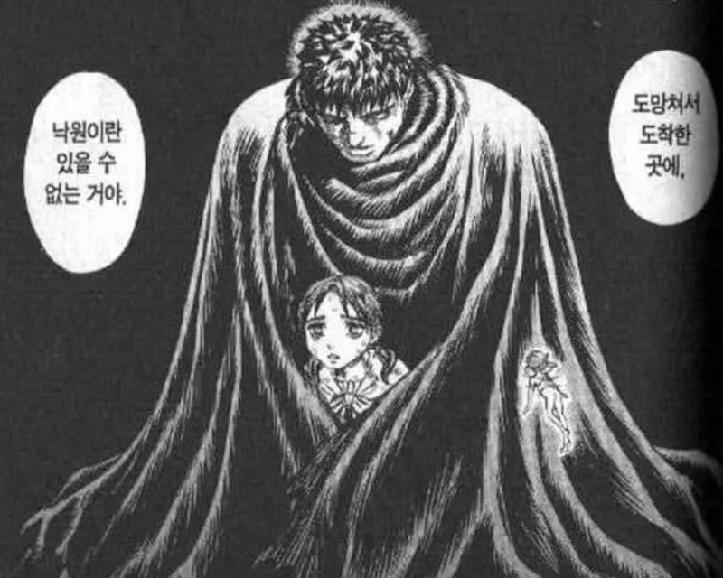

컴퓨터 앞에 앉아 이력서를 쓰고 
개발공부를 하고  
쉬려고 핸드폰을 켜면 취업시장이 더 어려워졌다는 기사  
서류 넣으면 날아오는 불합격 메일

괜히 더 작아지는 기분이 든다.

별일을 안 했는데도 괜히 지치고, 아무것도 안했는데도 마음이 무겁다

 

그런날들 사이에서 요즘 내 머릿속에 계속 맴도는 문장이 하나 있다

> 힘든 건 면책 사유가 될 수 있어도, 반복적인 회피의 면허증은 아니다

처음엔 그냥 문장으로 스쳐 지나갔는데, 자꾸 요즘 내 태도랑 마음을 정확이 찌르는것같아서 하루에도 몇번씩 다시 떠올리게 된다

졸업도 얼마안남아서 그런가 조금 지쳐있고 조금 흔들리고 있는것 같다  
그만큼 내 태도를 고민하게 되는 요즘이다

 

## 힘든 건 진짜다

사람은 누구나 힘들다  
우울할 수도 있고 무기력해질 수도 있고,  
아무것도 하기 싫은 시기가 찾아올 때도 있는것 같다.

예전에 내가 창업을 하다 실패하고 정신적으로 힘들었을때, 강인해보였던 부모님도 힘든 시기가 있었다고 말씀하셨다

나는 그 감정을 부정하지 않는다.,  
힘든건 진짜고, 충분히 이해받아야 할 감정이라고 생각한다.

누군가에게는 하루를 버티는 것 자체가 전부인 날도 있고,  
그런 날엔 아무 말 없이 그대로 쉬어도 된다고 생각한다

힘들다는 감정은 그 자체로 잘못되거나 틀린게 아니라고 생각한다

 

## 극복할 것인가 회피할 것인가

하지만 힘든 감정을 인정하는 것과  
그 감정에 계속 머무르는 것은 다르다고 생각한다

> **힘든 순간이 잠시 멈추는 이유가 될 수는 있어도, 같은 이유로 계속 책임에서 물러나는 면허증이 될 수는 없다**

고통은 설명이 될 수는 있어도, 반복적인 회피의 정당화가 되지는 않는다

힘든것은 사실이지만, 그 이후에 어떤 태도를 선택할지는 결국 각자의 몫이다

["도망쳐서 도착한 곳에 낙원이란 있을 수 없는 거야"](https://namu.wiki/w/%EB%8F%84%EB%A7%9D%EC%B3%90%EC%84%9C%20%EB%8F%84%EC%B0%A9%ED%95%9C%20%EA%B3%B3%EC%97%90%20%EB%82%99%EC%9B%90%EC%9D%B4%EB%9E%80%20%EC%9E%88%EC%9D%84%20%EC%88%98%20%EC%97%86%EB%8A%94%20%EA%B1%B0%EC%95%BC)

## 나도 도망치고 싶었던 순간들이 있었다

사실 나도 그런 순간들이 있었다.  
아무것도 하기 싫고, 뭔가 무기력하고 그냥 숨어버리고 도망가고싶었던 날들

도망치는동안은 솔직히 편하다  
누구도 나를 재촉하지 않고, 아무것도 책임지지 않아도 되니까

근데 시간이 지나 다시 돌아와 보면 문제는 오히려 더 커진 상태로 그 자리에 남아 있다

그때 알았다. 도망치는 동안 문제가 해결되는 경우는 없다는걸  
도망치는건 결국 문제를 더 키울 뿐이라는걸

 

## 도망가지 마, 맞서 싸워

그래서 나는 이제 힘들어도 도망가지 않기로 했다  

힘들면 힘들다고 말하되, 해야할 일 앞에서 완전히 사라지지는 말자

무너질 땐 무너지되, 최소한 나에게 맡겨진 책임 만큼은 놓지 말자

완벽하지 않아도 좋고 느려도 괜찮다

나는 더이상 힘들다는 이유로 도망가고 싶지 않다.

나는 이제 내 문제와 맞서 싸우기로 했다.

한번 도망치치 않고 맞서 싸워보자

한번 극복해보면 힘든 일에 대해 내성이 생긴다고 생각한다

그리고, 실제로도 힘든일을 극복하고 나면 그 다음에 힘든일이 와도 훨씬 덜 힘들게 느껴진다
