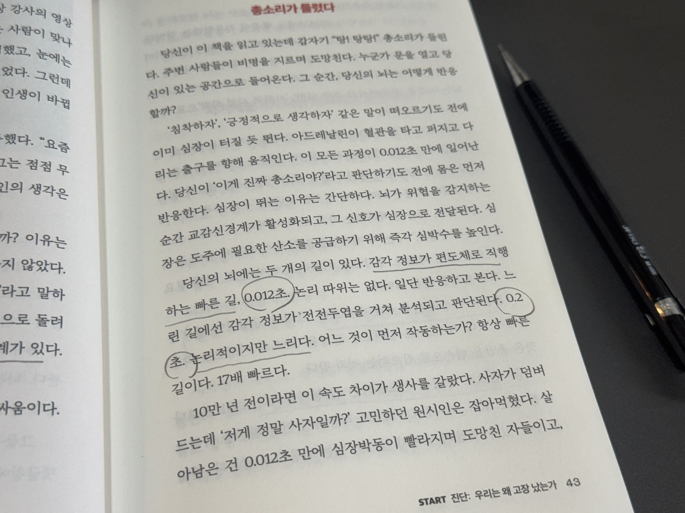

> '완벽한 원시인'을 읽고 - 인간을 시스템처럼 분석해보니, 감정과 행동은 버그가 아니라 원시시대부터 최적화된 뇌의 알고리즘이었다.

 

:::info 📚 인간의 감정과 행동을 리버스 엔지니어링 해보자 시리즈

1. [인간의 감정과 행동을 리버스 엔지니어링 해보자 1편 - 나는 왜 '이해'가 있어야만 움직일까](./index.md)
 <!-- 2. [인간의 감정과 행동을 리버스 엔지니어링 해보자 2편 - 왜 어떤 사람은 공감이 먼저고, 어떤 사람은 해결이 먼저일까? (해결형T vs 공감형F 프로토콜)](./2.md) -->

:::

최근 회사에서 의견 충돌이 있었다.  
내가 나름 구조적으로 고민해서 낸 제안이 있었는데, 결국 반려됐다.

이상했던 건 결과가 아니라, 그때 올라온 감정이었다  
단순히 아쉬운 게 아니라 억울함, 실망이 한 번에 올라왔다.

> "왜 이게 안 되는 거지?"  
> "이게 더 나은 방향 아닌가?"

생각은 계속 돌았는데,
감정은 정리가 안 됐다.

그래서 나는 이걸 하나의 **버그**로 보기 시작햇다

 

그런데 그 이후,  
시니어 분이 왜 이 방향으로 가게 되었는지에 대한 배경과 의사결정의 기준을 설명해주셨다.

그 설명을 듣는 순간, 이상하게 감정이 가라앉았다.  
내가 틀렸다는 느낌이 들어서가 아니라, 이제야 이 선택이 어떤 맥락에서 나온 것인지 이해됐기 때문이었다

그때 처음으로 느꼈다

> 나는 결과에 반응하고 있었던 게 아니라,  
> 이해되지 않는 상태에 반응하고 있었던 거라는 걸

## 🧠 나는 원래 이런 식으로 생각하는 사람이다

개발을 하다 보니 자연스럽게 생긴 습관이 있다.  
문제가 생기면 구조를 쪼개고, 근본 원인을 찾고, 더 나은 구조로 바꾸려고 한다.

그런데 가만히 보니, 나는 감정이나 인간관계도 비슷하게 보고 있었다

> 감정이 생기면 그냥 느끼기보다 "왜 이런 반응이 나오지?"를 먼저 생각했고  
> 사람 행동도 "패턴" 이나 ""알고리즘" 처럼 해석하려고 했다  
> 비논리적이거나 비효율적인 상황을 보면 스트레스를 크게 받았다  

문제는, 이 방식이 항상 잘 작동하지는 않는다는 점이었다.

특히 사람과의 관계에서는.

## 📚 그러다 “완벽한 원시인”이라는 책을 읽게 됐다

이 책을 읽으면서
머릿속에서 뭔가 딱 맞아떨어지는 느낌이 들었다.

이 책이 말하는 핵심은 단순했다.

> 지금의 인간은 현대 환경에 살고 있지만,
> 뇌는 여전히 원시 환경 기준으로 동작한다.

감정뿐만 아니라, 우리가 당연하게 받아들이던 행동과 사고방식까지...  
모두 특정 환경에서 생존을 위해 최적화된 결과라는 점이다.

나는 나를 이해하고 있다고 생각했지만,  
사실은 그 시스템의 동작원리는 한번도 본 적이 없었다

이 책을 읽는 순간 내가 왜 그렇게 반응했는지가 이해되기 시작했다.

## 🦍 내가 실망했던 이유를 원시시대 기준으로 해석해보자

회사에서 의견이 반려됐을 때, 나는 단순히 "아이디어가 거절됐다" 고 느낀 게 아니었다

내 안에서는 이렇게 해석되고 있었다

> - 내가 고민해서 만든 구조가 인정받지 못했다
> - 내 판단 능력이 부정된 것 같다
> - 이 집단에서 내 영향력이 낮은 것 같다

즉, 단순한 의사결정 문제가 아니라 '내 위치와 능력' 에 대한 신호로 받아들였던 거다

 

⚠️ **원시시대 기준으로 보면, 이건 꽤 큰 리스크**이다!!

 

> 🤔 내가 만든 구조가 받아들여지지 않았다  
> 🦍 **내 기여가 집단에 필요 없는 것으로 간주된 상태**

> 🤔 내 판단이 틀린 것처럼 보였다  
> 🦍 **위험을 잘못 읽는 개체로 낙인찍힐 가능성**

> 🤔 내 영향력이 낮아진 것 같다  
> 🦍 **집단에서 밀려나고, 자원과 기회를 잃을 수 있는 위치**

이 실망감, 억울함과 같은 감정들은 상황을 설명하기 위한게 아니라,  
"지금 당장 어떻게 행동해야 하는지" 를 빠르게 결정하기 위한 장치였다

이 모든 과정은 논리적인 사고를 거치지 않는다.  
생존이 걸린 원시인의 입장에서는 빠른 판단이 정확한 판단보다 중요했기 때문이다.  
(완벽한 원시인에서 말하는 0.012초의 벽처럼)

문제는, 이 시스템이 현대 환경에서도 그대로 동작한다는 점이다

## 👶 돌이켜보니 금쪽이 시절에도 비슷했다

어렸을 때 부모님께서 자주 하시던 말들이 있었따

- 햇빛을 쐬고, 일찍 자라
- 앉아있지만 말고 움직여라
- 스마트폰 좀 그만 봐라

그때는 솔직히 하나도 와닿지 않았다.  
왜 해야 하는지 모르겠으니까 그냥 안 했다

그런데 이 책을 읽고 나니까 그 말들이 완전히 다르게 들렸다.

> 🤔 앉아서만 계속 일을 한다 
> 🦍 **부상당하거나 병에 걸렸구나. 지금 나가면 위험할수도 있으니까 세상이 무섭게 느껴지도록 할게**

> 🤔 스마트폰 속 부정적인 정보 
> 🦍 **주변에 위협이 가득하고, 적대적, 나보다 강한 경쟁자들이 많다. 스트레스 호르몬을 분비할게**

즉, 그냥 ""좋은 습관"이 아니라
**시스템을 정상 상태로 유지하는 조건**이었던 거다.

이걸 이해하고 나니까 이상하게 행동이 바로 바뀌기 시작했다

## 👀 나는 "의지"로 움직이는 사람이 아니었다

이 지점에서 깨달은 게 하나 있다.

나는 의지로 꾸역꾸역 하는 사람이 아니라,

> 이해되면 누구보다 강하게 실행하고,
> 이해되지 않으면 아예 움직이지 않는 타입이었다

그래서 지금까지 안 되던 것들도
사실은 게을러서가 아니라
**이해가 부족해서 실행 엔진이 안 켜진 상태**였던 거다

 

그래서 방식을 바꾸기로 했다  
앞으로는 "그냥 해라" 방식이 아니라 구조를 먼저 만든다.

내 기준에서 행동은 이렇게 바뀐다.

1. 트리거
2. WHY 이해
3. 행동

예를들어 이렇게 바꾸면 억지로 하지 않아도 자동으로 움직인다

- 운동은 건강관리를 위해서 해야한다. (X)
- 운동을 하지 않으면, 원시시대의 뇌는 부상당하거나 병에 걸렸다고 인식한다 (O)

이런 과정을 거치면, 이해가 되고 그 다음에야 실행이 된다

## 결론

완벽한 원시인 책을 읽으며, 나는 인간이라는 레거시 시스템을 리버스 엔지니어링하는 중이다.

그리고 놀랍게도 이 시스템은 생각보다 꽤 잘 만들어져 있었다  
문제는 내가 그걸 이해하지 못한 채 사용하고 있었다는 점이다

이제는 조금 다르게 쓰려고 노력하려 한다. 
의지로 버티는 대신 구조를 이해하고 그 위에서 움직여보자

## 그런데 또 다른 의문이 생겼다

이해가 생겼고 행동은 바뀌었다  
그런데 사람과 대화할 때는 여전히 이상한 일이 반복됐다.

누군가는 해결책을 말하면 좋아하고, 누군가는 오히려 거리를 둔다.

같은 입력을 넣었는데 왜 출력이 이렇게 다를까?

:::info
인간의 감정과 행동을 리버스 엔지니어링 해보자 2편 - 왜 어떤 사람은 공감이 먼저고, 어떤 사람은 해결이 먼저일까? (해결형T vs 공감형F 프로토콜) 작성중
:::

<!-- 👉 [인간의 감정과 행동을 리버스 엔지니어링 해보자 2편 - 왜 어떤 사람은 공감이 먼저고, 어떤 사람은 해결이 먼저일까? (해결형T vs 공감형F 프로토콜)](./2.md) -->
