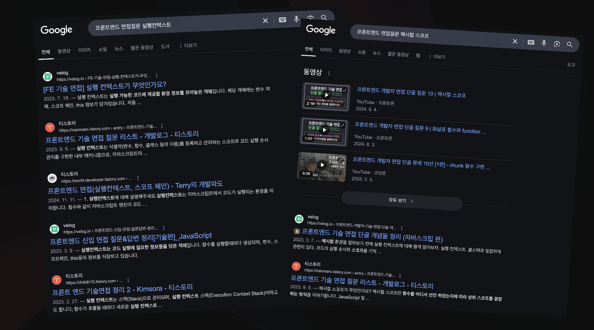
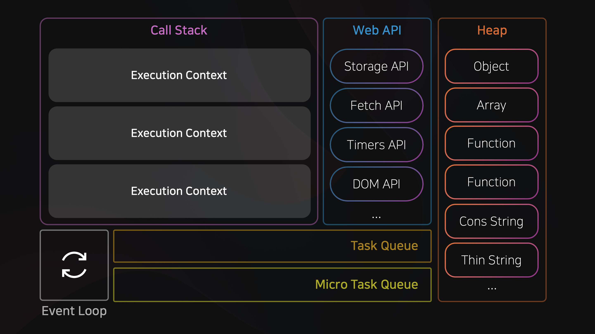
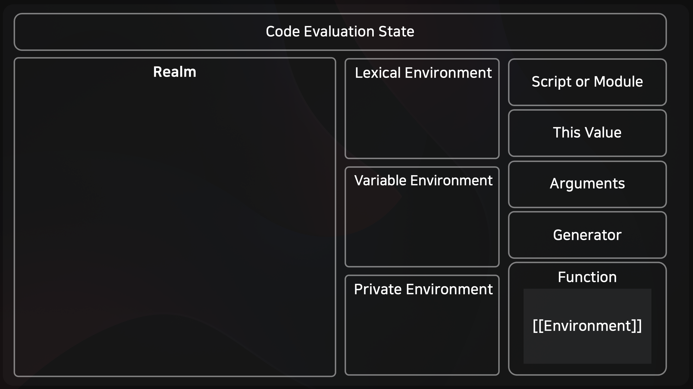
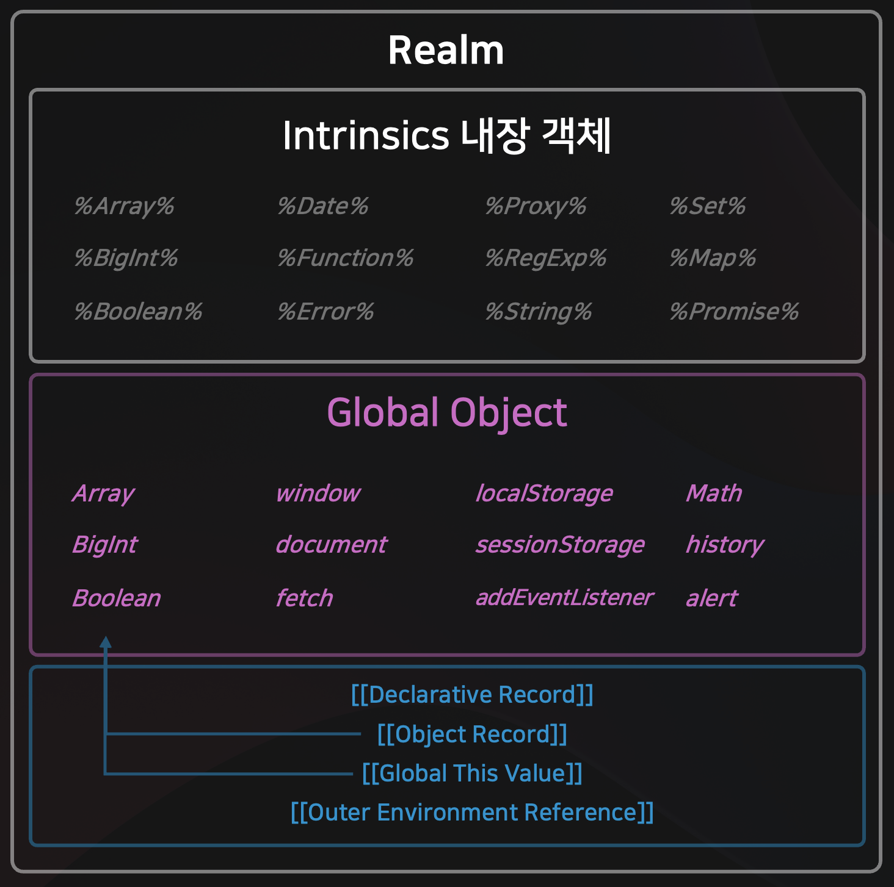
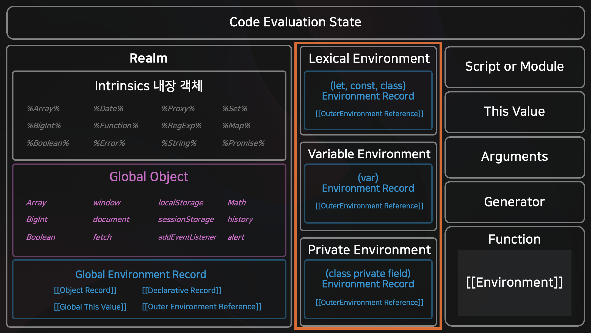
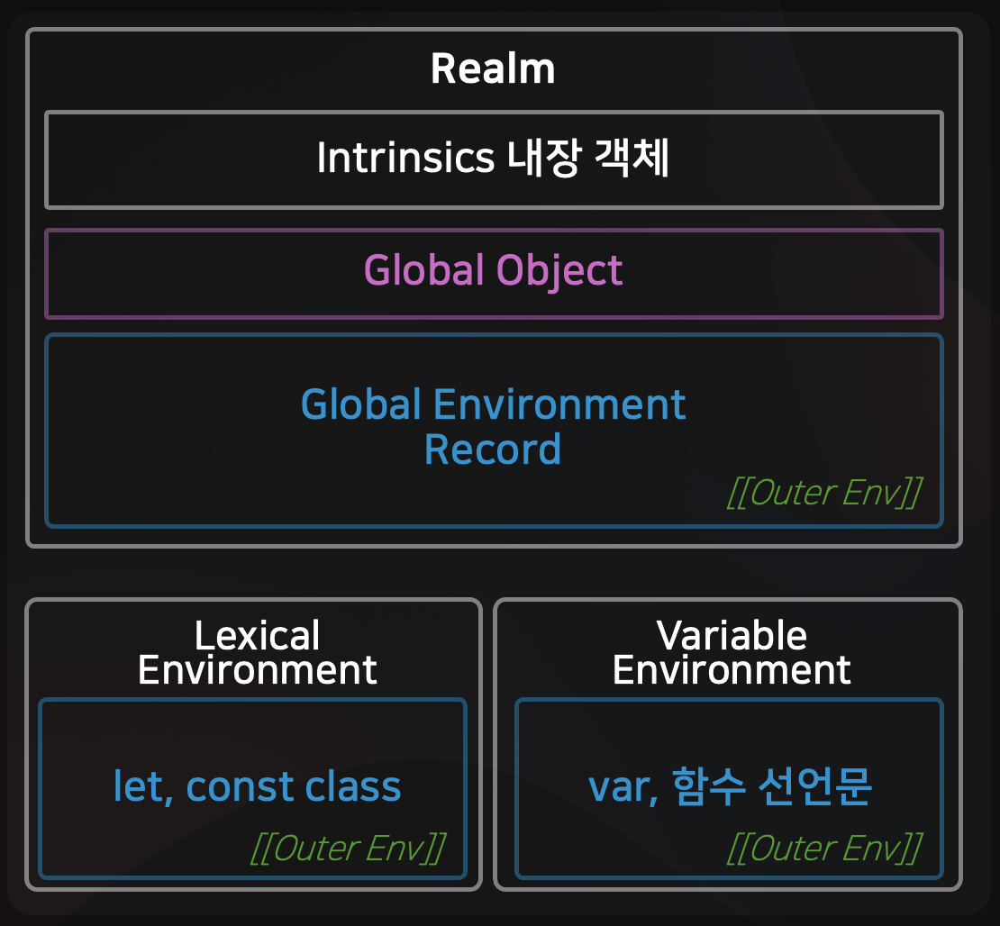

# JavaScript Execution Context 실행 컨텍스트 - 개념편 (feat. 호이스팅, 스코프 체인, 클로저)

자바스크립트를 공부하다보면 반드시 마주치는 개념이 있습니다. 바로 **실행 컨텍스트**입니다.

실행 컨텍스트는 자바스크립트 동작원리의 핵심입니다.  
스코프 (Scope), 클로저 (Closure), this 바인딩까지 모두 실행 컨텍스트와 연관되어 있습니다.

    

실제 면접에서도 "자바스크립트의 실행 컨텍스트에 대해 설명해보세요"는 단골 질문입니다.  
하지만, 막상 공부해보면 실행 컨텍스트는 어렵고 복잡한 개념입니다.

"코드를 실행할 때 무슨 일이 벌어지는지"  
"변수는 어디에 저장되고, 언제 접근 가능한지"  
이런것들을 명확히 이해하지 못하면 호이스팅, 스코프 체인, 클로저, this 바인딩을 이해하기 어렵습니다.

## 🤔 실행 컨텍스트란 무엇인가?

    

우리가 JavaScript 코드를 작성하고 실행될 때, `import` `export` 를 통해 모듈 코드를 실행할때, 함수 호출을 할 때,  
새로운 실행 컨텍스트 (Execution Context) 가 생성되고 콜스택에 푸시 됩니다.  
그렇다면 실행 컨텍스트 (Execution Context) 는 무엇이고 어떻게 구성되어 있을까요?

## 🏗️ 실행 컨텍스트의 구성 요소

    

실행 컨텍스트는 크게 다음과 같은 요소로 구성되어 있습니다.

> 1. **Code Evaluation State** : 현재 실행중인 코드의 상태를 나타냅니다.
> 2. **Realm** : JavaScript 코드가 실행되는 독립된 환경입니다. (브라우저 새탭, `<iframe>`, Worker 등이 생성될때 Realm 이 생성됩니다) 실제로든 해당 Realm 을 가리키는 객체를 생성합니다.
> 3. **Lexical Environment** : `const`, `let`, `class`, `Function Expression`(`const foo = function() {}`또는`const bar = () => {}`) 를 위한 식별자 바인딩을 저장합니다.
> 4. **Variable Environment** : `var`, `Function Declaration` (`function foo() {}`) 를 위한 식별자 바인딩을 저장합니다.
> 5. **Private Environment** : `class` 의 private 필드에 대한 식별자 바인딩을 저장합니다.

이 중, **Realm**, **Lexical Environment**, **Variable Environment** 를 조금더 자세히 알아보겠습니다.

### 🏰 1. Realm

Realm 은 JavaScript 코드가 실행되는 독립된 (Isolated) 환경을 의미합니다.  
브라우저의 새탭을 열거나, `<iframe>` 내부 JS 코드가 로드될 때, `Web Worker` 스크립트가 로드될 때 등에서 각각의 Realm 이 생성됩니다.

Realm 은 다음과 같은 요소로 구성되어 있습니다.

    

#### 1.1. Intrinsics (내장객체)

실제 ECMA Script (JavaScript) 사양에 정의된 내장 객체로,  
언어 자체를 구성하는 기본 빌딩 블록들입니다.

`Number`, `String`, `Array`, `Object`, `Function`, `Date`, `Proxy` 등과 같은 내장 객체들이 구현되어 있습니다.  

#### 1.2. Global Object (전역 객체)

Global Object 에는 Intrinsics(내장객체)에 정의된 빌트인 객체를 노출하고,  
호스트 (Browser, NodeJS 등) 에서 제공하는 API를 노출합니다. (브라우저의 경우 `document`, `localStorage`, `sessionStorage` 등..)  
또한 사용자가 정의한 전역 변수와 함수도 포함됩니다.  

> **❓ 어떻게 Global Object 에 사용자 정의 속성을 추가할 수 있나요?**
>
> 1. 브라우저의 경우 `window.newProperty` 와 같이 window 객체에 새 속성을 추가하거나,
> 2. NodeJS 의 경우 `global.newProperty` 와 같이 global 객체에 새 속성을 추가합니다.
> 3. 또한, `this` 를 사용하여 `this.newProperty` 와 같이 전역 객체에 새 속성을 추가할 수 있습니다.
> 4. 마지막으로 `var` 키워드를 사용하여 변수를 선언하면, 해당 변수가 전역 객체에 추가됩니다. (단, `let`, `const` 제외)

#### 1.3. Global Environment Record

Global Environment Record 는 전역 스코프에 대한 식별자 바인딩을 저장하는 객체입니다.  
`[[Declarative Record]]`, `[[Object Record]]`, `[[Global This]]`, `[[Outer Env Reference]]` 슬롯으로 구성되어 있습니다  

`[[Object Record]]` 에는 전역 환경에서의 식별자 바인딩을 저장하고,  
`[[Global This]]` 에는 전역 객체에 대한 참조를 저장합니다.

그리고 이 두 슬롯은 `Global Object` 를 참조합니다  
(이 덕분에, `localStorage` 또는 `this.localStorage` 와 같이 전역스코프에서 Global Object 에 접근할 수 있습니다)  

`[[Outer Env Reference]]` 는 외부 Environment Record 에 대한 참조를 저장합니다.  
(전역 스코프에는 외부 Environment Record 가 없으므로, `null` 을 참조합니다)  

### 🏞️ 2. Environment Record

실행 컨텍스트는 `Lexical Environment` 와 `Variable Environment` 를 포함하는 **Environment Record** 를 가집니다.  
Environment Record 는 **식별자 바인딩**을 저장하는 객체입니다. (쉽게 말해 변수이름과 값 쌍을 저장한다고 생각하면 됩니다)  

또한, 공통적으로 **상위 Environment Record 에 대한 참조를 저장**하는 `[[Outer Env Reference]]` 슬롯을 가집니다.  

    

`Environment Record` 는 식별자를 어떻게 선언하느냐에 따라 `Lexical Environment` 와 `Variable Environment` 로 나뉩니다.  

#### 2.1. Lexical Environment (const, let, class, Function Expression)

Lexical Environment 는  
`const`, `let`, `class`, `Function Expression`(`const foo = function() {}`또는`const bar = () => {}`)  
를 위한 식별자 바인딩을 저장합니다.  

#### 2.2. Variable Environment (var, Function Declaration)

Variable Environment 는  
`var`, `Function Declaration` (`function foo() {}`)  
를 위한 식별자 바인딩을 저장합니다.  

### ⭐️ 실행컨텍스트의 구성요소 정리

    

정리하자면, 실행컨텍스트는

> 1. JavaScript 코드가 Isolate 하게 실행되는 환경을 가리키는 **Realm**
> 2. `let`, `const`, `class`, `함수표현식` 을 위한 식별자 바인딩을 저장하는 **Lexical Environment**
> 3. `var`, `함수선언문` 을 위한 식별자 바인딩을 저장하는 **Variable Environment**

으로 구성됩니다

## ⚙️ 실행 컨텍스트의 두 단계 : Creation Phase, Execution Phase

실행 컨텍스트는 **Creation Phase** 와 **Execution Phase**, 두 단계로 나뉘어져 있습니다.  

### 1. Creation Phase (생성 단계)

스크립트가 최초로 로드되거나, 함수 호출 직전에 Creation Phase 가 실행됩니다.  
Creation Phase 에서는 변수 함수 선언문을 스캔하고, 이를 위한 메모리 공간을 예약합니다.  

Creation Phase 로 인해 Hoisting 이 발생합니다.  
(변수와 함수 선언문이 코드의 최상단으로 끌어올려지는 것처럼 보이는 현상)  

> **‼️ Hoisting 호이스팅**
>
> JavaScript 에서는 모든 식별자는 호이스팅 (Hoisting) 됩니다.  
> Execution Context 의 Creation Phase 에서 Variable Environment 와 Lexical Environment 가 생성되고,  
> 식별자를 스캔하여 메모리 공간을 예약합니다
>
> 단, 선언 방식에 따라 초기화 시점과 접근 가능성이 달라지고,   `let` `const` `class` 는 **Temporal Dead Zone (TDZ)** 에 의해 선언 전 접근시 에러가 발생합니다

### 2. Execution Phase (실행 단계)

Execution Phase 에서는 실제 코드가 실행됩니다.  
변수에 값을 할당하고, 함수를 호출하고, 연산을 수행하는 등의 작업이 이루어집니다.  

## 🔍 간단한 예제로 실행 컨텍스트 과정을 살펴보자

실행 컨텍스트 (Execution Context) 의 구성요소와 두 단계 (Creation Phase, Execution Phase) 를 이해했으니,  
실제코드가 실행될때 어떤식으로 실행 컨텍스트가 생성되고, 변수는 어디에 저장되며 어떻게 식별자를 찾는지 예제를 통해 직접 확인해보겠습니다.

다음 글에서는 간단한 예제를 바탕으로

> 실행 컨텍스트가 어떻게 생성되고, 식별자를 찾는 과정, 클로저와 호이스팅이 어떻게 동작하는지

단계별로 시각화해보겠습니다.

<Link
    href="/posts/js-execution-context-example"
    className="flex h-[80px] w-full items-center rounded-md border-[1px] border-white bg-white px-4 font-semibold hover:underline"
>
    ✏️ 다음글 : JavaScript Execution Context 실행 컨텍스트 - 예제편 (feat. 호이스팅, 스코프 체인,
    클로저)
</Link>

## 🔗 참고 자료

- [ECMA 262 명세서 – JS 에서의 식별자 탐색](https://262.ecma-international.org/5.1/#sec-10.3.1)
- [ECMA 262 명세서 – JS 실행 컨텍스트](https://262.ecma-international.org/5.1/#sec-10)
- [자바스크립트 실행 컨텍스트와 클로져](https://jaehyeon48.github.io/javascript/execution-context-and-closure/)
- [실행컨텍스트 원리](https://inpa.tistory.com/entry/JS-%F0%9F%93%9A-%EC%8B%A4%ED%96%89-%EC%BB%A8%ED%85%8D%EC%8A%A4%ED%8A%B8)
- [Stack Overflow – How to Understand JS Realms](https://stackoverflow.com/questions/49832187/how-to-understand-js-realms)
- [Js Hoisting](https://developer.mozilla.org/ko/docs/Glossary/Hoisting)
- [Understanding of Lexical Env in JS](https://medium.com/@ensing89/js-understanding-lexical-environments-in-javascript-deep-dive-part-1-019367194502)
- [Difference Between Lex Env, Var Env](https://stackoverflow.com/questions/69288356/difference-between-lexical-environments-and-environment-records-in-modern-ecmasc)
- [Understanding Closure, Lex Env in Js](https://dev.to/ayako_yk/understanding-closures-and-lexical-environment-in-javascript-1ino)
- [Understanding JS Execution Context](https://dev.to/omriluz1/understanding-javascripts-execution-contexts-3l34)
- [Explain JS Lexical Scoping](https://github.com/yangshun/top-javascript-interview-questions/blob/main/questions/explain-the-concept-of-lexical-scoping/en-US.mdx)
- [StackOverflow – What is Execution Context in JS Exactly](https://stackoverflow.com/questions/9384758/what-is-the-execution-context-in-javascript-exactly)
- [Ultimate guide to JS Execution Context, Closures, Hoisting, Scopes](https://ui.dev/ultimate-guide-to-execution-contexts-hoisting-scopes-and-closures-in-javascript)
- [JS Closure](https://javascript.info/closure)
- [StackOverflow – Lexical Env, Scope, Execution Context in JS](https://stackoverflow.com/questions/63487834/lexical-environment-vs-scope-vs-execution-context-in-javascript)
- [ES5 Spec Lexical Env vs Variable Env](https://2ality.com/2011/04/ecmascript-5-spec-lexicalenvironment.html)
- [JavaScript Visualized Execution Contexts](https://www.youtube.com/watch?v=zdGfo6I1yrA&ab_channel=LydiaHallie)
- [실행컨텍스트와 JS 동작원리](https://marklee1117.tistory.com/36)
