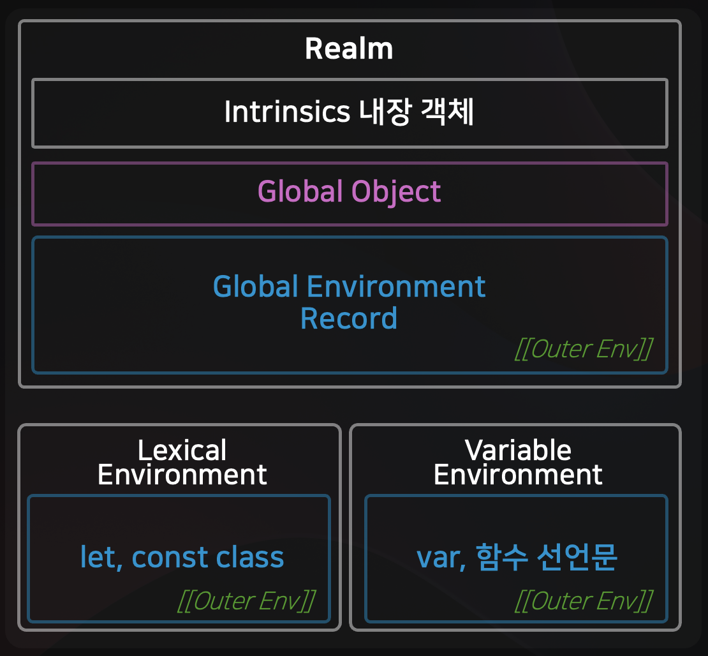
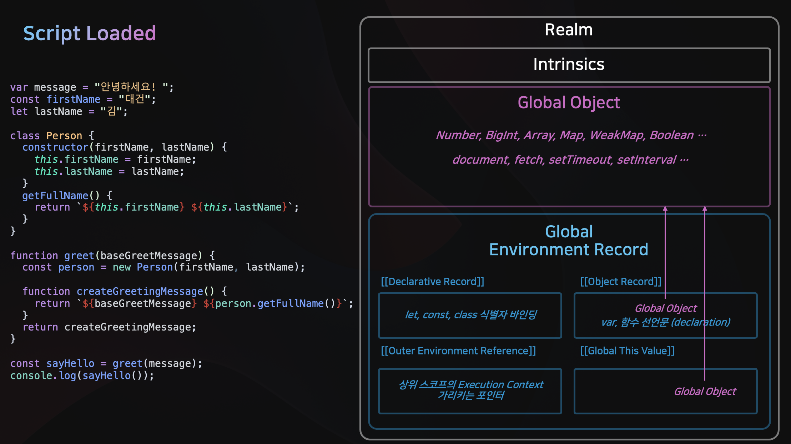
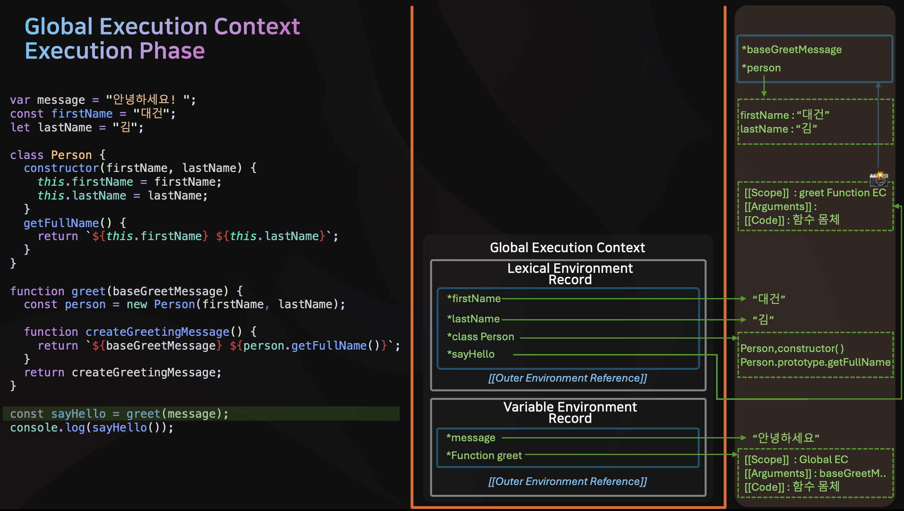
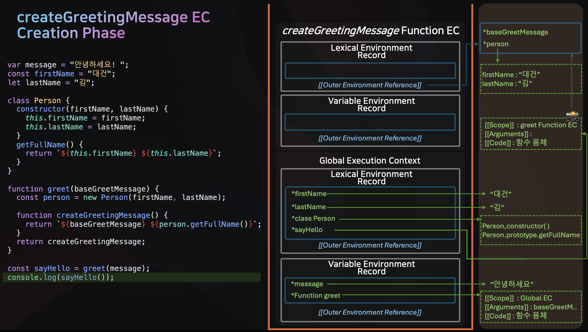
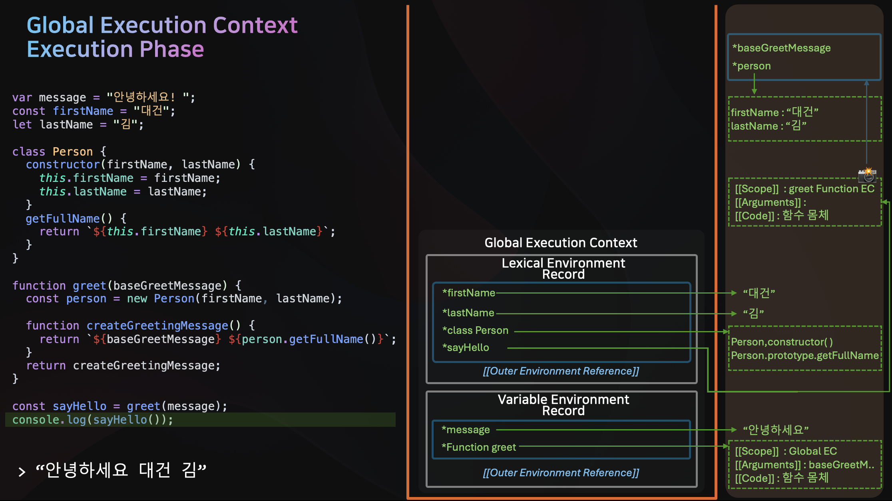

## 🤔 Recap

이전 글에서는 [JavaScript 실행 컨텍스트의 개념과 구성요소, Creation Phase와 Execution Phase](../js-execution-context-part1/)에 대해 알아보았습니다. <br />

다시 한번 정리하자면,

<center>
    
</center>

실행 컨텍스트는

> 1. JavaScript 코드가 Isolate 하게 실행되는 환경을 가리키는 **Realm**
> 2. `let`, `const`, `class`, `함수표현식` 을 위한 식별자 바인딩을 저장하는 **Lexical Environment**
> 3. `var`, `함수선언문` 을 위한 식별자 바인딩을 저장하는 **Variable Environment**

으로 구성되어 있고,

> 1. 스크립트가 실행되거나,
> 2. 함수가 호출되거나,
> 3. 모듈이 로드될때,
> 4. `eval()` 함수가 호출될 때

실행컨텍스트가 생성 (Creation Phase) 되며, Lexical Environment와 Variable Environment가 생성되고, <br/>
식별자를 스캔하여 메모리 공간을 예약합니다. (이때, Hoisting 이 발생합니다) <br/>

## 🔎 예제로 알아보는 실행컨텍스트의 동작원리

이번 글에서는 간단한 예제코드를 바탕으로 실행 컨텍스트가 어떻게 생성되고, 식별자를 찾는 과정, 클로저와 호이스팅이 어떻게 동작하는지 단계별로 시각화해보겠습니다. <br />

```javascript
var message = "안녕하세요! ";
const firstName = "대건";
let lastName = "김";

class Person {
    constructor(firstName, lastName) {
        this.firstName = firstName;
        this.lastName = lastName;
    }
    getFullName() {
        return `${this.firstName} ${this.lastName}`;
    }
}

function greet(baseGreetMessage) {
    const person = new Person(firstName, lastName);

    function createGreetingMessage() {
        return `${baseGreetMessage} ${person.getFullName()}`;
    }
    return createGreetingMessage;
}

const sayHello = greet(message);
console.log(sayHello()); // "안녕하세요! 대건 김"
```

### 1. Script Loaded

<center>
    
</center>

가장 먼저 스크립트가 로드되면, **Realm** 이 생성됩니다. <br />
내장객체 (Intrinsics) 와 전역객체 (Global Object) 가 생성되고, <br />

`Global Environment Record` 에는 <br/>
`[[Declarative Record]]` `[[Object Record]]` `[[Global This]]` `[[Outer Env Reference]]` 슬롯이 생성됩니다. <br />

현재 스크립트가 최초로 로드되었으므로, <br/>
**Realm** 의 `[[Outer Env Reference]]` 슬롯은 `null` 을 참조합니다. <br />
(즉, 외부 Environment Record 가 없으므로)

### 2. Global Execution Context - Creation Phase

Realm 이 생성되면, **Global Execution Context** 가 생성(Creation Phase)됩니다. <br />

<center>
    
</center>

Global Execution Context 의 `Lexical Environment` 는 Realm 의 `Global Environment Record` 의 `[[Declarative Record]]` 슬롯을 참조합니다. <br />

`Variable Environment` 는 Realm 의 `Global Environment Record` 의 `[[Object Record]]` 슬롯을 참조합니다. <br />

<br />
<br />

Creation Phase 에서는 식별자들을 스캔하여 메모리 공간을 예약합니다.

<center>
    
</center>

> 1. `message` : `var` 키워드로 선언되었으므로, `Variable Environment Record` 에 등록되고 `undefined` 로 초기화됩니다. <br />
> 2. `firstName` : `const` 키워드로 선언되었으므로, `Lexical Environment Record` 에 등록되고 `Temporal Dead Zone(TDZ)` 상태가 됩니다. <br/>(이때 변수에 접근시 Reference Error 발생) <br />
> 3. `lastName` : `let` 키워드로 선언되었으므로, `Lexical Environment Record` 에 등록되고 `Temporal Dead Zone(TDZ)` 상태가 됩니다. <br/>(이때 변수에 접근시 Reference Error 발생) <br />
> 4. `Person` : `class` 키워드로 선언되었으므로, `Lexical Environment Record` 에 등록되고 `Temporal Dead Zone(TDZ)` 상태가 됩니다. <br/>(이때 변수에 접근시 Reference Error 발생) <br />
> 5. `greet` : `function declaration` 으로 선언되었으므로, `Variable Environment Record` 에 등록되고 **‼️함수객체가 Heap 영역에 생성된 뒤 곧바로 바인딩‼️** 됩니다. <br />
> 6. `sayHello` : `const` 키워드로 선언되었으므로, `Lexical Environment Record` 에 등록되고 `Temporal Dead Zone(TDZ)` 상태가 됩니다. <br/>(이때 변수에 접근시 Reference Error 발생) <br />

### 3. Global Execution Context - Execution Phase

<center>
    
</center>

Creation Phase 가 끝나면, 실제 코드가 실행되는 **Execution Phase** 가 실행됩니다 <br />
생성된 Global Execution Context 는 콜스택에 쌓이고, 실행됩니다.

<center>
    
</center>

> 1. `message` : "안녕하세요! " 문자열이 Heap 영역에 생성되고, `message` 변수는 해당 값을 가리킵니다. <br />
> 2. `firstName` : "대건" 문자열이 Heap 영역에 생성되고, `firstName` 변수는 해당 값을 가리킵니다. <br />
> 3. `lastName` : "김" 문자열이 Heap 영역에 생성되고, `lastName` 변수는 해당 값을 가리킵니다. <br />
> 4. `Person` : Person 클래스의 생성자 함수와 `getFullName` 메서드가 Heap 영역에 생성되고, `Person` 의 프로토타입 체인에 연결됩니다. <br />
> 5. `greet` : `greet` 함수는 Creation Phase 에서 이미 Heap 영역에 생성되었으므로 건너뜁니다 <br/>
> 6. `sayHello` : `greet` 함수가 호출되기 전까지는 `Temporal Dead Zone(TDZ)` 상태입니다. <br />

<br />

여기서, `sayHello` 초기화를 위해 `greet` 함수가 호출되면, 새로운 **Function Execution Context** 가 생성됩니다. <br />
Function Execution Context 또한 Creation Phase 와 Execution Phase 를 거칩니다.

### 4. greet Function Execution Context - Creation Phase

<center>
    
</center>

`greet` 함수가 호출되기위해 **greet Function Execution Context** 의 Creation Phase 가 시작됩니다. <br />

> 1. `baseGreetMessage` : `[[Parameter]]` (또는 `[[Arguments]]`) 슬롯으로부터 `baseGreetMessage` 에 대한 식별자 바인딩이 `Lexical Environment Record`에 생성됩니다. (단, 함수의 파라미터는 Creation Phase 에서 즉시 인수값으로 초기화됩니다) <br />
> 2. `person` : `const` 키워드로 선언되었으므로, `Lexical Environment Record` 에 등록되고 `Temporal Dead Zone(TDZ)` 상태가 됩니다. (이때 변수에 접근시 Reference Error 발생) <br />
> 3. `createGreetingMessage` : 함수 선언문이므로, greet Function Execution Context 의 `Variable Environment` 에 등록되고, `createGreetingMessage` 함수 객체가 Heap 영역에 생성됩니다. <br /> 이때, `createGreetingMessage` 함수의 `[[Scope]]`(또는 ES6 `[[Environment]]`) 슬롯은 `greet` 함수의 Lexical Environment 를 참조합니다. (‼️ 클로저 생성 ‼️) <br />
> 4. `[[Outer Env Reference]]` : `greet` 함수의 `Lexical Environment` 의 `[[Outer Env Reference]]` 는 상위 스코프인 `Global Execution Context` 의 `Lexical Environment` 를 참조합니다. <br />

## 5. greet Function Execution Context - Execution Phase

`greet` 함수의 Execution Context Creation Phase 가 끝났으므로, 콜스택에 쌓이고, Execution Phase 가 시작됩니다. <br />

<center>
    
</center>

> 1. `person` : `new Person(firstName, lastName)` 를 통해 `Person` 클래스의 인스턴스가 생성되고, `person` 변수는 해당 인스턴스를 가리킵니다. <br />
>
> &nbsp;&nbsp; **‼️ 스코프 체이닝 : 식별자를 찾는 과정 ‼️** <br/> &nbsp;&nbsp; 1️⃣`firstName` 과 `lastName` 식별자는 현재 `greet` 함수의 `Lexical Environment` 에 존재하지 않으므로, <br /> &nbsp;&nbsp; 2️⃣`greet` 함수의 `Lexical Environment` 의 `[[Outer Env Reference]]` 슬롯을 통해 **상위 Lexical Environment** 인 <br /> &nbsp;&nbsp; `Global Execution Context` 의 `Lexical Environment` 로 올라갑니다. <br /> &nbsp;&nbsp; 3️⃣`Global Execution Context` 의 `Lexical Environment` 에서 `firstName` 과 `lastName` 을 찾을 수 있으므로, <br /> &nbsp;&nbsp; `firstName` 과 `lastName` 은 각각 "대건" 과 "김" 으로 초기화됩니다. <br />
>
> 2. `return createGreetingMessage` : Heap 영역에 생성된 `createGreetingMessage` 함수 객체를 반환합니다. <br />

### 6. Global Execution Context - Execution Phase (계속)

<center>
    
</center>

`greet` 함수의 Execution Phase 가 끝나고, `sayHello` 변수에 `createGreetingMessage` 함수 객체가 바인딩됩니다. <br />
`console.log(sayHello())` 를 통해 `sayHello` 함수가 호출되면, 새로운 **Function Execution Context** 가 생성됩니다. <br />

### 7. createGreetingMessage Function Execution Context - Creation Phase

<center>
    
</center>

`createGreetingMessage` 함수가 호출되기위해 **createGreetingMessage Function Execution Context** 의 Creation Phase 가 시작됩니다. <br />

`createGreetingMessage` 함수의 `Lexical Environment` 는 `greet` 함수의 `Lexical Environment` 를 참조합니다. (‼️ 4-3 에서 생성된 Closure) <br />
이를 통해 `baseGreetMessage` 와 `person` 식별자에 접근할 수 있습니다. <br />

## 8. createGreetingMessage Function Execution Context - Execution Phase

`createGreetingMessage` 함수의 Execution Context Creation Phase 가 끝났으므로, 콜스택에 쌓이고, Execution Phase 가 시작됩니다. <br />

<center>
    
</center>

> 1. `baseGreetMessage` : (‼️ 4-3 에서 생성된 Closure 를 통해) `greet` 함수의 `Lexical Environment` 에 접근하여, `baseGreetMessage` 는 "안녕하세요! " 가 됩니다 <br/>
> 2. `person` : (‼️ 4-3 에서 생성된 Closure 를 통해) `greet` 함수의 `Lexical Environment` 에 접근하여, `person` 은 `Person` 클래스의 인스턴스를 가리킵니다. <br />
> 3. ``return \`${baseGreetMessage} ${person.getFullName()}\`` : `getFullName` 메서드를 호출하여, `person` 인스턴스의 `firstName` 과 `lastName` 을 가져와서, <br /> `${baseGreetMessage} ${person.getFullName()}` 를 반환합니다. <br />

`console.log(sayHello())` 에서 `createGreetingMessage` 함수가 반환한 값은 "안녕하세요! 대건 김" 이 됩니다. <br />

### 9. Global Execution Context - Execution Phase (계속)

<center>
    
</center>

> 1. `console` : `console` 식별자를 찾기위해 Global Execution Context 의 `Lexical Environment` 를 참조하고, 이는 Global Object 를 참조합니다. <br />
> 2. `log` : `console` 식별자에 바인딩된 Global Object 의 `log` 메서드를 호출합니다. <br />
> 3. `sayHello()` : `createGreetingMessage` 함수가 반환한 값인 "안녕하세요! 대건 김" 을 인자로 전달합니다. <br />
> 4. `console.log(sayHello())` : "안녕하세요! 대건 김" 이 콘솔에 출력됩니다. <br />

## 📝 마무리

다시한번 정리하자면,

1. 실행 컨텍스트는 JavaScript 의 독립된 실행환경인 **Realm** <br/>
   &nbsp;&nbsp; `let`, `const`, `class` 식별자 바인딩이 저장되는 **Lexical Environment** <br/>
   &nbsp;&nbsp; `var`, `함수 선언문`에 대한 식별자 바인딩이 저장되는 **Variable Environment** <br/>
   &nbsp;&nbsp; 로 구성됩니다

2. 실행컨텍스트는 스크립트 로드, 함수 실행시 식별자를 등록하고 메로리를 예약하는 **Creation Phase**와 <br/>
   &nbsp;&nbsp; 실제 코드가 실행되는 **Execution Phase** 를 거친다
   &nbsp;&nbsp; 이때, Creation Phase 에서 **‼️호이스팅‼️** 이 발생한다

3. Environment Record 는 상위 실행 컨텍스트의 Environment Record 를 가리키는 **[[Outer Environment Reference]]** 가 존재한다

4. Execution Phase 에서 현재 실행컨텍스트의 Environment Record 에서 식별자를 찾고, <br/>
   &nbsp;&nbsp; 존재하지 않는 경우 **[[Outer Environment Reference]]** 를 통해 상위 실행컨텍스트에서 식별자를 찾는다 (‼️스코프 체인‼️)

5. 함수 내부에 다른 함수가 정의된 경우, 내부 함수의 Environment Record 는 <br/>
   &nbsp;&nbsp; 상위 함수 실행 컨텍스트의 Environment Record 를 캡쳐하고, [[Outer Environment Reference]] 로 참조한다
   &nbsp;&nbsp; 이를 통해, 내부 함수는 상위함수의 Environment Record 에 접근 가능하다 (‼️클로저‼️)
