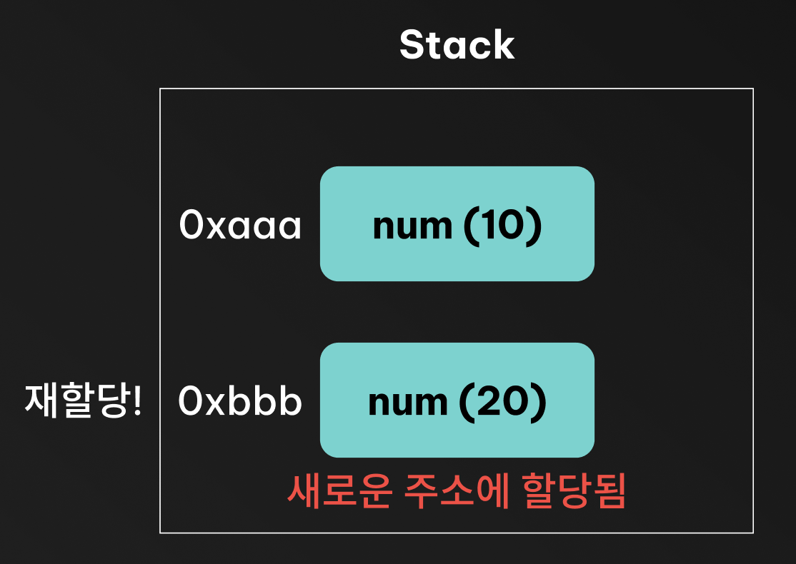
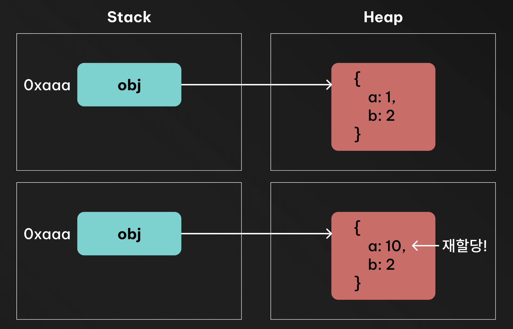

```ts
// ❌ 가변 (배열 자체 변경)
const arr = [1, 2, 3];
arr.push(4); // arr === [1,2,3,4]

// ✅ 불변 (새 배열 생성)
const arr = [1, 2, 3];
const newArr = [...arr, 4]; // arr는 그대로 [1,2,3]
```

리액트를 처음 배우게 되면, 배열이나 객체의 상태를 변경할때 직접 변경하는것이 아니라 복사본을 만들어서 변경해야 한다는 말을 자주 듣게 됩니다. <br/>
그러면서 가장 처음 접하게 되는 개념이 바로 **불변성(Immutability)** 입니다. <br/>

## 🫨 불변성(Immutability) 란?

불변성은 데이터가 한 번 만들어지고나서는 직접 변경되지 않는 성질을 말합니다.
즉, 어떤 값이 불변성을 가진다면 그 값은 생성된 이후로는 변경되지 않고, 변경이 필요할 때는 기존 값을 복사하여 새로운 값을 만들어내는 방식을 의미합니다.

불변성은 단순히 코드스타일의 문제가 아니라, `데이터의 일관성`과 `예측 가능성`을 높여줍니다. <br/>

> 1. `예측 가능한 상태 관리` :
>    불변성을 유지하면, 데이터가 한 번 정해진 후에는 변경되지 않기 때문에, 언제 값이 바뀌었는지 명확히 추적할 수 있습니다
> 2. `Side Effect 방지` :
>    동일한 객체를 여러 곳에서 참조할 때, 한 곳에서 변경이 일어나면 다른 곳에도 영향을 미칠 수 있습니다. 불변성을 유지하면 이러한 부작용을 방지할 수 있습니다.
> 3. `효율적인 변경 감지` :
>    불변성을 유지하면, 이전의 상태를 그대로 남겨둘 수 있기 때문에, 상태를 되돌리거나 기록하기 쉬워집니다

## 🧐 자바스크립트에서 불변성 다루기

자바스크립트에서는 크게 두 가지 데이터 타입, `원시 타입(Primitive Type)`과 `참조 타입(Reference Type)`이 있습니다. <br/>

- 원시 타입: `string, number, boolean, null, undefined, symbol, bigint`
- 참조 타입: `object, array, function`

> 4.5절 "값의 할당" 에서 살펴보았듯이 원시 값을 할당한 변수에 새로운 원시값을 재할당하면, 메모리 공간에 저장되어 있는 재할당 이전의 원시 값을 변경하는 것이 아니라 새로운 메모리 공간을 확보하고 재할당한 원시 값을 저장한 후, 변수는 새롭게 재할당한 원시 값을 가리킨다. 이때 변수가 참조하던 메모리 공간의 주소가 바뀐다. <br/>
> 하지만 원시 값은 변경 불가능한 값이기 때문에 값을 직접 변경할 수 없다. 따라서 변수 값을 변경하기 위해 원시 값을 재할당하면 새로운 메모리 공간을 확보하고 재할당한 값을 저장한 후, 변수가 참조하던 메로리 공간의 주소를 변경한다. 값의 이러한 특성을 불변성(immutability)이라 한다. <br/>
> 《모던 자바스크립트 딥다이브》 11장 값의 비교

### 원시 타입 (Primitive Type) - 불변성

신기하게도 자바스크립트의 `원시 타입`은 기본적으로 `불변성`을 가집니다. <br/>

```ts
let num = 10;
num = 20; // ✅ 새로운 숫자 재할당
console.log(num); // 20
```



```ts
let str = "hello";
str[0] = "H"; // ❌ 불가능
console.log(str); // "hello"

str = "Hello"; // ✅ 새로운 문자열 재할당
console.log(str); // "Hello"
```

::: details ⁉️ 실제로는 원시 타입의 값은 Stack 에 저장되지 않을 수도 있습니다
자바스크립트 엔진은 성능 최적화를 위해 원시 타입의 값을 반드시 스택 메모리에 저장하지 않을 수도 있습니다. <br/>
V8 엔진의 경우 SMI(Small Integer), 작은 정수는 스택에 저장하지만, 큰 정수나 문자열 같은 경우 힙 메모리에 저장할 수도 있습니다. <br/>
:::

### 참조 타입 (Reference Type) - 가변성

반면에 `참조 타입`은 기본적으로 `가변성(Mutability)`을 가집니다. <br/>

```ts
const obj = { a: 1, b: 2 };
obj.a = 10; // ✅ 내부 프로퍼티 변경
console.log(obj); // { a: 10, b: 2 }
```



```ts
const user = { name: "Alice", age: 25 };
const copyOfUser = user; // 참조 복사

copyOfUser.age = 26; // ✅ 내부 프로퍼티 변경
console.log(user.age); // 26 (원본 객체도 변경됨)
```

참조 타입의 변수는 힙 메모리에 저장된 객체의 참조(주소)를 가리키고 있기 때문에, <br/>
위 예시에서 `user` 와 `copyOfUser` 는 동일한 객체를 가리키고 있습니다. <br/>
따라서 `copyOfUser` 의 내부 프로퍼티를 변경하면, `user` 객체도 영향을 받게 됩니다. <br/>

참조 타입은 하나의 값 (주소)를 여러 변수가 공유할 수 있고, <br/>
기본적으로 가변성을 가지기 때문에, 불변성을 지키지 않으면 의도치 않은 SideEffect 가 발생할 수 있습니다.

## ⚛️ React 와 불변성

React 는 상태가 변경될 때 재렌더링이 트리거됩니다.
이때 값의 내용이 아니라 참조(주소) 가 바뀌었는지를 기준으로 변경 여부를 판단합니다. <br/>

```ts
// ❌ 잘못된 예시 (불변성 위반)
const [user, setUser] = useState({ name: "Tom", age: 20 });

user.age = 21;
setUser(user); // React는 같은 참조라고 판단 → 렌더링 안 됨
```

```ts
Object.is(prevState, nextState); // === 참조 비교
```

내부적으로는 대략 이런식으로 비교가 일어납니다. <br/>
참조가 동일하면 React 는 상태가 변경되지 않았다고 판단하고, 재렌더링이 일어나지 않습니다.

```ts
// ✅ 올바른 예시 (불변성 유지)
const [user, setUser] = useState({ name: "Tom", age: 20 });
setUser({ ...user, age: 21 }); // 새로운 객체 생성
```

## ✍️ 정리!

1. 식별자는 스택에 저장된다.
    - 변수명과 해당 변수가 가리키는 값의 참조(주소)가 스택 프레임에 저장된다
    - 예를들어 `const obj = {}` 라면 `obj` 라는 식별자는 스택에 저장되고, `{}` 객체는 힙 메모리에 저장된다
2. 원시 값은 스택에 직접 저장된다
    - 원시값은 불변(immutable)하기 때문에, 재할당시 기존 값을 바꾸는 것이 아니라, 새로운 메모리 공간을 확보하고 새 값을 저장한다.
    - 때문에 참조 주소가 바뀜으로 값을 변경하는 것이 아니라 새로운 값을 가리키게 된다
3. 참조 값은 힙에 저장된다
    - 객체, 배열, 함수 등의 참조 타입은 힙에 실제 데이터가 저장된다
    - 스택에는 그 힙 객체의 참조만 저장된다
4. 참조 타입은 내부 프로퍼티를 바꿀 수 있다 (가변성)
    - 힙 메모리에 있는 실제 객체 내용을 변경할 수 있으므로, 참조는 그대로인데 내부 데이터가 달라진다
5. 하지만, React 에서는 참조 타입도 불변성을 지켜야 한다.
    - React 는 상태 변경을 감지하기 위해 얕은 비교(shallow comparison, `===`)를 사용한다
    - 참조 타입의 내부 프로퍼티를 직접 변경하면, 참조 주소는 그대로이기 때문에 React 가 변경을 감지하지 못한다
    - 따라서, 참조 타입도 불변성을 지켜서 새로운 객체나 배열을 생성하여 상태를 업데이트 해야 한다

> 오늘의 TIL:  
> "React의 렌더링은 값이 바뀌었을 때 일어나는 게 아니라,  
> **새로운 값이 생겼을 때** 일어난다."
> 변수는 언제든 바뀔 수 있지만, 한번 만들어진 값 자체는 변하지 않는다
