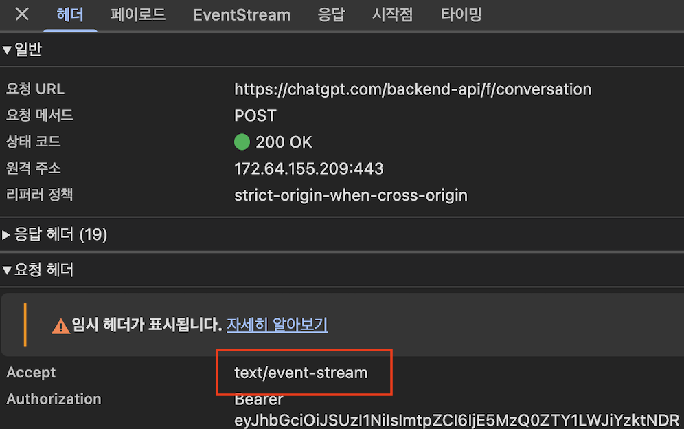
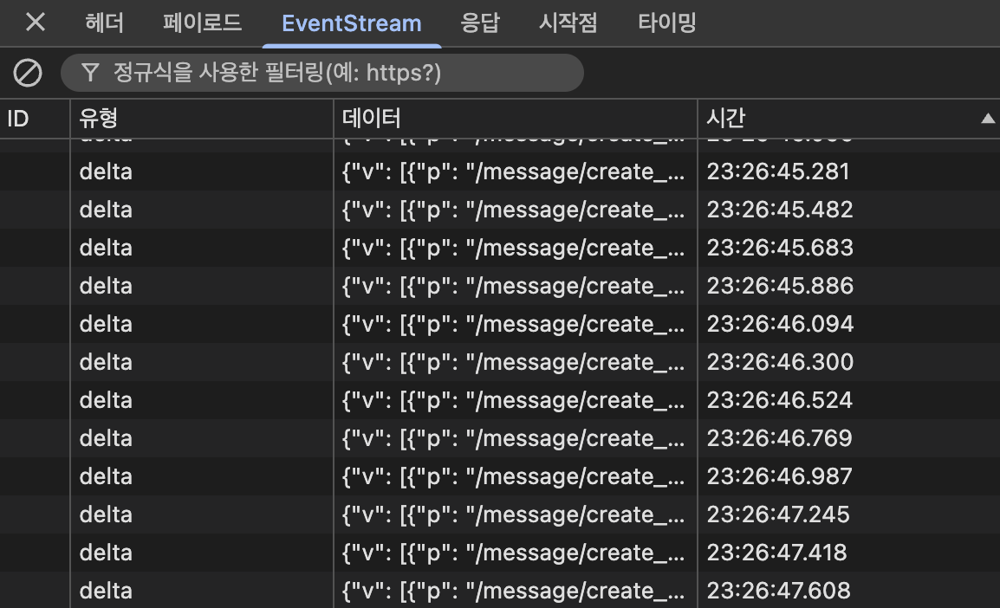
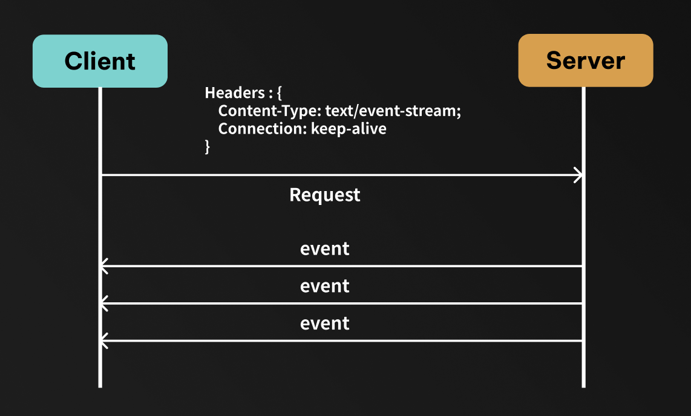

GPT, Gemini, Claude 등 다양한 LLM 모델들이 등장하면서, 이 모델들과 상호작용하는 방법도 다양해지고 있습니다. 특히, 서버에서 클라이언트로 실시간으로 데이터를 푸시하는 `Server Sent Events (SSE)` 는 LLM 의 스트리밍 응답을 처리하는데 유용한 기술입니다.

<div style="display:flex">


</div>

그렇다면 먼저 `Server Sent Events` 는 뭔지 알아보겠습니다

## ⚡️ Server Sent Events (SSE) 란?

> Server Sent Events(SSE) 는 서버가 클라이언트(브라우저)에 단방향으로 지속적으로 데이터를 push 할 수 있게 해주는 기술

<center>

</center>

SSE 는 HTTP 프로토콜을 기반으로 하고, 클라이언트가 서버에 연결을 열면 서버는 이벤트 스트림을 통해 데이터를 지속적으로 전송할 수 있습니다. 클라이언트는 `EventSource` API 나 `fetch` API 를 사용하여 SSE 스트림에 연결할 수 있습니다.

:::warning 실시간 데이터 전송에 SSE 가 최선일까? 단점은 없을까?

Chrome 브라우저 기준으로 동일한 도메인에 대해 최대 `6개` 의 HTTP 연결을 허용합니다. <br/>
SSE 는 `keep-alive` 를 통해 연결을 지속적으로 유지하기 때문에, SSE 연결이 많아지면 다른 요청에 영향을 줄 수 있습니다. <br/>
(단, HTTP/2 에서는 멀티플렉싱을 지원해주기 때문에 그나마 덜한 편입니다)

:::

| 헤더                                     | 역할                                     |
| ---------------------------------------- | ---------------------------------------- |
| `Content-Type: text/event-stream`        | 이 응답이 **SSE 스트림**임을 명시        |
| `Cache-Control: no-cache`                | 중간 프록시/브라우저에서 **캐싱 방지**   |
| `Connection: keep-alive` (주로 HTTP/1.1) | 연결을 **끊지 않도록 유지**              |
| **(HTTP/2일 경우 프레이밍 자동 처리)**   | chunked 없이도 **스트림 단위 전송 지원** |

### 😙 SSE 예시

Express 서버에서 간단한 SSE 는 다음과 같이 구현할 수 있습니다.

```js
app.get("/stream", (req, res) => {
    res.setHeader("Content-Type", "text/event-stream");
    res.setHeader("Cache-Control", "no-cache");
    res.setHeader("Connection", "keep-alive");

    let index = 0;

    const intervalId = setInterval(() => {
        res.write(`data: 메시지 ${index++}\n\n`);

        if (index >= 5) {
            clearInterval(intervalId);
            res.end();
        }
    }, 1000);
});
```

클라이언트에서는 [`EventSource`](https://developer.mozilla.org/en-US/docs/Web/API/EventSource) API 를 사용해 SSE 스트림에 연결할 수 있습니다.

```js
const eventSource = new EventSource("/stream");

eventSource.onmessage = (event) => {
    console.log("서버로부터 메시지 수신:", event.data);
};
```

또는 `fetch` API 를 사용하여 SSE 스트림을 처리할 수도 있습니다.

```js
async function fetchSSE(url) {
    const response = await fetch(url);
    const reader = response.body.getReader();
    const decoder = new TextDecoder("utf-8");

    while (true) {
        const { done, value } = await reader.read();
        if (done) break;

        const chunk = decoder.decode(value, { stream: true });
        console.log("서버로부터 메시지 수신:", chunk);
    }
}
```

:::details 🤔 두 방식의 차이점이 뭔데 ?

| 기능                 | `fetch` + `ReadableStream`       | `EventSource`                                      |
| -------------------- | -------------------------------- | -------------------------------------------------- |
| 연속적인 데이터 읽기 | `reader.read()` 루프 필요        | `onmessage` 로 자동으로 연결유지 및 데이터 전달    |
| SSE 데이터 파싱      | `data:`, `event:` 직접 파싱 필요 | 브라우저가 자동으로 파싱하여 `message` 이벤트 발행 |
| 자동 재연결          | 직접 구현 필요                   | 기본적으로 자동 재연결                             |
| HTTP 헤더 설정       | 가능                             | 불가능 (인증토큰 붙이는 등에 제약)                 |

:::

## 🧐 프론트엔드에서 이걸 어떻게 함수로 추상화할까 ?

보통 프론트엔드를 개발하면서 API를 `Promise` 를 리턴하는 함수로 추상화하여 사용하는 경우가 많습니다. <br/>
이 함수는 **한 번만 응답**을 받고 끝내기 때문에 `Promise` 하나만 리턴하는 함수로 충분합니다.

```js
export async function getUserById(userId) {
    const response = await fetch(`/api/users/${userId}`);
    if (!response.ok) throw new Error("사용자 정보를 불러오는데 실패했습니다.");
    return response.json();
}
```

### ❌ Promise 로는 SSE 스트림을 다룰 수 없다!

그렇다면 `Promise` 로 SSE 스트림을 다룰 수 있을까요?

SSE 는 **응답이 끝나지 않고**, 여러번 데이터(이벤트)를 지속적으로 받습니다. <br/>
그래서 아래처럼 SSE 를 `Promise` 로 감싸면 문제가 생깁니다

```js
async function subscribeServerSentEvents() {
    const response = await fetch("/api/stream", {
        headers: { Accept: "text/event-stream" },
    });

    // ❌ response.json() 같은걸 할 수 없음
    // Stream 이 끝나지 않아 Promise 가 끝까지 Resolve 되지 않거나
    // 한번만 읽고 끝나버림
}
```

결국 SSE Stream 은 값 하나를 돌려주는 함수가 아니라, <br/>
값들이 여러번 도착하는 특정을 갖는다는 점에서 `Promise` 로는 다룰 수 없습니다.

## ✅ Async Generator 로 SSE 스트림 다루기

그렇다면 SSE 스트림을 어떻게 함수로 추상화할 수 있을까요? <br/>
결론부터 말하자면 `Async Generator` 를 사용하면 됩니다!

### 🤨 Generator 가 뭔데 ?

`Generator` 는 함수의 실행을 중간에 멈췄다가 다시 재개할 수 있는 특별한 함수입니다. <br/>
`function*` 키워드로 정의하고, `yield` 키워드를 사용하여 값을 하나씩 반환합니다.

```js
function* generator() {
    yield 1;
    yield 2;
    yield 3;
}

const gen = generator();
console.log(gen.next()); // { value: 1, done: false }
console.log(gen.next()); // { value: 2, done: false }
console.log(gen.next()); // { value: 3, done: false }
console.log(gen.next()); // { value: undefined, done: true }
```

이렇게 `Generator` 는 값을 하나씩 순차적으로 반환할 수 있고, <br/>
함수의 실행 흐름을 외부에서 제어할 수 있다는 장점이 있습니다.

:::info TODO
여기에 Generator 관련 포스트 링크 걸기
대충안에 generator, iterator, iterable 내용 정리하기
symbol.iterator 내용 추가하기 (symbol.asynciterator 도 ??)
:::

### 😎 Generator 의 비동기 버전 - Async Generator

Async Generator 는 Generator 의 비동기 버전입니다.

```js
async function* asyncGenerator() {
    yield await Promise.resolve(1);
    yield await Promise.resolve(2);
    yield await Promise.resolve(3);
}

for await (const value of asyncGenerator()) {
    console.log(value);
}
// 출력:
// 1
// 2
// 3
```

`yield` 하는 값이 `Promise` 여도 알아서 기다려주고, <br/>
사용하는 곳에서는 `for await ... of` 문으로 비동기 Iterable 을 순회할 수 있습니다.

| 기능                         | Promise | Generator | Async Generator |
| ---------------------------- | ------- | --------- | --------------- |
| 값이 여러 번 도착            | ❌      | ⭕️        | ⭕️              |
| 값이 비동기로 도착           | ⭕️      | ❌        | ⭕️              |
| `for await ... of` 반복 처리 | ❌      | ❌        | ⭕️              |

이러한 특성 덕분에, SSE 스트림 같은 `여러 번 + 비동기` 상황에서 Async Generator 가 딱 맞습니다!

<br/>

## 🚀 SSE 를 Async Generator 로 구현하기

저 역시 종합설계프로젝트2에서 이미지 생성 과정을 실시간으로 사용자에게 보여주는 기능을 구현했습니다. <br/>
이때 SSE 스트림을 Async Generator 로 추상화하여 깔끔하게 처리할 수 있었습니다.

실제로 구현했던 이미지 생성 스트림 API 를 예시로, 어떻게 Async Generator 패턴을 적용할 수 있는지 살펴보겠습니다.

:::details 📚 [API 명세] 이미지 생성 — taskId 발급

이미지 생성 요청을 비동기로 등록하고, 스트림으로 상태를 조회합니다.

```http
POST /api/ai/images/generate
```

| Query Param       | Type   | Required | Default | Description     |
| ----------------- | ------ | -------- | ------- | --------------- |
| prompt            | string | o        | -       | 프롬프트        |
| height            | int    | x        | 1536    | 이미지 세로     |
| width             | int    | x        | 1024    | 이미지 가로     |
| guidanceScale     | double | x        | 3.5     | 가이던스 스케일 |
| numInferenceSteps | int    | x        | 20      | 추론 스텝       |
| seed              | int    | x        | 0       | 랜덤 Seed       |

**Response (예시)**

```json
{
    "taskId": "1b3a4647-0e03-4961-8344-5bc150c84b99",
    "message": "이미지 생성 작업이 등록되었습니다."
}
```

:::

:::details 📚 [API 명세] 이미지 생성 상태 스트림 조회

```http
GET /api/ai-images/stream/{taskId}
Accept: text/event-stream
Authorization: Bearer <ACCESS_TOKEN>
```

| Path Param | Type   | Description         |
| ---------- | ------ | ------------------- |
| taskId     | string | 이미지 생성 작업 ID |

**SSE Message Format(예시)**

```text
id:40d1de7b
event:image-generation
data:{"taskId":"...","status":"UPLOADING","message":"S3 업로드 중","progress":90,"timestamp":"2025-11-23T19:25:00.986Z"}

id:6d999191
event:image-generation
data:{"taskId":"...","status":"COMPLETED","message":"완료","progress":100,"imageUrl":"https://...png","timestamp":"2025-11-23T19:25:01.071Z"}
```

:::

### 1️⃣ 이미지 생성 요청 함수 구현하기

```ts
export async function generateImage(request: GenerateImageRequest) {
    const response = await api.post<GenerateImageResponse>(
        "/api/ai/images/generate",
        {},
        { params: request },
    );
    return response.data;
}
```

이미지 생성 작업을 서버에 등록하고, `taskId` 를 발급받는 함수입니다. <br/>
`taskId` 로 이후에 SSE 스트림을 구독할 수 있습니다.

### 2️⃣ 이미지 생성 상태 스트림 함수 구현하기 (Async Generator)

```ts
export async function* generateImageStream(
    taskId: string,
): AsyncGenerator<GenerateImageStreamResponse> {
    const { accessToken } = useAuthStore.getState();

    const response = await fetch(API_BASE_URL + `/api/ai-images/stream/${taskId}`, {
        method: "GET",
        headers: {
            Accept: "text/event-stream",
            Authorization: `Bearer ${accessToken}`,
        },
    });

    if (!response.ok || !response.body) throw new Error("SSE 스트림 연결에 실패했습니다");

    const reader = response.body.getReader();
    const decoder = new TextDecoder("utf-8");

    let buffer = "";

    while (true) {
        const { value, done } = await reader.read();
        if (done) break;

        buffer += decoder.decode(value, { stream: true });

        // 이중 개행 기준으로 이벤트 블록 분리
        const events = buffer.split("\n\n");
        buffer = events.pop() ?? "";

        for (const eventText of events) {
            const lines = eventText.split("\n");

            for (const line of lines) {
                if (line.startsWith("data:")) {
                    const json = line.replace("data:", "").trim();

                    const parsed: GenerateImageStreamResponse = JSON.parse(json);
                    yield parsed;
                    // yield 로 이벤트를 외부에 전달

                    if (parsed.status === "COMPLETED") return;
                    // 완료 이벤트 수신 시 종료
                }
            }
        }
    }
}
```

SSE 스트림을 구독해서 서버에서 보내주는 진행 상태 이벤트를 `yield` 를 통해 한 번에 하나씩 전달하는 `Async Generator` 함수입니다. <br/>
`for await ... of` 를 사용하여 순차적으로 이벤트를 사용할 수 있습니다

### 3️⃣ React Hook 으로 통합하기

React 18부터 도입된 Automatic Batching 때문에, 비동기 작업 내에서 발생한 여러 개의 `setState` 호출은 성능 최적화를 위해 하나의 렌더링으로 묶여(Batch) 처리됩니다.

따라서, 스트림에서 이벤트를 수신할 때마다 상태를 업데이트하려면 [`flushSync`](https://ko.react.dev/reference/react-dom/flushSync) 를 사용하여 각 상태 업데이트가 즉시 반영되도록 해야 합니다.

```ts
export const useGenerateImage = () => {
    const [isPending, setIsPending] = useState<boolean>(false);
    const [event, setEvent] = useState<GenerateImageStreamResponse | null>(null);
    const [error, setError] = useState<Error | unknown>(null);

    const generate = async (request: GenerateImageRequest) => {
        setIsPending(true);

        try {
            const { taskId } = await generateImage(request);
            for await (const streamEvent of generateImageStream(taskId)) {
                // ⚠️ 이벤트 수신 시마다 flushSync 로 상태 업데이트 강제 실행
                flushSync(() => {
                    setEvent(streamEvent);
                });
            }
        } catch (e) {
            setError(e);
        } finally {
            setIsPending(false);
        }
    };

    return { isPending, event, error, generate };
};
```

### 4️⃣ 컴포넌트에서 사용하기

이제 컴포넌트에서 `useGenerateImage` 훅을 사용하여 이미지 생성 스트림을 처리할 수 있습니다.

```tsx
const ImageGeneratorComponent = () => {
    const { isPending, event, error, generate } = useGenerateImage();

    const handleGenerateClick = () => {
        generate({ prompt: "귀여운 아기고양이 사진" });
    };

    return (
        <div>
            <button onClick={handleGenerateClick} disabled={isPending}>
                이미지 생성
            </button>

            
        </div>
    );
};
```
