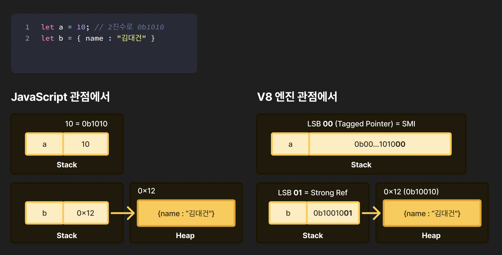

:::warning
아직 작성중이거나 검토중인 글입니다. 내용이 부정확하거나 변경될 수 있습니다
:::

## 🤔 JavaScript 값은 어디에 저장되나? (힙 or 스택)

JavaScript에서는 숫자, 문자열, 불리언, 객체 등 다양한 값을 다룰 수 있습니다.  
일반적인 언어 지식에서는 "원시 값은 스택에 저장되고, 객체는 힙에 저장된다"고 배웁니다.

하지만 스택에는 고정된 크기의 메모리에 데이터를 저장하게되는데, <br />
그렇다면 런타임에 타입이 결정되는 JavaScript 에서는, <br />
크기도 타입도 다양한 값들을 어떻게 고정된 메모리에 저장할 수 있을까요? <br />

또 값을 읽을 때는 어떻게 타입을 구분할까요 ?

이를 이해하기 위해서는 JavaScript 엔진의 메모리 관리 방식을 알아야 합니다.

## 💾 실제로는 JavaScript 의 모든 값은 '힙메모리' 에 저장됩니다

V8 엔진에서는 숫자, 문자열, 객체를 포함해 **모든 값이 힙 메모리에 저장** 됩니다

이를 통해 어떤 값이든 **객체 처럼** 다뤄지고, Garbage Collector (GC) 가 메모리를 효율적으로 관리할 수 있습니다.

> **❓ JavaScript 의 원시값은 스택에 저장되는거 아닌가요?** <br/>
>
> JavaScript 언어 관점에서 원시값은 스택에 저장되고, 객체 배열 등 참조값은 힙에 저장됩니다 <br/>
>
> 여기서 모든 값이 힙에 저장된다는것은 V8 엔진 관점에서의 이야기입니다. <br/>
>
> _정리하자면, JS 의 모든 값은 **객체처럼** 다루어 지며, <br/>
> V8 엔진 입장에서는 어떤 값이든 HeapObject 로 취급될 수 있도록 설계되어있다는 의미입니다 <br/>
> (즉, 값을 '동일한 인터페이스로 다룰 수 있도록' Tagging 구조로 표현한다는 뜻)_

## 🏷️ Tagged Value

V8 엔진에서는 값을 저장할 때, **타입 정보(Tag Bits)** 를 함께 저장합니다.

64비트 슬롯의 **하위 2비트 (LSB, Least Significant Bit)** 를 사용하여 값을 구분합니다.

```cpp
// v8/objects/objects.h

// Tagged<T> represents an uncompressed V8 tagged pointer.
//
// The tagged pointer is a pointer-sized value with a tag in the LSB. The value
// is either:
//
//   * A small integer (Smi), shifted right, with the tag set to 0
//   * A strong pointer to an object on the V8 heap, with the tag set to 01
//   * A weak pointer to an object on the V8 heap, with the tag set to 11
//   * A cleared weak pointer, with the value 11
```

하위 비트만 확인하면 별도의 타입 정보를 찾지 않고도, 해당 값이 정수(SMI)인지, Heap Object 를 가리키는 포인터인지 즉시 알 수 있습니다.

| LSB 값 | 설명                     |
| ------ | ------------------------ |
| 00     | SMI (Small Integer)      |
| 01     | Strong Ref (Heap Object) |
| 10     | Weak Ref (Heap Object)   |

## 🤔 Tag Bits 의 역할

이 `Tag Bits` 는 두가지의 역할을 합니다.

> **1. V8 힙에 있는 객체를 가리키는 포인터인지 (강한참조 / 약한 참조) 구분**
>
> **2. 혹은 작은 정수 (SMI, Small Integer) 인지 구분**

이 덕분에 V8은

작은 정수 (SMI) 는 별도의 Heap Object 를 생성하지 않고, 64비트 스택 슬롯에 직접 값을 저장할 수 있습니다.

> **❓ 어떻게 가능한데 ??** <br/>
> 별도의 V8 실제 힙공간을 할당하지 않고, 스택 슬롯에 바로 31비트 정수 + 태그 비트를 넣어서 표현할 수 있습니다. <br/>

### ⌨️ 실제 코드 예시

> **❗️ JavaScript 관점의 힙메모리** <br/>
> JS에서 말하는 힙은 객체나 배열처럼 참조 타입이 저장되는 공간을 말합니다. <br/>
>
> **❗️ V8엔진 관점의 힙메모리** <br/>
> 실제로 JS 에서 선언되는 모든 값은 V8 엔진의 힙에 저장됩니다. <br/>
> V8 엔진에 의해 GC (Garbage Collector) 가 관리되는 물리적인 힙 영역을 말합니다

> V8 엔진은 항상 힙에 객체를 word 단위 (word-aligned) 의 주소에 할당합니다. <br/>
> 64비트 시스템에서는 8바이트 단위로 할당되며, 32비트 시스템에서는 4바이트 단위로 할당됩니다.

실제로 v8 엔진에서는 다음과 같이 `kHeapObjectTag`, `kWeakHeapObjectTag`, `kHeapObjectTagSize` 를 정의하고 있습니다.

```cpp
// v8/include/v8-internal.h

// Tag information for HeapObject.
const int kHeapObjectTag = 1;       // 01
const int kWeakHeapObjectTag = 3;   // 11
const int kHeapObjectTagSize = 2;   // 10

// Tag information for Smi.
const int kSmiTag = 0;
const int kSmiTagSize = 1;
const intptr_t kSmiTagMask = (1 << kSmiTagSize) - 1;
```

## 💡 SMI (Small Integer)

하지만, 숫자와 같은 작은 값들을 매번 객체로 만들면 성능이 떨어집니다.

V8 은 SMI(Small Integer) 라는 방법을 사용해 작은 정수는 힙 객체를 만들지 않고, **스택 슬롯에 직접 저장** 합니다.


정수 값, SMI (Small Integer) 는 왼쪽으로 Shift 한 뒤, 하위 2비트 (LSB)를 `00` 으로 두고 "이건 SMI야!" 라는 태그를 붙입니다. <br />

<br />

V8 엔진 내에서 JavaScript의 정수도 객체처럼 다뤄야 합니다.

하지만 정수 값이 변경될 때 마다 매번 새로운 객체를 만들면 성능이 떨어집니다.

그래서 V8은 **SMI (Small Integer)** 라는 트릭을 씁니다. <br/>
정수값을 별도의 객체 없이, **64비트 스택 슬롯에 직접 넣는 방식**입니다. <br/>
그리고 그게 정수인지 포인터인지 구분하기 위해 **하위 LSB 2비트를 Tag Bits** 로 사용합니다.

```cpp
V8_INLINE static constexpr int SmiToInt(Address value) {
    int shift_bits = kSmiTagSize + kSmiShiftSize;
    // Shift down and throw away top 32 bits.
    return static_cast<int>(static_cast<intptr_t>(value) >> shift_bits);
}
```

정리하면, LSB 1비트는 SMI vs HeapObject 를 구분하는데 사용되고, <br />
LSB 2비트는 Strong Ref vs Weak Ref 를 구분하는데 사용됩니다.

## 👀 예를들어, 아래와 같은 코드가 있다고 해보겠습니다.

<center>
    
</center>

### 🧠 JavaScript 관점에서는...

- `a = 10` 은 원시 타입이기 때문에, 변수 `a` 자체에 값 10이 직접 저장됩니다.
- 반면 `b = {name : "김대건"}` 은 객체 타입이기 때문에, 변수 `b` 는 실제 객체의 "참조 (주소)" 만 스택에 저장되고, 객체 자체는 힙(Heap) 에 저장됩니다.

### 🧠 V8 엔진의 관점에서는...

- V8 엔진은 내부적으로 모든 값을 Tagged Value 포맷으로 저장합니다.
- `a = 10` 의 경우 SMI (Small Integer) 를 힙에 객체로 만들지 않고, 64비트 슬롯 안에 직접 저장합니다.
- `10` 은 내부적으로 좌측으로 2비트 shift 한 뒤, 하위 2비트 (LSB)를 `00` 으로 두고 "이건 SMI야!" 라는 태그를 붙입니다.
- `b = {name : "김대건"}` 의 경우, 객체는 메모리상의 힙에 새롭게 할당됩니다.
- `b` 에는 객체가 저장된 주소 `0x12` 를 좌측으로 2비트 shift 한 뒤, 하위 2비트 (LSB)를 `01` 로 두고 "이건 Strong Ref로 가리키는 Heap Object 야!" 라는 태그를 붙입니다.

<br />
<br />

ㅇㅇ

# 🔗 참고 자료

- [V8 - Pointer Compression](https://v8.dev/blog/pointer-compression)
- [NodeJS - Understanding and Tuning Memory](https://nodejs.org/en/learn/diagnostics/memory/understanding-and-tuning-memory)
