# Next.js Rendering Patterns 완벽 정리 (feat. SSG, SSR, ISR, CSR)

안녕하세요 NextJS 웹 프레임 워크에 대해 발표하게 된 김대건입니다

## ✍️ NextJS 란 ?

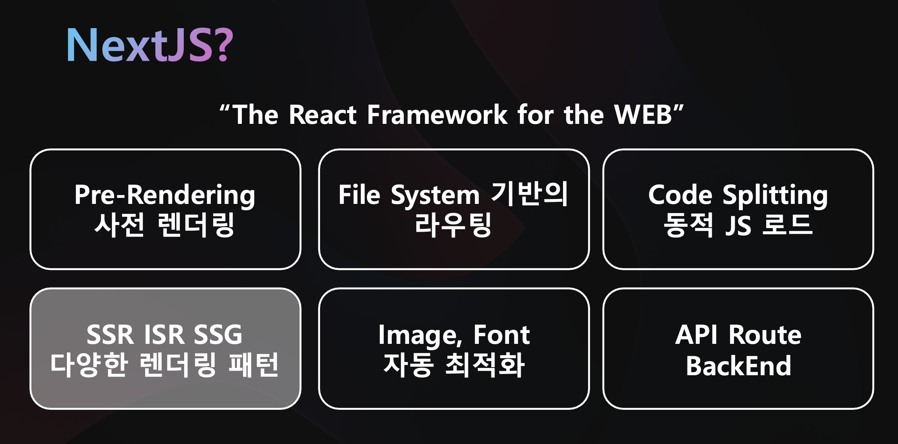

NextJS 는 무엇일까요? NextJS 공식 웹사이트에 들어가면

> React Framework For the WEB

웹을 위한 리액트 프레임워크 라고 되어 있습니다

리액트가 프레임워크가 아니라 라이브러리 라는것은 아마 프론트엔드 개발을 경험해 본 사람들은 한번씩 들어보셨을 겁니다

그렇기 때문에 Client Side Routing 을 위해서는 **React Router DOM** 을,
사전렌더링과 같은 기능을 위해서는 **React Snap** 이나 **SSR 플러그인**과 같은 추가적인 라이브러리를 설치해야하고,
Code Splitting 을 위해서는 **React.lazy** 나 번들러 설정을 추가로 해주어야 합니다

NextJS 는 리액트 기반의 웹 프레임워크이기 때문에 다음과 같은 핵심 기능들을 내부적으로 제공합니다.
그중에서 저는 `렌더링 패턴`에 중점을 맞추어 발표를 하도록 하겠습니다

## ✍️ Rendering? 렌더링이란?

그렇다면 NextJS 의 렌더링 패턴을 자세히 알아보기에 앞서, 렌더링(Rendering) 이 무엇인지 알아보겠습니다

우리가 브라우저에서 유튜브에 접속하는 상황을 가정해보도록 하겠습니다

Client - Server 아키텍쳐에서 클라이언트가 웹서버에 요청을 보내면,
WAS (Web Application Server) 가 데이터베이스와 정보를 주고받으며 동적 컨텐츠를 로드하고,
추가적으로 요청에 맞는 HTML, CSS, JS 등과 같은 정적 자원을 응답으로 보냅니다.

브라우저는 HTML, CSS, JS 를 해석하여 화면에 웹페이지를 그리게되는데,
이 과정을 `Rendering 렌더링` 이라고 부릅니다

그렇다면 브라우저는 렌더링을 어떤 순서대로 진행하는지 간략하게 보도록 하겠습니다
브라우저가 렌더링하는 과정을 `Critical Rendering Path` 라고 부릅니다

### Construction 단계

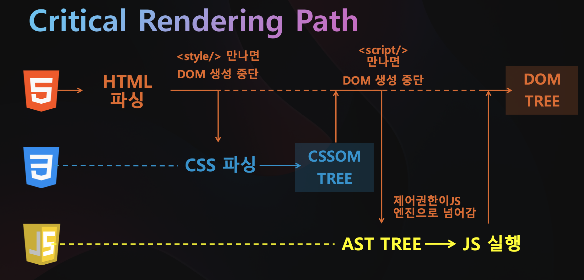

먼저 브라우저는

> 1. HTML 을 받아 파싱을 진행하고, DOM Tree 생성을 시작합니다
> 2. 이후 `<style/>` 태그를 만나면 DOM 생성을 잠시 중단하고, CSS 를 파싱하여 CSSOM Tree 를 생성합니다.
> 3. CSSOM Tree 가 완성되면, DOM 생성을 재개하고 `<script/>` 태그를 만나면 다시 DOM 생성을 중단하고, 제어권한기 JS 엔진으로 넘어갑니다.
>    이는 DOM API (`document.querySelector` 와 같은 함수) 가 DOM 을 조작하고 변경할 수 있기 때문입니다
> 4. JS 는 파싱되어 추상구문트리 AST Tree 가 만들어지고, JS 를 실행하게 됩니다
> 5. 이후 DOM 트리를 마저 완성시키고, DOM Tree, CSSOMTree 를 합쳐 Render Tree 를 생성합니다

여기 까지의 과정을 `construction` 단계라고 합니다

### Operation 단계

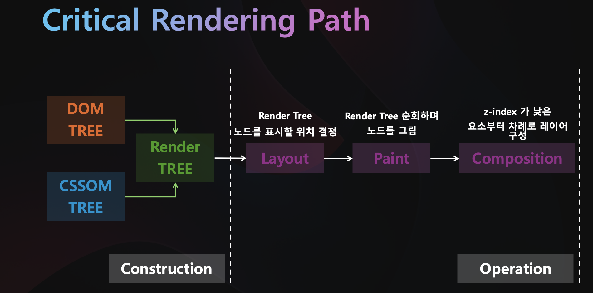

다음으로 Render Tree 의 노드를 표시할 위치를 결정하는 Layout 단계와, Render Tree 를 순회하며 Node 를 그리는 Paint 단계를 거쳐,

z-index 가 낮은 요소부터 차례로 레이어를 구성하는 composition 단계를 거쳐 화면에 보여지게 됩니다

## ✍️ Core Web Vitals

렌더링 패턴은 UX 에 직접적인 영향을 미칩니다.
그렇다면 좋은, 사용자 경험에 맞는 렌더링 패턴은 무엇일까요?

본격적으로 렌더링 패턴들에 대해 알아보기에 앞서서,
구글에서 제안하는 웹 페이지들의 사용자 경험을 평가하는 지표인 Core Web Vitals 에 대해 잠깐 알아보겠습니다

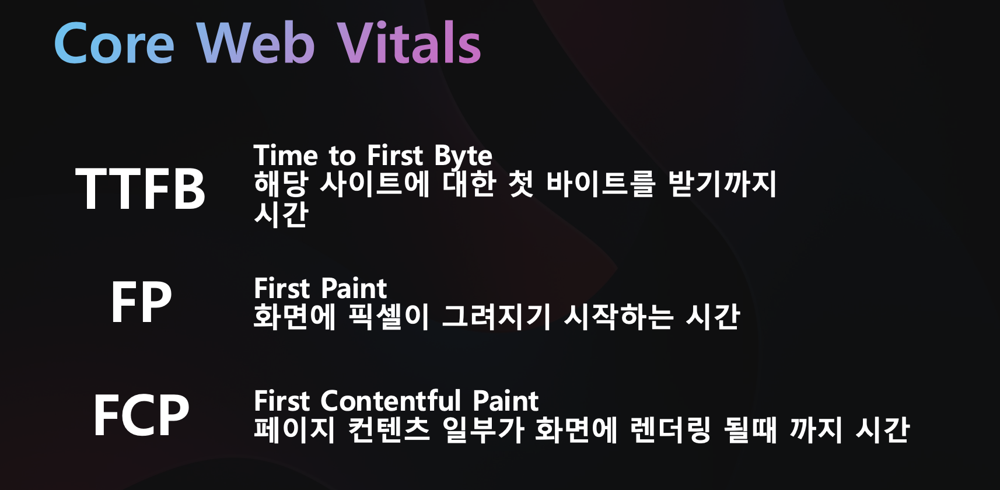
 
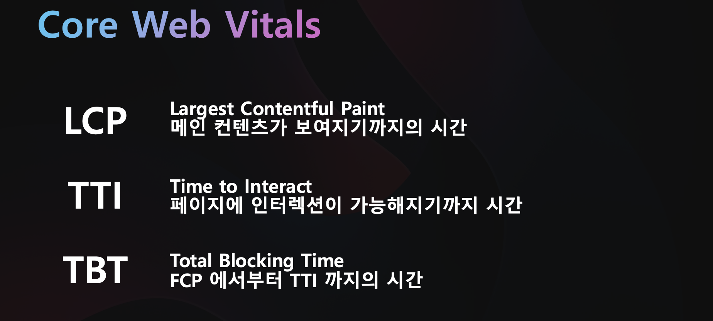

## ✍️ Rendering Patterns

지금부터는 본격적으로 렌더링 패턴들에 대해 웹이 발전하게 된 순서대로 알아보겠습니다

### Static Site

가장 먼저 Static Site 입니다.

초기에 웹은 정적인 컨텐츠를 보여주는것에 그쳤습니다.

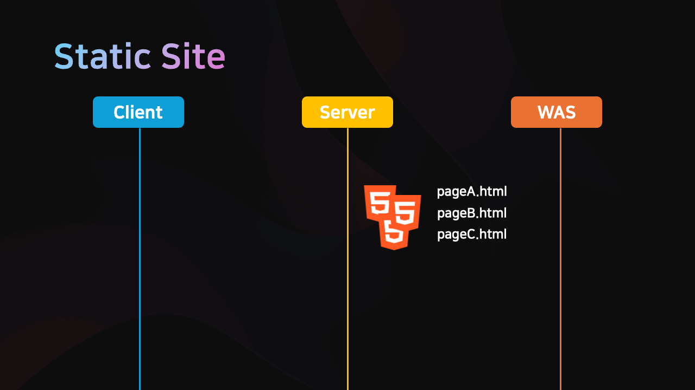

클라이언트가 특정 페이지에 접속하면, 정적인 HTML, CSS, JS 를 제공합니다.
AWS S3 버킷과 같은 저장소에 올리거나, NginX 등을 사용해 정적인 페이지는 서빙됩니다

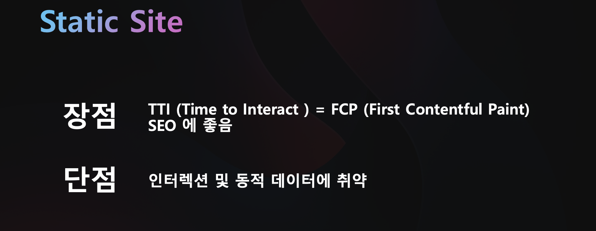

Static Site 를 Core Web Vitals 관점에서 보면,

상호작용할 수 있는 시간인 TTI 와 브라우저에서 처음 그려지는 FCP 와의 시간이 동일한 장점이 있고,
검색엔진 크롤링 봇이, 페이지를 정상적으로 수집할 수 있기 때문에 검색엔진 최적화 SEO 에 좋습니다

하지만, 동적 데이터에 취약하다는 단점이 있습니다.

### Server Side Rendering (SSR)

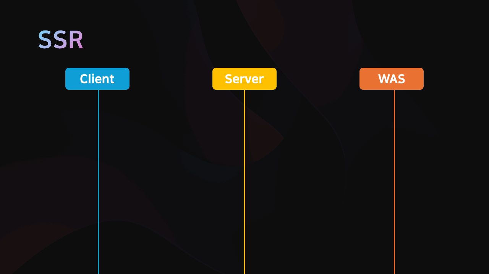

다음으로는 서버사이드 렌더링입니다.

클라이언트에서 요청이 들어올 때 마다, 서버에서 HTML 과 Data 가 동적으로 만들어집니다.

요청에 따라 서버에서 데이터를 삽입한 완성된 HTML 을 클라이언트에게 제공합니다.
JSP, TimeLeaf, HandleBars 등과 같은 템플릿 엔진을 사용해 구현할 수 있습니다.

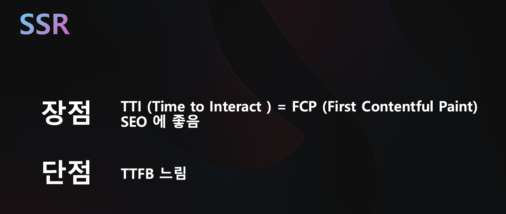

Static Site 와 동일하게 TTI 와 FCP 가 동일하다는 점과 SEO 에 좋다는 장점이 있습니다.

하지만 서버에서 데이터를 받아와 삽입 후, 응답으로 보내는데 시간이 걸리기 때문에 TTFP 가 느리다는 단점이 있고,
새로운 페이지를 접속할 때 마다, 새로운 HTML 을 요청하고 화면이 깜박여 UX 에 좋지 못한다는 단점이 있습니다

### Client Side Rendering (CSR) 와 Single Page Application (SPA)

처음에는 위 두가지 방식으로 개발이 되었는데,
AJAX 라는 기술이 나오게 되면서 새로고침 없이 동적으로 데이터를 가져올 수 있어졌고,

이에 따라 React, Angular, Vue 와 같은 라이브러리가 발전하여 앱과같은 부드러운 화면 전환이 가능해졌습니다

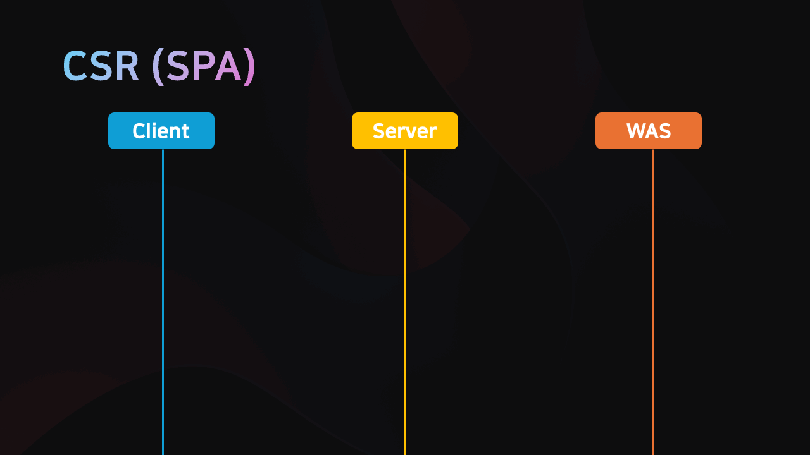
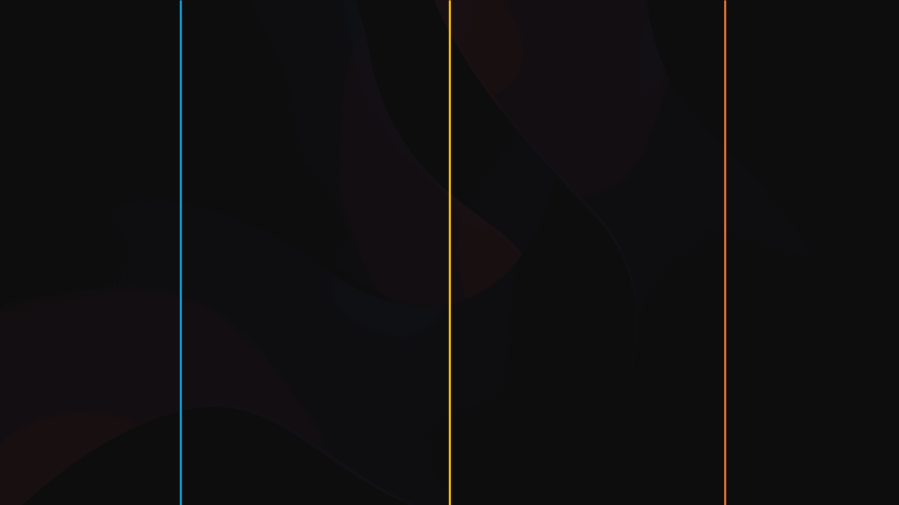

페이지를 요청하면, HTML 과 CSS 를 받고,
빌드된 JS 번들 파일을 응답으로 받습니다

이후, 클라이언트 측에서 JS (React) 를 사용해 DOM 요소를 삽입하고 조작하며 렌더링을 진행하고,
AJAX 요청을보내서 서버로부터 동적인 데이터를 받아옵니다

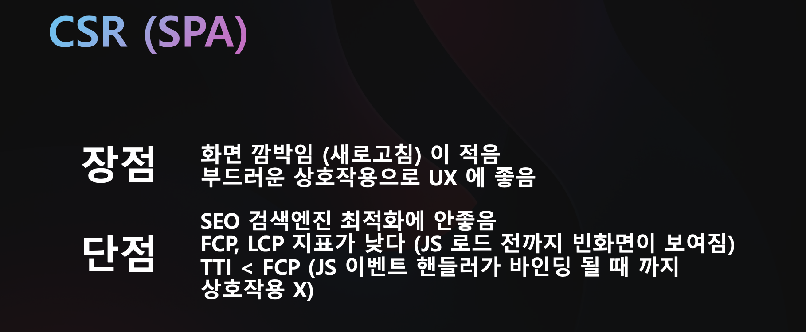

앱처럼 부드러운 전환과 상호작용으로 UX 에 좋지만,
검색엔진 크롤링 봇이 텅 빈 HTML 을 크롤링하기 때문에 검색엔진 최적화 SEO 에 좋지 못합니다
또한, JS 번들 파일이 크다면, TTFP 가 느려지고,
FCP 와 TTI 의 차이가 크기 때문에, 사용자가 페이지가 로드되었는지 인지하지 못하는 단점이 있습니다

### SSR with Hydration

다음으로 알아볼 패턴은 NextJS 에서 지원하는 렌더링 패턴들입니다.

먼저 SSR with Hydration 입니다.

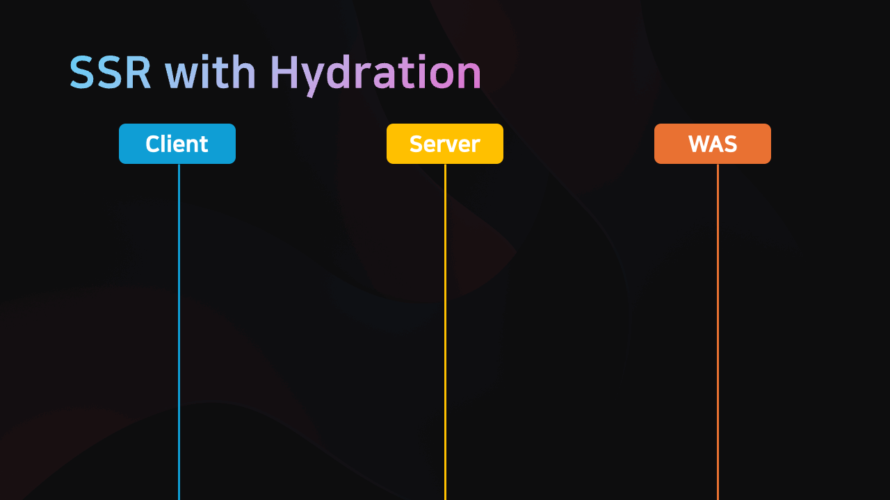

이름에서 알 수 있듯이, 앞서 봤던 SSR 과 유사하게 동작합니다

NextJS 내부적으로 서버사이드에서 리액트를 이용해 렌더링을 진행하고,
API 요청을 보내 데이터를 삽입 후, 완성된 HTML 을 응답으로 제공합니다

여기까지는 SSR 과 동일합니다

이후, 추가적으로 React 코드가 클라이언트로 함께 전송되어 `Hydration` 이 진행됩니다

Hydration 이란, 서버에서 사전렌더링되어 만들어진 HTML 에 React 가 연결되어,
이후로는 Client Side Rendering 으로 전환되어 실행됩니다

### SSG with Hydration

SSG with Hydration (Static Site Generation with Hydration) 은
SSR with Hydration 과 유사하나,

요청마다 서버에서 렌더링을 진행하는 것이 아닌,
빌드시간에 변하지 않는 부분은 HTML 로 생성해두고

이후, React 코드가 연결되는 Hydration 이 진행되고,
API 요청은 AJAX 를 통해 진행됩니다

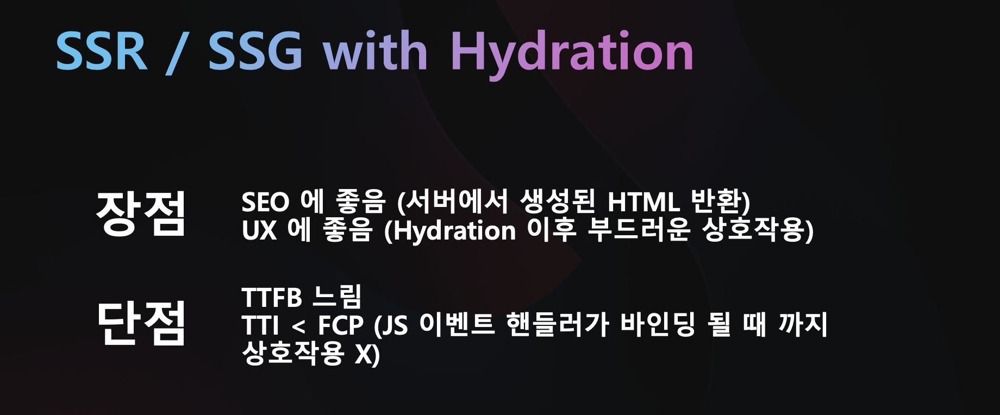

두 렌더링 패턴 모두 검색엔진 최적화에 좋지만,
TTFB 가 느리다는 단점이 있습니다

### Incremental Static Regeneration (ISR)

마지막으로 ISR 증분정적 생성이 있습니다

SSR with Hydration 과 SSG with Hydration 을 합친 렌더링 패턴이라고 볼 수 있습니다

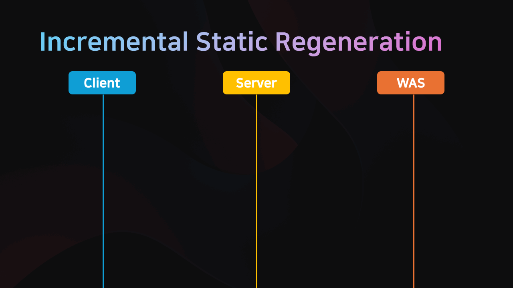

빌드타임에 리액트를 사용해 사전렌더링된 HTML 을 캐싱하고 (SSG with Hydration 과 유사) 응답으로 제공합니다

이후, 요청이 발생하고 캐시가 유효하지 않을때 (만료 되었을때, revalidate 시간 지정)
서버에서 개별 페이지를 재생성하여 캐싱합니다

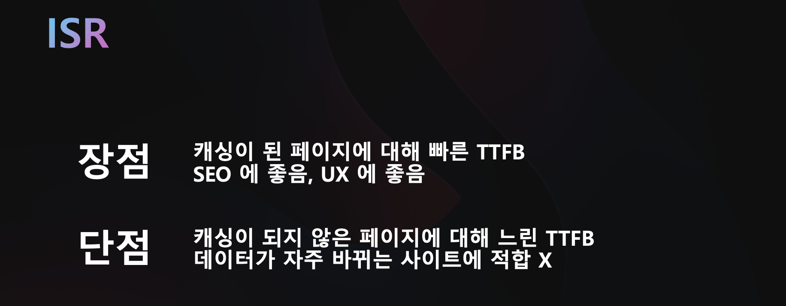

캐싱된 페이지에 대해서는 TTFB 가 빠르다는 장점이 있지만,
데이터가 자주 바뀌는 사이트에서는 적합하지 않습니다

## ✍️ 마치며

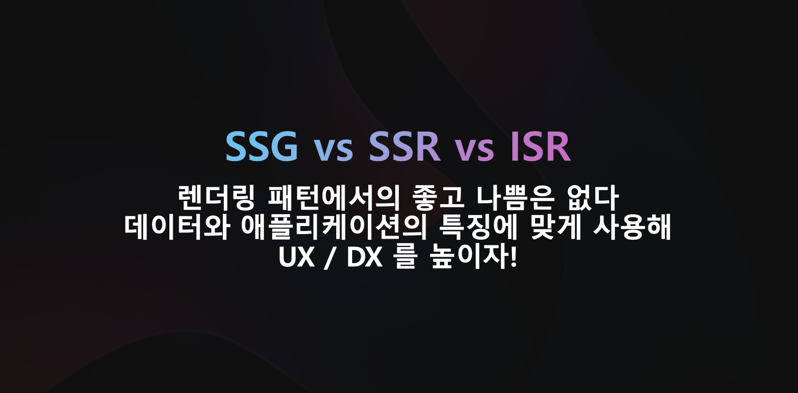
