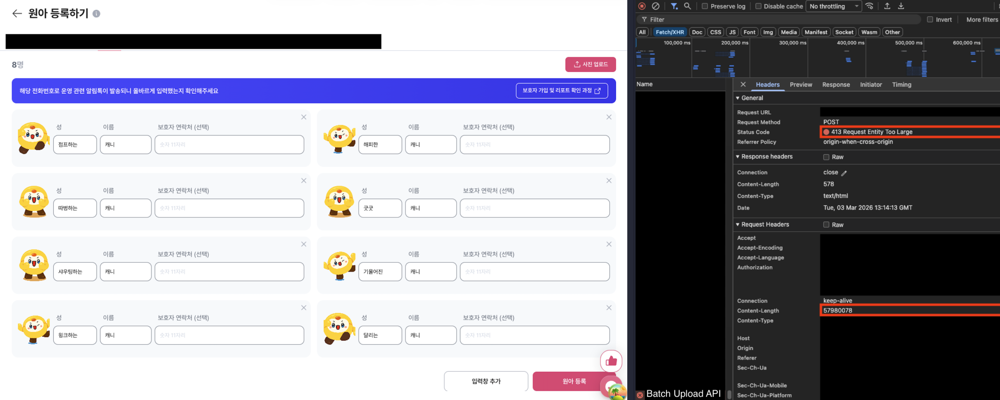
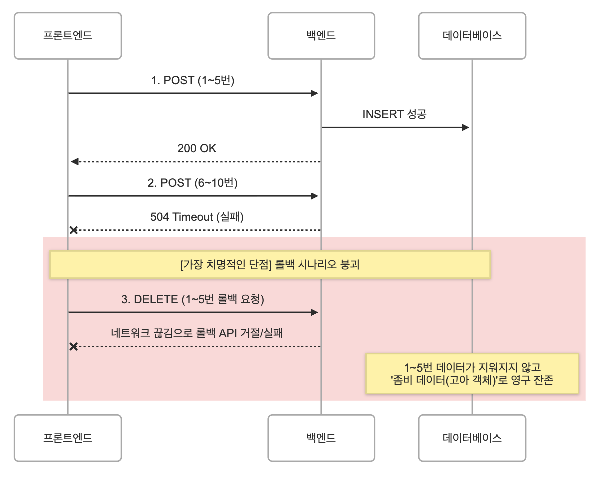
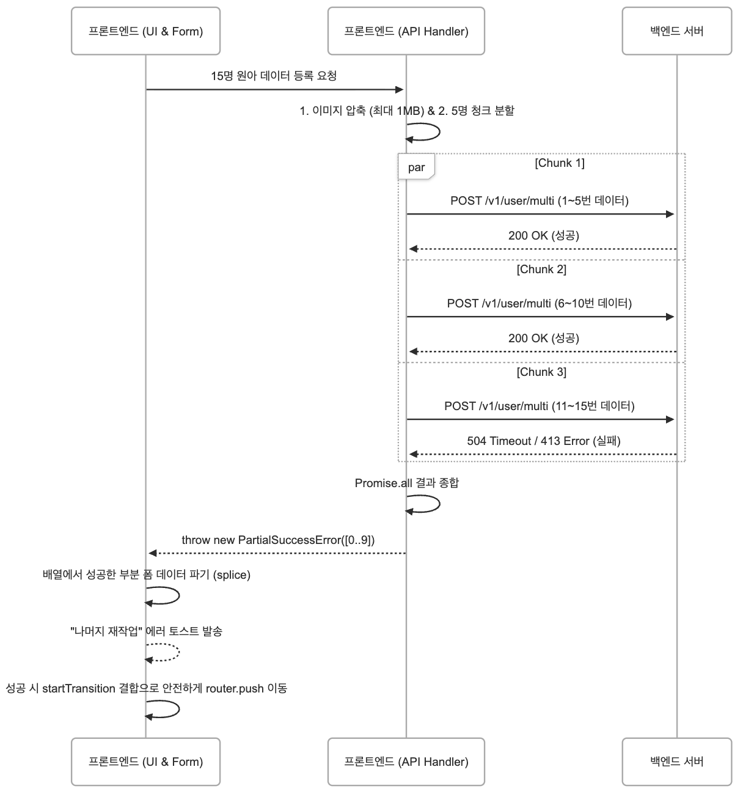

인턴으로 재직 중인 누비랩에서는 선생님이 여러 명의 원아를 한 번에 등록할 수 있는 **원아 일괄 등록 기능**을 운영하고 있습니다. <br/>
3월인 신학기 시즌에는 다수의 원아를 한 번에 등록하는 경우가 많았고, 어느 날 CX 채널로 다음과 같은 문의가 들어왔습니다.

> "원아 등록이 안돼요. 등록 버튼을 눌러도 아무 반응이 없어요."

문제를 재현해보니 실제로 요청이 서버에 도달하기도 전에 **413 Payload Too Large** 에러가 발생하고 있었습니다.



기존 API는 모든 데이터를 **단일 multipart 요청**으로 전송하고 있었고, <br/>
여러 장의 원아 사진이 한 번에 업로드되면서 **API Gateway의 Payload 제한을 초과**하고 있었습니다.

이 문제를 해결하기 위해 다음과 같은 구조를 도입했습니다.

> 1. 이미지 압축 <br/>
> 2. API 요청 청크 분할 <br/>
> 3. 부분 성공 복구 로직 <br/>
> 4. Next.js 전환 지연 처리 <br/>

이를 통해 **프론트엔드에서 사실상 "All or Nothing"에 가까운 업로드 구조**를 구현했습니다.

## 기존 업로드 구조의 한계

기존 원아 등록 API 는 여러명의 데이터를 하나의 Multipart 요청으로 전송하는 구조였습니다.

```bash
POST /batch-upload
Content-Type: multipart/form-data

files[]
metadata[]
```

선생님이 여러 원아 정보를 입력한 뒤 "등록" 버튼을 누르면,<br>
각 원아의 프로필 사진과 메타데이터가 하나의 FormData 로 묶여 서버로 전송됩니다.

원아 프로필 사진은 평균 3~7MB 정도의 크기를 가지고 있었고, 15명의 원아를 한번에 등록한다고 가정했을 때 <br/>
`5MB x 15 = 75MB` 의 데이터가 하나의 multipart 요청에 담기면서 API Gateway 의 요청 크기 제한을 초과했습니다.

## 해결 전략 설계

문제의 핵심은 **단일 Multipart 요청에 모든 데이터를 담고 있다는 점** 이었습니다. <br/>
따라서 해결방법을 두 가지로 나눌 수 있었습니다.

| 전략                            | 설명                                                   | 장점                                                   | 단점                             |
| ------------------------------- | ------------------------------------------------------ | ------------------------------------------------------ | -------------------------------- |
| **A. 이미지 압축**              | 클라이언트에서 이미지를 압축하여 페이로드 크기를 줄임  | - 요청 크기 감소<br/> - 구현 비교적 간단               | 압축하더라도 대량 업로드 시 한계 |
| **B. 요청 청킹 (Batch Upload)** | 여러 원아 데이터를 여러 API 요청으로 나누어 전송       | - Payload 제한 문제 해결<br/>- 실패 복구 가능          | 요청 관리 로직이 복잡해짐        |
| **C. S3 Presigned URL**         | 이미지를 S3에 직접 업로드 후, 메타데이터만 서버로 전송 | - Payload 제한 완전 우회<br/>- 대용량 파일 처리에 유리 | 백엔드 인프라 변경 필요          |

여기서 **C. S3 Presigned URL** 방식도 충분히 유효한 대안이었습니다.
Presigned URL을 발급받아 이미지를 S3에 직접 업로드하고, 서버에는 S3 키와 메타데이터만 전송하면 API Gateway의 Payload 제한을 근본적으로 우회할 수 있기 때문입니다.

하지만 이 방식을 채택하지 않은 이유는 다음과 같습니다.

> 1. **백엔드 변경이 필요했습니다.** Presigned URL 발급 엔드포인트 추가, S3 버킷 설정, IAM 권한 구성, CORS 설정 등 인프라 레벨의 작업이 수반됩니다. 당시 백엔드 팀의 스프린트 일정상 즉각적인 대응이 어려웠고, 프론트엔드 변경만으로 빠르게 해결할 수 있는 방법이 필요했습니다. <br/>
> 2. **업로드-등록 간 정합성 문제가 생깁니다.** S3 업로드는 성공했지만 이후 등록 API가 실패하면, S3에 고아 파일(orphaned file)이 남게 됩니다. 이를 정리하기 위한 별도의 클린업 로직이나 TTL 정책이 추가로 필요합니다.<br/>
> 3. **기존 API를 그대로 활용할 수 있었습니다.** 청크 분할 방식은 기존 배치 등록 API의 인터페이스를 변경하지 않고, 프론트엔드에서 요청을 나눠 보내는 것만으로 문제를 해결할 수 있었습니다.

결과적으로 **기존 API 호환성을 유지하면서 프론트엔드만으로 빠르게 대응할 수 있는 A + B 조합**을 선택했습니다.

<br/>

## 구현 과정

### 1️⃣ 이미지 압축으로 요청 크기 줄이기

가장 먼저 시도한 방법은 **클라이언트에서 이미지를 압축하여 요청 Payload 크기를 줄이는 것**이었습니다.

이를 위해 `browser-image-compression` 라이브러리를 사용했습니다.  
이 라이브러리는 브라우저에서 Canvas를 이용해 이미지를 압축하고, 원하는 크기나 해상도로 변환할 수 있습니다.

```ts
import imageCompression from "browser-image-compression";

const options = {
    maxSizeMB: 1,
    maxWidthOrHeight: 1024,
    useWebWorker: true,
};

const compressedFile = await imageCompression(file, options);
```

이미지 압축을 적용한 결과, 15명의 원아를 등록할 때의 Payload 크기가 평균 75MB에서 **약 15MB 수준으로 감소**했습니다.  
이 정도면 API Gateway의 Payload 제한을 충분히 통과할 수 있는 수준이었습니다.

하지만 이 방법에는 한계가 있었습니다.  
만약 선생님이 **30명 이상의 원아를 한 번에 등록**하려고 한다면,  
이미지를 압축하더라도 Payload 크기가 다시 제한을 초과할 가능성이 있었습니다.

따라서 이미지 압축만으로는 근본적인 해결책이 될 수 없었습니다.

<br/>

### 2️⃣ 요청 청킹 + Batch 업로드

이미지 압축만으로는 한계가 있었기 때문에, 근본적으로 요청 자체를 여러 개로 나누는 방식을 도입했습니다.

```ts
const CHUNK_SIZE = 5;

function splitChunks<T>(array: T[], size: number): T[][] {
    const result = [];
    for (let i = 0; i < array.length; i += size) {
        result.push(array.slice(i, i + size));
    }
    return result;
}
```

이렇게 하면 `1~5명`, `6~10명`, `11~15명` 총 3개의 요청으로 나누어 서버에 전송할 수 있습니다.

```ts
const chunks = splitChunks(students, CHUNK_SIZE);

await Promise.all(chunks.map((chunk) => api.post("/batch-upload", chunk)));
```

<br/>

### ⚠️ 그런데.. 원자성(Atomicity)이 깨진다

하지만 여기서 새로운 문제가 발생합니다. <br>

> 중간에 일부 요청만 실패하면 어떻게 될까?

예를 들어,

- 1~5명: 성공
- 6~10명: 성공
- 11~15명: 실패

이런 상황이 발생하면, 서버에는 이미 10명의 원아 데이터만 등록된 상태가 됩니다. <br>
이는 흔히 말하는 원자성(Atomicity)을 깨는 구조입니다.

#### 1. 실패 시 전체 롤백 (All or Nothing)

- 성공했던 요청까지 모두 삭제
- DB 상태를 완전히 원래대로 복구

<center>

</center>

하지만 이 방식에는 치명적인 문제가 있었습니다.

> 롤백 요청도 실패하면 어떡하지?

#### 2. 부분 성공 허용 + 재시도 유도

그래서 방향을 바꿨습니다.

> 완벽한 원자성 대신, UX 레벨에서 원자성을 만들자

핵심 전략은 다음과 같습니다

- 성공한 데이터는 그대로 둔다
- 실패한 데이터만 사용자에게 다시 보여준다
- 사용자는 남은 것만 재시도한다

<br/>

### 3️⃣ 부분성공 복구 로직 (프론트엔드에서 원자성 만들기)

이를 위해 `PartialSuccessError` 라는 개념을 도입했습니다

```ts
export class PartialSuccessError extends Error {
    readonly successIndices: number[];

    constructor(successIndices: number[]) {
        super("일부 업로드에 실패했습니다.");
        this.name = "PartialSuccessError";
        this.successIndices = successIndices;
    }
}
```

청크 요청 결과를 모아서, 일부라도 실패했다면 `PartialSuccessError`를 던집니다.

<details>
<summary>
🙋‍♂️ `Promise.all` vs `Promise.allSettled` vs `Promise.any` vs `Promise.race` 뭐가 다른가요?
</summary>

| 메서드               | 성공 조건               | 실패 조건                 | 반환값                 |
| -------------------- | ----------------------- | ------------------------- | ---------------------- |
| `Promise.all`        | 모두 성공               | 하나라도 실패             | 성공값 배열            |
| `Promise.allSettled` | 그냥 전부 끝나면 됨     | 거의 없음(항상 fulfilled) | 상태 객체 배열         |
| `Promise.race`       | 가장 먼저 성공하면 성공 | 가장 먼저 실패하면 실패   | 가장 먼저 끝난 값/에러 |
| `Promise.any`        | 하나라도 성공           | 전부 실패                 | 가장 먼저 성공한 값    |

</details>

```ts
const results = await Promise.allSettled(requests);

const successIndices = results.flatMap((result, index) =>
    result.status === "fulfilled" ? [index] : [],
);

if (successIndices.length !== chunks.length) {
    throw new PartialSuccessError(successIndices);
}
```

이후, React Hook Form 에서 이 에러를 잡아서 성공한 항목은 폼에서 제거하고, 실패한 항목만 그대로 남깁니다

```ts
onError: (error) => {
    if (error instanceof PartialSuccessError) {
        removeSuccessItems(error.successIndices);
    }
};
```

결과적으로 사용자 입장에서는 이미 성공한 원아들은 화면에서 사라지고, 실패한 원아들만 남아서 재시도할 수 있게 됩니다.

<center>

</center>

<br/>

## 💡 그래서, 이게 왜 “프론트엔드에서 원자성 보장”일까?

엄밀히 말하면, 이 방식은 데이터베이스 레벨의 원자성(Atomicity)을 보장하지는 않습니다. <br/>
이미 일부 요청이 성공하면, 시스템 내부 상태는 중간 상태를 가지게 됩니다.

하지만 중요한 건 사용자 경험(User Experience) 입니다.

- 성공한 데이터는 유지되고
- 실패한 데이터만 남아 재시도할 수 있으며
- 사용자는 전체 작업을 다시 하지 않아도 됩니다

즉, 사용자 입장에서는 다음과 같이 느껴집니다.

> "한 번에 다 처리되거나, 실패한 것만 다시 하면 된다"

결과적으로 시스템이 아닌 UX 레벨에서 “All or Nothing”에 가까운 경험을 제공하게 됩니다.

<br/>

## 🧠 Atomicity vs Idempotency vs UX

이번 경험을 통해 한 가지 중요한 관점을 얻을 수 있었습니다.

| 개념        | 설명                       | 이 문제에서의 역할                 |
| ----------- | -------------------------- | ---------------------------------- |
| Atomicity   | 모두 성공하거나 모두 실패  | 이상적이지만 구현 비용/리스크 높음 |
| Idempotency | 여러 번 실행해도 결과 동일 | 재시도 안정성 확보                 |
| UX Recovery | 사용자 경험 기반 복구      | 실제 해결 전략                     |

이 문제는 결국

> "시스템적으로 완벽한 원자성을 만들 것인가?"
> vs
> "사용자 경험으로 문제를 해결할 것인가?"

의 선택이었고, 저는 후자를 선택했습니다.

<br/>

## 🚀 확장 관점에서의 한계와 개선 방향

이번 방식에도 몇 가지 고려해야 할 지점이 있습니다.

1. Promise.all 기반 병렬 요청은 요청 수가 많아지면 브라우저 connection limit에 걸릴 수 있음
2. 향후 100명 이상 업로드 시 동시성 제한 (p-limit) 적용 필요
3. 서버 단에서도 batch 처리 API 또는 presigned URL 구조로 확장 가능

<br/>

## ✍️ 마치며

이번 문제는 단순히 413 Payload Too Large 에러를 해결하는 것을 넘어,

> 네트워크 제약, API 설계 한계, 데이터 정합성, 사용자 경험

이 네 가지를 동시에 고려해야 하는 문제였습니다.

특히 인상 깊었던 점은,

> 완벽한 시스템적 정합성을 보장할 수 없다면, 사용자 경험을 통해 그에 준하는 결과를 만들어낼 수 있다는 것

이었습니다.

프론트엔드는 단순히 데이터를 전달하는 계층이 아니라,
실패를 다루고, 복구하고, 사용자 경험을 설계하는 영역이라는 것을 다시 한 번 느낄 수 있었습니다.
