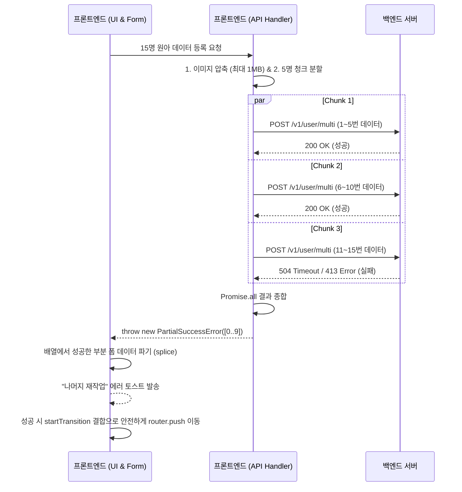

새 학기가 시작되면 어린이집, 유치원 등에서 가장 먼저 하는 일은 무엇일까요? 바로 새로운 원아들의 정보를 시스템에 등록하는 일입니다. 저희 서비스에서도 선생님들이 다수의 원아 정보를 엑셀로 한 번에 입력하거나 수기로 여러 명을 동시에 등록하는 기능은 온보딩의 핵심 흐름 중 하나였습니다.

그런데 최근 다수의 원아(15명 이상)를 한 번에 등록하려고 하면 화면이 멈추거나 알 수 없는 에러가 발생하는 치명적인 버그가 발견되었습니다. 서비스 도입부에서 무한 로딩을 겪는다면 유저의 경험은 최악이 되겠죠. 이를 백엔드 인프라 수정 없이 프론트엔드 단에서 어떻게 똑똑하게 해결했는지, 그 트러블슈팅 과정을 공유해보려 합니다.

## 🚨 문제 상황: 413 Request Entity Too Large

기존의 원아 다중 등록 API(`POST /v1/user/multi`)는 `multipart/form-data`로 이미지 목록과 메타데이터를 한 번에 서버로 전송하는 구조였습니다.
5~6명을 올릴 때는 문제가 없었지만, 고화질 사진(장당 보통 5~10MB)을 16명분 이상 첨부하면 단일 페이로드 크기가 약 80MB를 초과하게 됩니다.

이 엄청난 용량을 백엔드 API Gateway에서 감당하지 못해 `413 Request Entity Too Large` 에러를 뱉었고, 실패 시의 방어 로직이 없어 화면이 무한 로딩에 빠지고 마는 상태였습니다.

## 🤔 해결 방안을 향한 고민: 어떻게 우회할 것인가?

이 문제를 근본적으로 해결하고 확장성을 챙기기 위해, 다양한 옵션을 단계적으로 검토했습니다.

### Option 1: 프론트엔드 이미지 압축

가장 먼저 떠오른 생각은 브라우저 단에서 이미지를 압축해 페이로드를 줄이는 것이었습니다.
하지만 당초 15~20명 규모는 어찌 막는다 해도, 향후 100명 단위의 대규모 기관 등록이 발생하면 결국엔 다시 페이로드 제한이나 타임아웃에 부딪힐 수밖에 없는 미봉책이었습니다.
따라서 요청을 여러 번으로 쪼개는 **청크(Chunking) 분할** 과정이 필수불가결했습니다. 그런데 데이터를 쪼개서 보낼 때 **"중간에 일부만 실패하면 어떡하지?"** 하는 원자성(Atomicity)에 대한 깊은 고민이 생겼습니다.

### Option 2: All-or-Nothing (실패 시 롤백)

데이터 정합성을 유지하기 위해 5명 단위로 쪼개어 요청을 보내되, 단 하나라도 실패하면 먼저 업로드 성공했던 유저들까지 `DELETE` API를 날려 전부 원상 복구시키는 방법입니다.
하지만 이 방식엔 치명적인 맹점이 있었습니다. **"롤백 기능을 수행하는 DELETE 통신마저 무선 네트워크 끊김으로 에러가 나버린다면?"** 시스템에 좀비 데이터가 쌓여 영구히 잔존하게 되는 구조적 문제가 있었습니다.

### Option 3: 부분 성공 허용 + UI를 통한 우아한 복구 (채택✨)

결제 시스템 수준의 완벽한 롤백이 요구되는 상황이 아니라 단순 "학생 리스트 등록"이므로, 전통적인 무결성(Atomicity)은 타협하는 대신 **UX적인 멱등성(Idempotency)**을 채택했습니다.
병렬 통신 중 네트워크 오류가 생기더라도 이미 성공한 아이템은 그대로 두고, **실패한 원아만 입력 폼에 잔존시켜 유저가 남은 대상만 자연스럽게 재시도하게 유도**하는 방식입니다.

## 🛠 구체적인 구현 과정

최종적으로 **[이미지 전처리 압축] + [데이터 청크 분할] + [부분 성공 폼 동기화] + [RSC 렌더링 지연 방어]** 를 결합한 하이브리드 전략을 도입했습니다.

### 1. 브라우저 단 이미지 전처리

`maxSizeMB: 1`, `maxWidthOrHeight: 1280` 옵션을 걸어 한 장에 5~10MB가 넘던 사진 사이즈를 1MB 이내로 대거 경감시켰습니다. 16장의 페이로드도 단 10MB 아래로 떨어뜨려 무거운 통신에 여유를 줍니다.

### 2. Promise.all을 활용한 데이터 병렬 청크 처리

배열 슬라이싱을 통해 5명 단위로 페이로드를 조각냈습니다. 단일 묶음 용량을 컨트롤하여 병렬 호출(`Promise.all`)로 서버에 부담을 덜고 안정성을 확보했습니다.

### 3. PartialSuccessError 커스텀 에러와 폼 갱신

```typescript
export class PartialSuccessError extends Error {
    readonly successIndices: number[];
    constructor(successIndices: number[]) {
        super("일부 원아 등록에 실패했습니다.");
        this.name = "PartialSuccessError";
        this.successIndices = successIndices;
    }
}
```

청크 응답들을 취합해 일부라도 에러가 발생하면, 위와 같이 에러의 위치 정보(`successIndices`)를 담은 커스텀 에러를 반환합니다. React-hook-form의 `onError` 영역에서 이 에러를 낚아채어 폼의 Input Item 중 인덱스 기준으로 성공된 요소만 `splice`하여 제거합니다. 이로써 사용자 화면에는 "실패한 원아 목록만" 마법처럼 남아 잔여 작업을 유도할 수 있습니다.

### 4. RSC 페치 딜레이 방어를 위한 `useTransition` 결합

모든 데이터 통신이 무사히 끝나더라도 UX 함정이 있었습니다. 다음 화면으로 넘어가기 위해 `router.push()`를 호출할 때, Next.js App Router 특유의 **서버 측 렌더링(RSC) fetching 시간 동안 화면이 멈춰있는 현상**이 발생합니다. 그 찰나에 조급한 유저가 등록 버튼을 한 번 더 누르면 중복 통신 우려가 생깁니다.

```typescript
const [isTransitionPending, startTransition] = useTransition();

// ...
startTransition(() => {
    router.push(`/dept/${departmentId}/children`);
});

// 네트워크 통신 시간 + 페이지 렌더링 딜레이 시간 병합
const isLoading = mutation.isPending || isTransitionPending;
```

이를 완벽히 막기 위해 React 18의 `useTransition`을 활용했습니다. API 로딩 상태(`mutation.isPending`)와 화면 렌더링 준비 상태(`isTransitionPending`)를 논리합으로 묶어, "다음 페이지에 도달 완료"될 때까지 로딩 바를 유지하고 버튼 입력을 차단했습니다.

## 💡 마치며

막막했던 `413 Request Entity Too Large` 에러를 단순 백엔드 서버 사양 증량에 기대지 않고, 프론트엔드 단에서 네트워크 엣지 케이스와 UX를 동시에 고려하여 복합적으로 엮어낸 가치 있는 경험이었습니다.
안전한 롤백을 담보할 수 없다면, **Graceful Degradation(우아한 성능 저하)** 관점에서 사용자에게 실패한 부분을 명확히 인지시키고 폼 멱등성에 기반해 자연스럽게 재작업을 유도하는 것 또한 훌륭한 프론트엔드 엔지니어링임을 배울 수 있었습니다.

---

<details>
  <summary>
  대용량 이미지 기반 일괄 등록(Batch Upload) 최적화 및 페이로드 에러/SSR 지연 해결 (작업 과정 요약본 저장)
  </summary>

## BACKGROUND

- **상황**: 신학기 및 신규 기관 유입으로 인해, 관리자(선생님)가 다수(15~17명)의 원아 정보를 엑셀 또는 수기로 한 번에 입력하여 동시 등록하는 시나리오가 급증함.
- **기존 API 스펙 (`POST /v1/user/multi`)**:
    - 원아 페이지에서 다중 원아를 생성하기 위해 사용 (해당 기관 소속 선생님만 가능). 파일의 순서대로 프로필 사진이 등록됨.
    - Request Body: `multipart/form-data`
    - Parameters:
        - `files` (`array<string>`): 원아 프로필 이미지 (파일 이름은 id.webp)
        - `metadata` (object): 유저 정보 metadata
- **플로우**: 선생님이 원아 정보 나열 -> 각 원아의 고화질 프로필 사진(장당 보통 5~10MB 이상) 매핑 -> `원아 등록` 클릭 -> 위 단일 API(`POST /v1/user/multi`)로 묶어 전체 전송.
- **중요한 이유**: 초기 온보딩 플로우이자 서비스의 핵심 도입부이므로, 해당 과정에서 무한 로딩이나 알 수 없는 네트워크 에러를 겪으면 심각한 사용성 저하와 CS 유발로 직결됨.

## PROBLEM

- **증상**: 5~6명의 원아를 업로드할 때는 성공하지만, 15명 이상을 등록 시도하면 무한 로딩이 걸리다가 전체 데이터 등록에 실패함.
- **재현 방법 및 에러**:
    - 5MB 가량되는 이미지 16개 삽입 후 `원아 등록` 버튼을 클릭.
    - 서버를 뚫지 못하고 백엔드(API Gateway) 단에서 감당하지 못해 `413 Request Entity Too Large` 에러가 즉시 터지며, 실패 시 처리도 되지 않고 멈춤 현상이 발생.


- **왜 문제인지**: 유저는 에러의 진짜 원인이나 내부 사정을 모르기 때문에, 처음부터 무의미한 시도를 끝없이 반복하거나 기능을 아예 이탈함.
- **근거 및 수치**:
    - 사진에 압축 로직이 부재(`maxSizeMB: Infinity`)하여, 16명 동시 업로드 시 단일 Request Payload 크기가 **약 80MB**를 초과함.
    - 추가로, 업로드 딜레이와 상관없이 성공 처리가 완료된 이후에도 Next.js 특유의 RSC 서버 컴포넌트 페칭(fetch)으로 인해 다음 화면으로 렌더링될 때까지 화면이 멈춰있어 유저가 버튼을 여러 번 중복 클릭하는 "클릭 씹힘" 의심 케이스가 발견됨.

## OPTIONS

대용량 업로드 실패를 근본적으로 해결하고 확장성을 챙기기 위해, 아래의 옵션들을 단계적으로 검토 및 결합했습니다.

- **Option 1: 프론트엔드 단독 이미지 압축 처리 (Base Approach)**
    - **설명**: API 구조를 건드리지 않고, 업로드 직전 브라우저 단에서 이미지 크기를 강제로 줄여 Payload 크기를 경감하는 방안.
    - **장점**: 백엔드 수정이나 데이터 전송 플로우의 변경 없이 가장 직관적이고 빠르게 적용 가능함.
    - **단점**: 당장 15~20명 규모는 방어 가능하나, 향후 한 번에 100명 단위의 대규모 기관 등록이 발생하면, 압축을 하더라도 결국 단일 요청의 한계점(Payload Size Limit 또는 Timeout)에 다시 부딪힘.

위 Option 1의 한계(대규모 확장에 취약함)를 극복하기 위해 데이터를 N명 단위로 쪼개는 배치/청크(Chunking) 처리가 필수적이었으며, 이 과정에서 **원자성 보장 방식**에 대해 두 가지 대안을 비교했습니다.

- **Option 2: 청크 분할 + 강제 롤백을 통한 원자성 보장 (All-or-Nothing)**
    - **설명**: 5명씩 쪼개어 API를 요청하되, **중간에 특정 묶음이 실패하면 이미 성공된 앞선 요청들을 `DELETE` API를 호출해 전부 지워버리고 원상복구**시키는 방식.
    - **장점**: DB에 절반만 들어가는 현상을 막아주어, 완벽한 데이터 정합성(Atomicity) 보장.
    - **단점**: 불필요한 반복 네트워크/DB I/O 낭비. 가장 치명적인 문제로, **"롤백 기능을 수행하는 `DELETE` 통신마저 무선 네트워크 끊김으로 에러가 날 경우" 방어가 불가능**해 시스템에 좀비 데이터가 남아버림.

        ```mermaid
        sequenceDiagram
            participant UI as 프론트엔드
            participant Server as 백엔드
            participant DB as 데이터베이스

            UI->>Server: 1. POST (1~5번)
            Server->>DB: INSERT 성공
            Server-->>UI: 200 OK

            UI->>Server: 2. POST (6~10번)
            Server--xUI: 504 Timeout (실패)

            rect rgb(255, 220, 220)
            Note over UI, DB: [가장 치명적인 단점] 롤백 시나리오 붕괴
            UI->>Server: 3. DELETE (1~5번 롤백 요청)
            Server--xUI: 네트워크 끊김으로 롤백 API 거절/실패
            Note over DB: 1~5번 데이터가 지워지지 않고<br/>'좀비 데이터(고아 객체)'로 영구 잔존
            end
        ```

- **Option 3: 청크 분할 + 부분 성공 허용 및 UI 멱등성(Idempotency) 결합**
    - **설명**: 5명 단위로 비동기 병렬 요청(`Promise.all`)을 던진 뒤, 실패한 청크가 생겨도 이미 **성공한 건 등록을 인정하고, UI 폼(Form)에서 실패한 아이템만 남겨 유저가 잔여분만 다시 업로드**하게 유도하는 방식.
    - **장점**: 네트워크 실패가 발생하더라도 "성공한 건 놔두고 남은 것만 재시도"하므로 가장 리소스 낭비가 없고 강력한 UX 복구 경험을 제공함.
    - **단점**: 전통적 REST의 "한 응답 = 완전 성공/완전 실패"라는 원자적(Atomic) 룰은 타협해야 함(부분만 생성되는 상태 발생).

- **비교 기준**: 향후 100명 이상의 대규모 확장 내성, 모바일 환경의 네트워크 끊김 엣지 케이스 선제적 방어력, 그리고 사용자 피로도(재작업량) 최소화 달성.

## DECISION

- **선택**: **Option 1 (이미지 압축) + Option 3 (분할 및 부분 성공 폼 동기화) + React Transition 보완**
- **선택 기준**: 단순히 API에 던지기 전 사진 용량을 줄이는 것(Option 1)은 미봉책에 불과하므로, 데이터를 쪼개는 청크 처리를 더했습니다. 여기서 결제 로직처럼 절대적인 무결성이 요구되는 것이 아닌 단순 "학생 리스트 등록"이므로, 위험하게 로직을 지우다 실패할 확률이 있는 롤백(Option 2) 대신 멱등성 있는 프론트엔드 에러 복리(Option 3)를 채택하는 것이 리소스 관리 및 UX 측면에서 압도적으로 훌륭한 엔지니어링 판단이었습니다. 이를 명시적 커스텀 에러(`PartialSuccessError`)로 제어하기로 결정함.

## ACTION

### 1. 사진 압축 전처리 (Browser-Image-Compression)

- 풀려있던 이미지 압축 옵션을 `maxSizeMB: 1` 및 `maxWidthOrHeight: 1280`으로 제한.
- 16장 동시 업로드 페이로드를 (기존 80MB에서) **약 10MB 이하**로, 90% 이상 대거 경감.

### 2. 데이터 청크 분할 다중 병렬 처리 (`Promise.all`)

- 단일 묶음 전송 로직을 `CHUNK_SIZE = 5`로 배열 슬라이싱하여 단일 페이로드 크기를 5MB 이내로 맞춘 후 비동기 호출.

### 3. `PartialSuccessError` 커스텀 에러 클래스 적용 및 멱등성 UI 핸들링

- 응답(`ChunkResult` 타입) 객체에서 성공/실패 여부를 분리.
- 일부 실패를 감지하면 `throw new PartialSuccessError(successIndices)`로 명확하게 에러 클래스를 튕겨냄.
- Form 단(React-hook-form)에서 `onError` Catch 후, Array `remove()` 메서드를 통해 폼의 Input Item 중 인덱스 기준으로 성공된 요소만 `splice`하여 역순으로 제거.
- "응답 지연으로 10명만 등록되었으며 실패한 원아 목록만 남겼습니다."와 같이 구체적인 피드백 알림 구현.

### 4. RSC 지연 시간 흡수를 위한 `useTransition` 적용

- 네트워크 전송이 끝나고 나서 다음 목록 페이지로 `router.push()` 할 때, **서버 측 렌더링(RSC Payload Download) 과정에서 화면 멈춤이 발생는 걸 해결**.
- React `useTransition` 훅을 도입하여 API 로딩(`mutation.isPending`) 상태와 화면 렌더링 로딩(`isTransitionPending`) 상태를 논리합(`||`)시켜, "다음 페이지 화면 도달 완료" 시점까지 로딩 스피너를 유지시킴으로써 유저의 중복 조작을 완벽 방지.

---

### 로직 및 아키텍처 다이어그램



### 코드 스니펫

```typescript
// 1. services.ts: 커스텀 에러와 타입 구체화
export class PartialSuccessError extends Error {
    readonly successIndices: number[];
    constructor(successIndices: number[]) {
        super("일부 원아 등록에 실패했습니다.");
        this.name = "PartialSuccessError";
        this.successIndices = successIndices;
    }
}

// 2. _remotes/index.ts: RSC 렌더링 딜레이 방어
export const useCreateChildren = () => {
    const [isTransitionPending, startTransition] = useTransition();

    const mutation = useMutation({
        onSuccess: () => {
            // API 응답 후 페이지 전환의 대기 시간(RSC fetch)을 트랜지션으로 래핑
            startTransition(() => {
                router.push(`/dept/${departmentId}/children`);
            });
        },
    });

    return {
        ...mutation,
        // 네트워크 통신 시간 + 페이지 렌더링 딜레이 시간 병합
        isPending: mutation.isPending || isTransitionPending,
    };
};
```

## RESULT

- **개선**: Payload 제한 용량 오버플로우 문제 해결 및 부분 성공에 대한 견고한(Graceful) 에러 복구 달성. SSR 환경에서의 전환 로딩 최적화를 통한 유저 클릭 중복 방어.
- **수치**:
    - 단일 이미지 업로드 사이즈: 장당 5MB -> 1MB 이내로 축소 보장.
    - 15명 업로드 기준 413 및 504 타임아웃 발생 확률 사실상 0%로 안정화(실시간 분할).
- **트레이드오프/한계**:
    - `Promise.all` 로직으로 무제한 병렬 전송하게 되므로 나중에 100명 단위를 올릴 경우 브라우저 Connection Limit이 발생할 수 있음. 향후 동시성 병렬처리 제한(`p-limit`) 적용 여지를 둠.

### Tech Keywords

- Payload Optimization (Image Compression)
- Payload Chunking (Request Partitioning)
- Promise.all (Async Handling)
- Idempotency & Partial Success Recovery (Graceful Degradation)
- Custom Error Instance Tracking
- React `useTransition` (Next.js Server Navigation Delay Handle)
- React Hook Form (Dynamic Splice Array Field)

</details>
