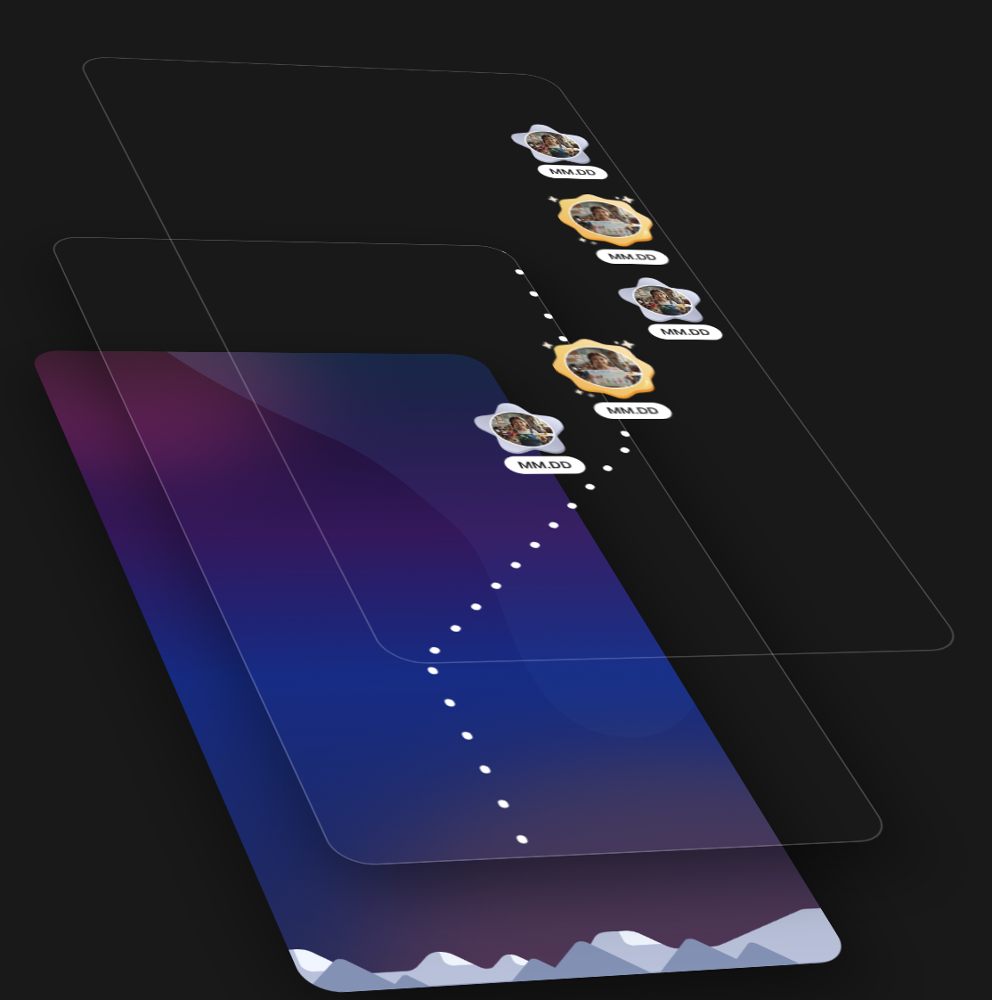
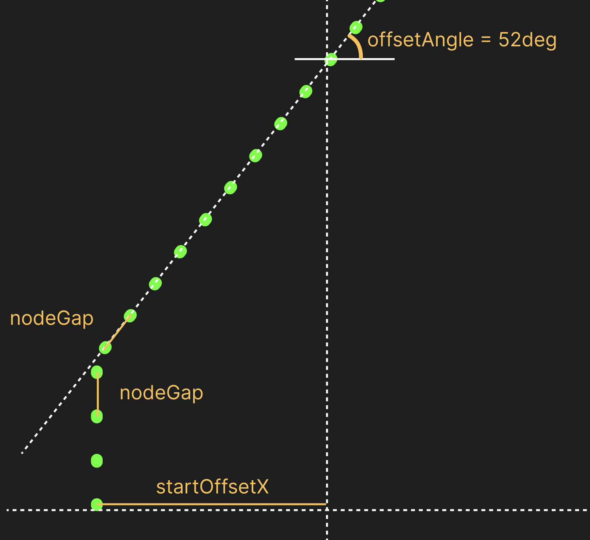
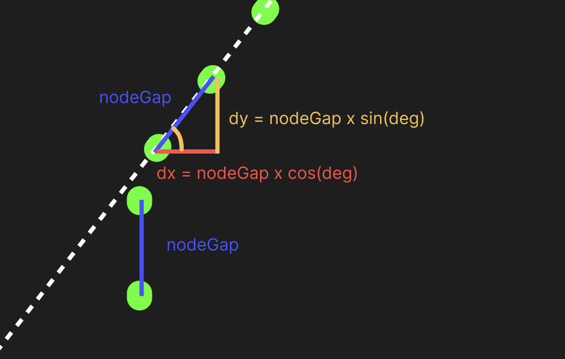

최근 인턴으로 재직중인 누비랩의 냠냠플러스 `오늘찰칵` 서비스 고도화 작업을 하면서, 단순 갤러리 형태의 화면을 조금 더 재미있고 감정적으로 연결되는 경험으로 바꾸는 작업을 맡게 되었습니다.

기존 POC는 "사진을 나열해서 보여주는 화면"에 가까웠습니다. 기능은 있었지만, 아이의 기록을 탐험하듯 따라가게 만드는 몰입감이나, 부모 입장에서 하나씩 발견하는 재미는 부족했습니다.

<div style="display: flex; justify-content: center; gap: 16px; width:100%">
    
    
</div>

그래서 도입된 컨셉이 바로 **별자리 지도 UI**이었습니다.

문제는 여기서부터였습니다. 겉으로 보기엔 별처럼 점이 이어진 예쁜 경로지만, 실제 구현 단계에 들어가면 이건 단순한 데코레이션이 아니라 다음 조건을 모두 만족해야 하는 시스템이었습니다.

> - 별자리 노드 개수가 바뀌어도 대응 가능해야 함
> - 경로 모양이 바뀌어도 유지보수가 가능해야 함
> - 모바일 WebView에서도 버벅이지 않아야 함
> - 디자인 QA에서 미세 조정을 요청해도 빠르게 반영 가능해야 함

처음엔 그냥 하드코딩으로 정적인 좌표를 박아 넣으면 되는 문제처럼 보였지만, 추후 확장성을 고려했을때는 해당 방법이 적절하지 않다고 생각했습니다.

이번 글에서는 그 과정에서 왜 단순 하드코딩을 버리고, **삼각함수 기반의 좌표 계산 + Render Props 패턴**으로 문제를 풀었는지 정리해보겠습니다.

## 예쁜 시안, 끔찍한 유지보수

디자인 시안을 기준으로 보면 별자리 노드는 세로 방향으로 길게 이어지고, 중간중간 좌우로 꺾이며, 특정 간격마다 큰 마커(별)가 들어가고 그 외에는 작은 점선처럼 이어지는 구조였습니다.

<center>
  
</center>

이걸 가장 단순히 구현하는 첫 번째 접근방법은 해당 경로가 포함된 이미지를 배경으로 깔고, 상호작용이 필요한 각 별의 x, y 좌표를 추출하여 하드코딩하는 방식입니다.

```tsx
const nodes = [
  { x: -102, y: 0 },
  { x: -102, y: 20 },
  { x: -102, y: 40 },
  { x: -86, y: 60 },
  ...
];

<Layer backgroundImage="/우주배경이미지.webp">
  {nodes.map((node, index) => (
    <StarNode key={index} x={node.x} y={node.y} />
  ))}
</Layer>
```

가장 단순한 구현방법이지만, 다음과 같은 문제점들이 예상되었습니다

### 1️⃣ 노드 개수나 경로가 바뀌는 순간, 전체 좌표를 다시 설정해야한다

오늘은 20개 노드지만 기록이 추가되며 추후 40개가 될 수 있고, 경로의 각도나 밀도를 바꿔야 할 수도 있습니다.<br>
하드코딩 방식은 일부만 수정해도 전체 균형이 깨질 수 있고, 하나하나의 좌표를 찾아서 수정하는 것은 비효율적입니다. <br>
Figma MCP 를 사용하더라도 여전히 안맞는 픽셀이 있는경우 하나하나 검토하는건 개발자의 몫이었습니다

### 2️⃣ 디자인 QA 대응의 비효율성

"여기 조금만 더 오른쪽으로", "이 구간은 간격이 너무 촘촘함"과 같은 픽셀 단위의 요청이 들어올 때마다 수동으로 좌표를 찾고 수정하는 과정은 비효율적입니다.

### 3️⃣ SVG Path의 실용성 한계

SVG Path는 곡선 표현력은 좋지만, 모바일 WebView 환경에서 경로가 길고 노드가 많아질 경우 래스터화 비용과 렌더링 안정성 측면에서 부담이 될 가능성이 있었습니다.<br>
무엇보다 특정 노드를 개별 UI 컴포넌트로 제어하기에는 유연성이 떨어졌습니다.

## 선택지 검토

구현 방향은 크게 세 가지로 압축되었습니다.

| 구분                           | 장점                                 | 단점                                       |
| :----------------------------- | :----------------------------------- | :----------------------------------------- |
| **A. 수동 하드코딩**           | 시안과 100% 동일하게 구현 가능       | 유지보수 비용 급증, QA 대응 취약           |
| **B. SVG Path 기반**           | 정교한 곡선 표현                     | WebView 성능 우려<br>개별 노드 제어 어려움 |
| **C. 삼각함수 기반 좌표 계산** | 파라미터 기반 자동 생성, 운영 최적화 | 초기 로직 설계 필요                        |

최종적으로 디자인 100% 복제보다 운영 가능한 시스템이 더 중요하다고 판단하여 C안을 선택했습니다.

## 좌표를 저장하지 말고, 규칙으로 만들자

> "노드 하나하나의 좌표를 직접 갖고 있지 말고, 시작점 + 간격 + 각도 + 방향 패턴만으로 좌표를 생성하자."

<center>
  
</center>

이 구조가 되면 경로는 더 이상 픽셀 덩어리가 아니라, **파라미터 기반 생성 결과물**이 됩니다.

- `nodeGap`: 노드 사이의 거리 (빗변)
- `angle`: 경로가 꺾이는 기준 각도
- `offsetArray`: 좌/우/직진 여부를 결정하는 패턴 배열
- `offsetStartX`: 시작점 가로 위치

## 구현 1: 삼각함수로 노드 간 수평/수직 이동 거리 계산

<center>
  
</center>

처음에는 단순히 세로 간격을 고정하고 가로 이동량만 계산했으나, 대각선 경로에서도 일정한 시각적 밀도를 유지하기 위해 **빗변(`nodeGap`)을 기준**으로 잡았습니다.

내려갈 때 좌우로 얼마나 이동할지(`dx`)와 아래로 얼마나 내려갈지(`dy`)를 각도와 빗변 기반으로 계산했습니다.

```ts
const deg = angle * (Math.PI / 180);
const dx = nodeGap * Math.cos(deg);
const dy = nodeGap * Math.sin(deg);
```

이렇게 구한 `dx`, `dy`를 패턴 배열에 적용하여 각 노드의 위치를 자동 생성하도록 했습니다.

```ts
export function createStarNodes({
    totalNodes,
    nodeGap,
    angle,
    offsetArray,
    offsetStartX,
}: CreatStarNodesArgs) {
    const nodes = new Array<NodePosition>();
    const deg = angle * (Math.PI / 180);
    const dx = nodeGap * Math.cos(deg);
    const dy = nodeGap * Math.sin(deg);

    let x = offsetStartX;
    let y = 0;

    for (let n = 0; n < totalNodes; n++) {
        nodes.push({ x, y });

        const dir = offsetArray[n % offsetArray.length];

        if (dir === 0) {
            // 직진할 때는 nodeGap만큼 수직으로만 이동
            y += nodeGap;
        } else {
            // 꺾일 때는 계산된 dx, dy만큼 이동
            x += dir * dx;
            y += dy;
        }
    }

    return nodes;
}
```

`offsetArray`의 값이 `0`이면 직진, `1`이면 우측, `-1`이면 좌측으로 흐름을 정의하되, 꺾이는 구간에서도 노드 사이의 거리(`nodeGap`)가 일정하게 유지되도록 설계했습니다.

## 구현 2: Render Props로 "좌표 생성"과 "UI"를 분리

좌표 로직과 UI를 섞지 않기 위해 `StarMapLayer`는 좌표 계산과 배치만 책임지고, 각 노드에 무엇을 낼지는 외부에서 주입받는 **Render Props** 패턴을 적용했습니다.

```tsx
// 0 : 직진, 1 : 우측, -1 : 좌측
const offsetArray = [
    Array(9).fill(0),
    Array(12).fill(1),
    Array(27).fill(0),
    Array(10).fill(-1),
    Array(9).fill(0),
    Array(8).fill(1),
    Array(11).fill(0),
    Array(12).fill(-1),
].flat();

<StarMapLayer
    totalNodes={offsetArray.length}
    nodeGap={20}
    angle={52}
    offsetArray={offsetArray}
    offsetStartX={-100}
    render={(node, index) => {
        // 5번째 노드만 별자리 마커로 표시
        if (index % 5 === 0) return <StarMapMarker node={node} index={index} />;
        return <DotMarker node={node} />;
    }}
/>;
```

덕분에 특정 인덱스만 잠금 상태로 표시하거나, 보상 강조 UI를 입히는 등의 확장이 자유로워졌습니다.

## 구현 3: 픽셀 맞추기 지옥에서 벗어나기 위한 "개발자 도구"

수학적으로 위치를 계산하게 만들었지만, 여전히 고민은 남았습니다.<br>
`angle`, `gap`, `offsetArray` 같은 값들을 바꿀 때마다 코드를 수정하고 HMR을 기다리며 픽셀을 맞추는 건 여전히 비효율적이었습니다

> "그냥 화면에서 직접 슬라이더로 조절하면서 최적의 값을 찾고, 그 코드만 복사해서 붙여넣으면 안 될까?"

이런 고민 끝에 별자리 에디터(StarMap DevTools)를 추가했습니다. <br>
슬라이더를 통해 실시간으로 경로를 비틀어보며 최적의 디자인을 찾고, `코드 복사하기` 버튼으로 즉시 현재 설정값을 복사할 수 있는 도구입니다.

<center>

</center>

이 개발자 도구 덕분에 며칠이 걸릴 수도 있었던 디자인 미세 조정 작업을 단 몇분만에 끝낼 수 있었습니다.

## 느낀 점

### 이거 좌표 하나하나를 나보고 찍으라고?

처음 시안을 받았을 때 가장 먼저 든 생각은 '노드 좌표를 언제 다 따고 있지?'였습니다. 하지만 단순히 귀찮음의 문제가 아니었습니다.<br>운영 환경에서 노드가 추가되거나 경로를 살짝만 비틀어달라는 요청이 오면, 그때마다 피그마에서 좌표를 다시 추출하고 코드를 수정하는 '노가다'가 반복될 게 뻔햇기 때문입니다.<br>

### 디자인 재현도와 제어 가능성의 균형

개발자로서 시안을 100% 똑같이 재현하고 싶은 욕심은 늘 있습니다. 하지만 실제 서비스 관점에서는 경로를 수식으로 완벽하게 그리는 것보다, **개발자가 숫자로 제어할 수 있고 운영팀의 요구에 즉각 대응할 수 있는 구조**를 만드는 게 훨씬 가치 있다는 걸 배웠습니다.<br>
`angle`, `gap` 같은 변수 몇 개로 전체 흐름을 바꿀 수 있게 되었습니다
