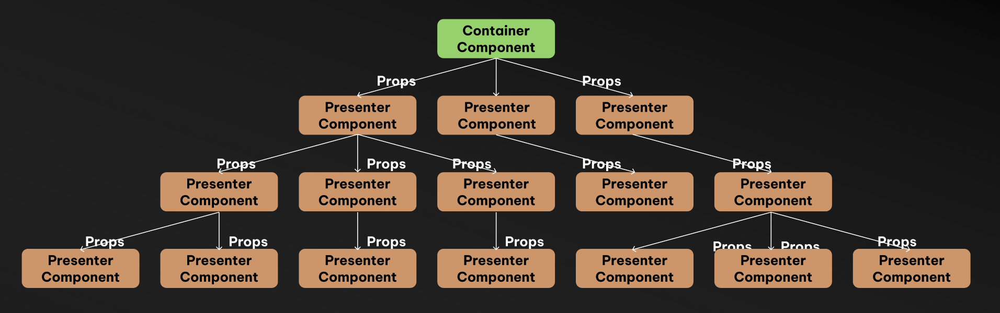

# 뭐? Context 가 복사가 된다고? (feat. Context Provider Hell)



React 를 사용하다 보면 전역적인 상태나 설정을 공유하기 위해 자연스럽게 Context를 사용하게 됩니다. 테마, 인증정보, 폼 상태 ... 처음엔 편합니다. `<Provider/>` 로 감싸주면, 어디서든 데이터를 쉽게 꺼내쓸 수 있으니까요.

하지만 프로젝트가 조금만 커지면 상황이 달라집니다. 컴포넌트 트리의 최상단에 `<Provider/>` 들이 복사가 되기 시작합니다. 🤮 <br />

저는 NextJS Page Router 에서 각각의 퍼널에 `getServerSideProps` 로 부터 받은 데이터를 Context 로 Funnel에 내려주는 작업을 하다가 이 문제를 겪었습니다.

```tsx
export const getServerSideProps = async (context) => {
    // ... fetch data
};

export default function ApplyExamPage() {
    return (
        {/* [!code focus] */}
        <OptionalFormProvider {...methods}>
            {/* [!code focus] */}
            <ExamAreaProvider examAreas={examAreas}>
                {/* [!code focus] */}
                <ProfileContextProvider profileData={profileData}>
                    {/* [!code focus] */}
                    <VerifyRegisterRecommenderContextProvider
                        verifyRecommender={verifyCanRegisterRecommender}
                    >
                        <FormPersistor storageKey="mosu:form" type="sessionStorage" />

                        <Title>모의수능 신청</Title>
                        <Funnel>
                            <Step name="apply-area">
                                <SiteMetadata
                                    title="신청하기 – 고사장 선택 – 모수"
                                    content="희망 시험일과 고사장을 선택하는 단계입니다. 지역별 학교 선택 가능."
                                />
                                <ApplyAreaStep />
                            </Step>
                            {/* ... */}
                        </Funnel>
                    {/* [!code focus] */}
                    </VerifyRegisterRecommenderContextProvider>
                {/* [!code focus] */}
                </ProfileContextProvider>
            {/* [!code focus] */}
            </ExamAreaProvider>
        {/* [!code focus] */}
        </OptionalFormProvider>
    );
}
```
