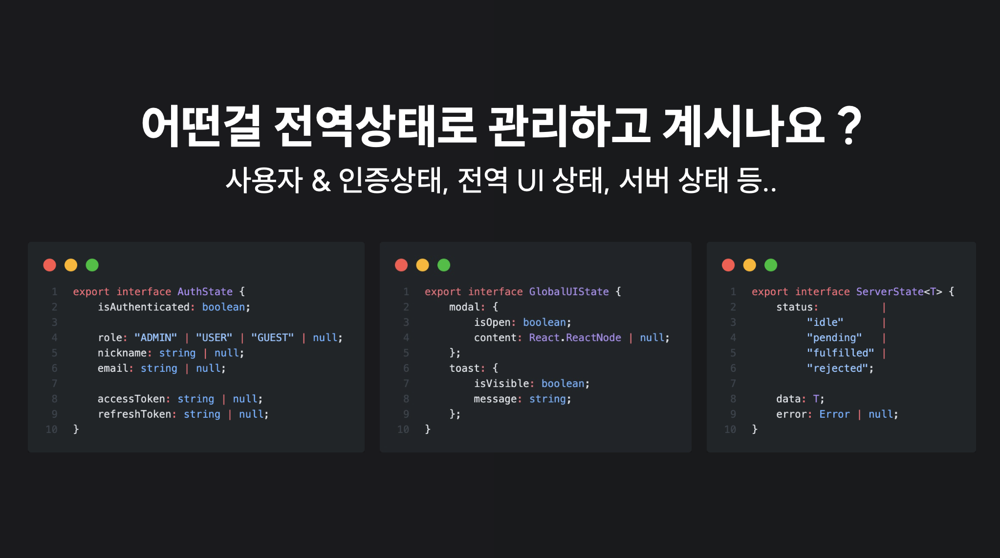
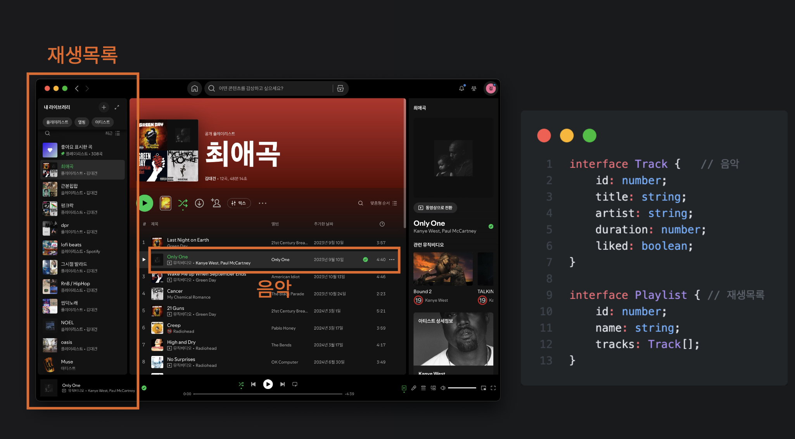
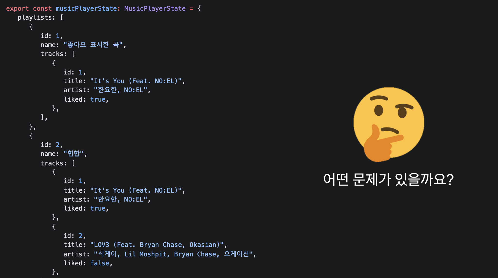
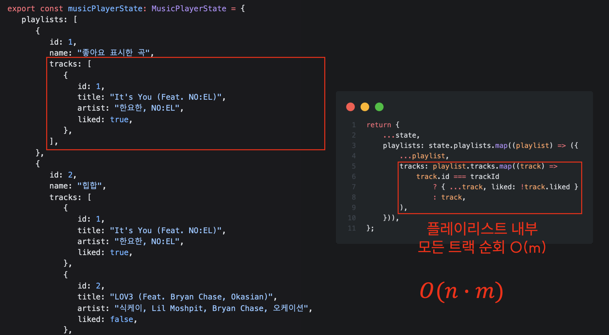
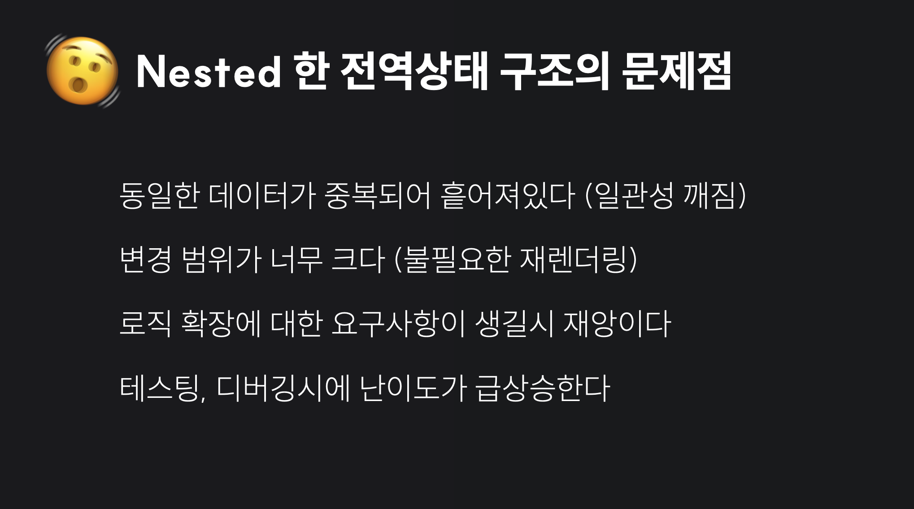
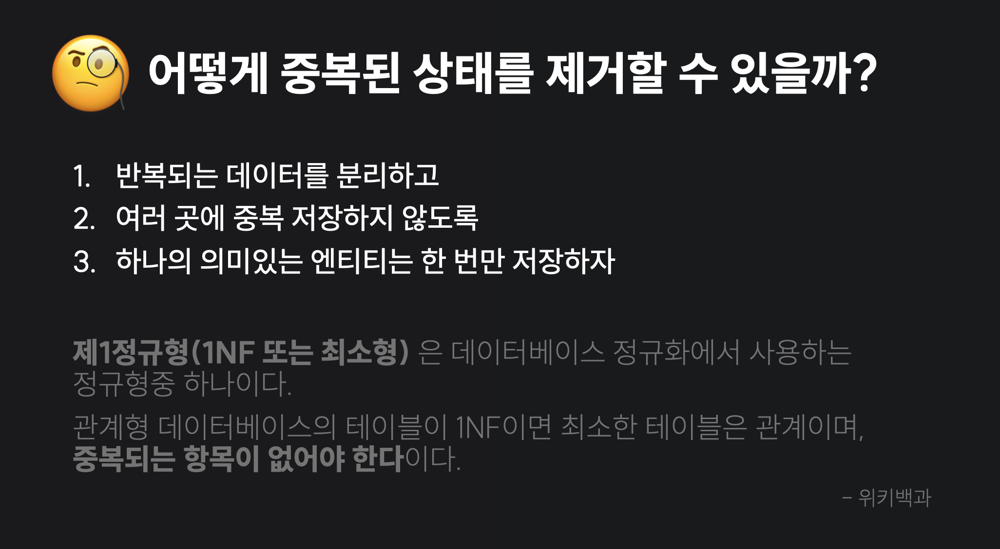
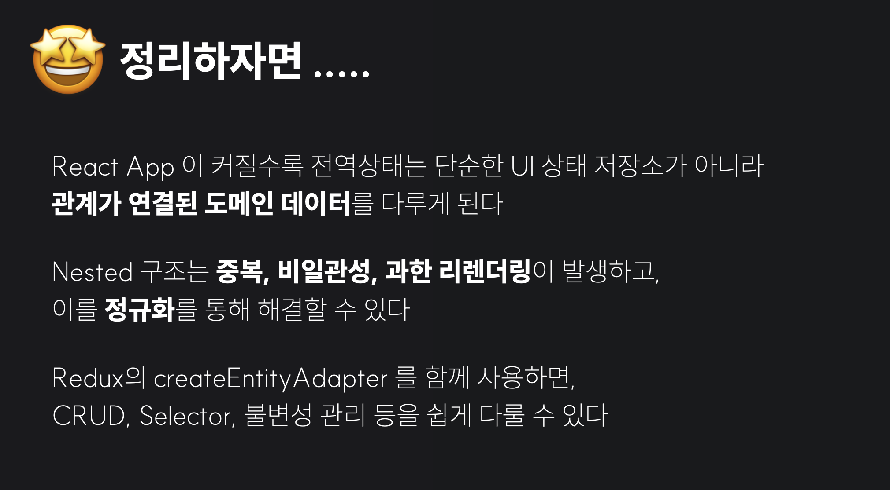

## 🤨 어떤걸 전역상태로 관리하고 있나요?

프론트엔드 개발을 하다 보면 전역 상태를 관리해야 하는 경우가 많습니다

혹시 여러분은 어떤 상태를 전역상태로 관리하고 있나요 ?



사용자의 인증정보, 테마 설정, 전역적으로 관리되는 모달이나 토스트, 그리고 서버에서 받아온 데이터들까지 다양한 상태들이 전역상태로 관리될 수 있습니다.

프론트엔드에서는 전역상태를 하나의 JSON 객체로 관리하는 경우가 많습니다.

그렇다면 항상 Nested 한 JSON 객체로 전역상태를 관리하는게 좋을까요?

## 🎧 Spotify 앱으로 보는 전역상태

Spotify 앱을 예시로 생각해봅시다



좌측에는 재생목록이 있고, 가운데는 재생목록에 속한 노래들이 목록 형태로 주어져 있습니다. <br/>
하단에는 현재 재생중인 노래의 정보가 표시되고 있네요.

이 앱에서 전역상태로 관리해야 할 상태는 어떤게 있을까요?

<br/>

재생목록, 노래목록, 현재 재생중인 노래 등이 앱이 이동하는 동안에도 유지되거나 변경되어야 하므로 전역상태로 관리하는게 좋겠다는 생각이 듭니다.

이 중에서 노래와 재생목록 데이터에 집중해서 어떻게 전역상태를 설계할지 생각해봅시다.

가장 처음 떠오르는 전역상태의 구조는 다음과 같습니다.

```ts
interface Track {
    id: number;
    title: string;
    artist: string;
    duration: number;
    liked: boolean;
}

interface Playlist {
    id: number;
    name: string;
    tracks: Track[];
}
```

각 플레이리스트 안에 `tracks` 배열로 노래들이 중첩(Nested) 되어 있는 형태입니다

## 🫨 Nested 한 전역상태의 문제점



이러한 구조에서 발생하는 문제는 어떤 것들이 있을까요? <br/>
처음 봤을때는 별 문제가 없어 보일수도 있습니다. 저도 그랬구요..

## 🥴 id 가 1인 노래가 싫어졌어요..

다음과 같은 상황을 가정해보겠습니다.

> id 가 1인 노래가 싫어졌어요 ㅠㅠ <br/>
> 모든 플레이리스트에서 id 가 1인 노래의 liked 속성을 false 로 토글해주세요!


먼저 모든 플레이리스트를 순회합니다 ($$O(n)$$)



이후, 각 플레이리스트의 `tracks` 배열을 순회하며 ($$O(m)$$)<br/>
id 가 1인 노래를 찾으면 liked 속성을 토글합니다

데이터의 개수가 적을때는 큰 문제가 없을수도 있지만, <br/>
`플레이리스트가 수백개, 각 플레이리스트에 수천개의 노래가 있다면?` 어떻게 될까요?

또는 구현을 했는데 `어느 한군데의 플레이리스트에서 id 가 1인 노래의 liked 속성이 토글되지 않았다면?` <br/>
디버깅하기가 너무 힘들어집니다.


그리고 두 플레이리스트를 각각 구독하고있는 컴포넌트 `<LikedPlaylistPanel/>` 과 `<HipHopPlaylistPanel/>` 이 있다고 가정해봅시다.

결국 모든 플레이리스트와 모든 노래를 순회하며 liked 속성을 토글했기 때문에, <br/>
전역 상태를 구독하고 있는 두 컴포넌트 모두 리렌더링이 발생하게 됩니다

<br/>

이처럼 Nested 한 전역상태는 다음과 같은 문제점이 있습니다.



> 1. 동일한 데이터가 중복되어 흩어져 있다 (일관성 깨짐)
> 2. 변경 범위가 너무 크다 (불필요한 재렌더링)
> 3. 로직 확장에 대한 요구사항이 생길시 재앙이다
> 4. 테스팅, 디버깅시 난이도가 급상승한다

이중 가장 근본적인 문제는 `동일한 데이터가 중복되어 흩어져 있다` 는 점입니다.

## 🧐 어떻게 중복된 상태를 제거할 수 있을까 ?



데이터베이스에서는 중복된 데이터를 제거하기 위해 `정규화(Normalization)` 라는 개념을 사용합니다. <br/>
그 중, 제1정규형 (1NF) 는 `최소한의 테이블은 관계이며, 중복되는 항목이 없어야한다` 는 원칙을 가지고 있습니다.

마찬가지로, 우리가 관리하려는 전역상태 또한

> 1. 반복되는 데이터를 분리하고
> 2. 여러 곳에 중복 저장하지 않도록
> 3. 하나의 의미있는 엔티티는 한 번만 저장

하는 방식으로 설계할 수 있습니다.

## 🤩 Spotify 전역상태 다시 설계하기


오른쪽 그림과 같이 기존에 중첩되어 있던 `tracks` 배열을 분리해서 각각의 id 로 접근할 수 있는 유사배열객체 형태로 바꿀 수 있습니다.

### 1️⃣ 좋아요 토글하기

```ts
function toggleLike(state: MusicPlayerState, action: PayloadAction<TrackId>) {
    const trackId = action.payload;
    const track = state.tracksById[trackId];

    if (!track) return;
    track.liked = !track.liked;
}
```

이제 좋아요 토글 기능을 구현할 때도, `tracksById` 에서 id 로 바로 접근하여 토글할 수 있고, <br/>
모든 플레이리스트를 순회할 필요가 없어졌습니다.

### 2️⃣ 플레이리스트에 있는 트랙 조회하기

```ts
function selectPlaylistWithTracks(playlistId: PlaylistId) {
    return (state: MusicPlayerState) => {
        const playlist = state.playlistsById[playlistId];
        if (!playlist) return null;

        return {
            ...playlist,
            tracks: playlist.trackIds.map((id) => state.tracksById[id]),
        };
    };
}
```

플레이리스트에 속한 트랙들을 조회할 때도, <br/>
플레이리스트의 `trackIds` 배열을 순회하며 `tracksById` 에서 각각의 트랙을 조회할 수 있습니다.

### 3️⃣ 플레이리스트에 트랙 추가하기

```ts
function addTrackToPlaylist(state: MusicPlayerState, action: PayloadAction<AddTrackPayload>) {
    const { playlistId, trackId } = action.payload;
    const playlist = state.playlistsById[playlistId];

    if (!playlist) return;

    if (!playlist.tracks.includes(trackId)) {
        playlist.tracks.push(trackId);
    }
}
```

플레이리스트에 트랙을 추가할 때도, <br/>
플레이리스트의 `trackIds` 배열에 새로운 트랙 id 를 추가해주면 됩니다.

## 🤗 Redux Toolkit 의 createEntityAdapter 사용하기

Redux Toolkit 에서는 `createEntityAdapter` 라는 유틸리티를 제공하여, <br/>
이러한 정규화된 전역상태를 쉽게 관리할 수 있도록 도와줍니다.

| 개념            | 설명                                          |
| --------------- | --------------------------------------------- |
| 정규화          | 중복 제거, 상태를 ID 기반으로 관리            |
| EntityAdapter   | ID 기반의 정규화된 데이터의 CRUD 를 처리      |
| getInitialState | Adapter 가 관리할 엔티티 상태의 초기구조 생성 |
| getSelectors    | 조회를 위한 Selector 생성                     |

이외에도 다양한 메서드들이 제공되는데, 이는 공식문서 [Redux Toolkit - createEntityAdapter](https://redux-toolkit.js.org/api/createEntityAdapter) 를 참고해주세요.

## 😎 Redux createEntityAdapter 로 Spotify 상태 관리하기

```ts
import { createSlice, createEntityAdapter, PayloadAction } from "@reduxjs/toolkit";

const tracksAdapter = createEntityAdapter<Track>({
    selectId: (track) => track.id,
});

const tracksSlice = createSlice({
    name: "tracks",
    initialState: tracksAdapter.getInitialState(),
    reducers: {
        addTrack: tracksAdapter.addOne,
        addTracks: tracksAdapter.addMany,
        updateTrack: tracksAdapter.updateOne,
        removeTrack: tracksAdapter.removeOne,

        toggleLike(state, action: PayloadAction<TrackId>) {
            const track = state.entities[action.payload];
            if (track) {
                track.liked = !track.liked;
            }
        },
    },
});
```

위와 같이 `createEntityAdapter` 를 사용하여 `tracks` 슬라이스를 만들 수 있습니다. <br/>
이제 `createEntityAdapter` 에서 제공하는 CRUD 메서드들을 사용해서 트랙을 추가, 수정, 삭제할 수 있습니다

### 1️⃣ 노래 추가하기

```ts
dispatch(
    tracksActions.addTrack({
        id: 1,
        title: "Song A",
        artist: "Artist A",
        duration: 210,
        liked: false,
    }),
);
```

### 2️⃣ 여러 노래 추가하기

```ts
dispatch(
    tracksActions.addTracks([
        { id: 2, title: "Song B", artist: "Artist B", duration: 200, liked: false },
        { id: 3, title: "Song C", artist: "Artist C", duration: 180, liked: false },
    ]),
);
```

### 3️⃣ 노래 수정하기

```ts
dispatch(
    tracksActions.updateTrack({
        id: 1,
        changes: { artist: "New Artist A" },
    }),
);
```

### 4️⃣ 노래 삭제하기

```ts
dispatch(tracksActions.removeTrack(1));
```

### 5️⃣ 좋아요 토글하기

```ts
dispatch(tracksActions.toggleLike(1));
```

---

이제 Playlist 슬라이스도 비슷한 방식으로 만들어주면 됩니다.

```ts
const playlistsAdapter = createEntityAdapter<Playlist>({
    selectId: (playlist) => playlist.id,
});

const playlistsSlice = createSlice({
    name: "playlists",
    initialState: playlistsAdapter.getInitialState(),
    reducers: {
        addPlaylist: playlistsAdapter.addOne,
        updatePlaylist: playlistsAdapter.updateOne,
        removePlaylist: playlistsAdapter.removeOne,

        addTrackToPlaylist(state, action: PayloadAction<AddTrackPayload>) {
            const { playlistId, trackId } = action.payload;
            const playlist = state.entities[playlistId];

            if (playlist && !playlist.trackIds.includes(trackId)) {
                playlist.trackIds.push(trackId);
            }
        },
    },
});
```

### 6️⃣ 플레이리스트에 해당하는 노래 조회하기

```ts
import {createSelector} from "@reduxjs/toolkit";

export const selectPlaylistWithTracks = (playlistId: PlaylistId) => {
    return createSelector(
        [
            playlistSelectors.selectEntities,
            tracksSelectors.selectEntities,
        ],
        (playlistEntities, trackEntities) => {
            const playlist = playlistEntities[playlistId];
            if (!playlist) return null;

            return {
                ...playlist,
                tracks: playlist.trackIds.map((id) => trackEntities[id]
            }
        }
    );
}
```

## 🏁 정리하자면



1. React App 이 커질수록 전역상태는 단순한 UI 상태 저장소가 아니라 관계가 연결된 도메인 데이터를 다루게 된다.
2. Nested 구조는 중복, 비일관성, 과한 리렌더링이 발생하고, 이를 정규화를 통해 해결할 수 있다
3. Redux 의 createEntityAdapter 를 함께 사용하면 CRUD, Selector 등을 쉽게 다룰 수 있다

발표 들어주셔서 감사합니다! 😊

## 🙋‍♂️ QnA

:::details 전역상태의 정규화는 어느 단계까지 진행해야 하나요? (1NF, 2NF, 3NF, BCNF 등)

| 정규화 단계                         | 프론트에서 필요한가? | **안 지켰을 때 발생하는 실제 문제**                                                            | 예시 상황                                                                                             |
| ----------------------------------- | :------------------: | ---------------------------------------------------------------------------------------------- | ----------------------------------------------------------------------------------------------------- |
| **1NF**<br>(Atomic, 반복 필드 제거) |      거의 필수       | - 깊은 중첩으로 업데이트 난이도 상승<br>- 불필요한 렌더링 증가<br>- 참조 비교 실패로 성능 저하 | 리스트 안에 객체가 중첩 2단계 이상 들어있고, 그 중 일부만 수정하는 경우 `setState`가 매번 전체 재렌더 |
| **2NF**<br>(부분 함수 종속 제거)    |         선택         | - 동일 데이터가 여러 구조에 중복 보관됨<br>- “한 곳 변경 → 다른 곳 불일치” 발생                | User 닉네임이 A 모달에는 업데이트 됐는데 B 페이지엔 이전 값 그대로                                    |
| **3NF**<br>(이행적 종속 제거)       |         선택         | - 상태 전파 지옥: 특정 필드 변경 시 연쇄 업데이트 필요<br>- 캐시 무효화 범위 확대 → 성능 문제  | 상품 `status` 바뀌면<br>“상태 그룹별 카운트” 등 **파생 데이터 일일이 SYNK 필요**                      |

:::

:::details 그냥 Map 자료구조를 쓰면 안되나요?

#### 1. Map vs 정규화는 서로 대체 관계가 아니다

`Map<number, Track>` 으로 저장하든 `{ [id: number]: Track }` 으로 저장하든 둘 다 `id > 엔티티` 라는 정규화된 형태이다 <br/>
즉, Map은 컨테이너 타입 선택의 문제이고,<br/>
정규화는 `중복 없이 한 번만 저장하고, 나머지는 id로 참조하자`는 모델링 규칙입니다.<br/>
그래서 Map을 쓰더라도, 같은 Track을 여러 Map에 중복으로 넣기 시작하면 여전히 정규화가 안 된 상태가 됩니다.

#### 2. 전역 상태(특히 Redux)에서 Map이 잘 안 쓰이는 이유

Redux/RTK, DevTools, 직렬화 관점에서 보면 Map은 단점이 꽤 있습니다.<br/>
Redux 공식 가이드라인이 `state는 직렬화 가능해야 한다`인데, Map은 `JSON.stringify` 하면 날아가거나 이상하게 변합니다.<br/>
때문에, Redux DevTools, time travel, persistence(로컬스토리지 저장)에서 문제가 생길 수 있습니다.<br/>

`createEntityAdapter` 자체가 `entities: Record<ID, Entity>` 구조를 전제로 만들어져 있습니다. <br/>
Map을 쓰면 이 유틸을 그대로 쓰지 못하고, 매번 Array.from(map.values()) 같은 브릿지 코드가 필요합니다.

또, `createSelector` / `useSelector` 에서 `state.entities`를 객체로 둘 때 <br/>
키/값이 바뀌지 않으면 참조 그대로 유지 해주는데, <br/>
Map은 이터러블이긴 하지만, 내부 변경을 감지하거나 equality를 정의하기 더 까다롭습니다.

그래서 `전역 상태 + DevTools + 직렬화 + RTK 생태계` 조합을 쓴다면
대부분 Record 형태의 객체를 기본으로 가져가는 편입니다.

#### 3. 그럼 Map은 언제 괜찮나?

컴포넌트 내부 로컬 상태에서 직렬화가 크게 중요하지 않고 Map의 메서드 API(set, get, has)가 편할 때 <br/>
연산이 많고 사이즈가 큰 컬렉션을 다룰 때 (예: 그래프 구조, 빈번한 삽입/삭제가 필요한 경우) <br/>
이런 곳에서는 Map을 써도 전혀 문제 없고, 오히려 장점이 될 수 있습니다.

하지만 이때도 같은 엔티티를 여러 Map/배열에 중복 저장하기 시작하면 Map을 쓰든, 객체를 쓰든 정규화가 안 된 상태가 됩니다.
:::
