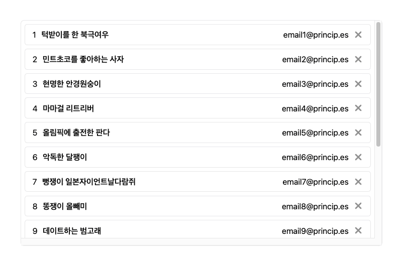
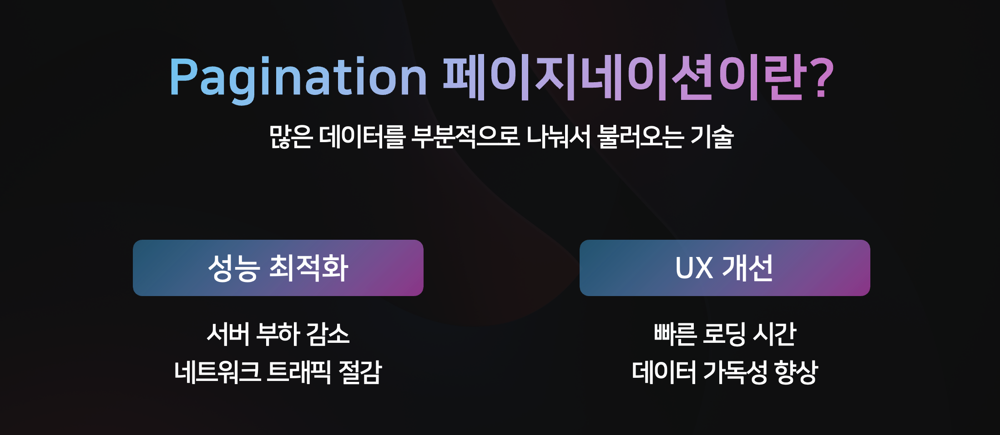
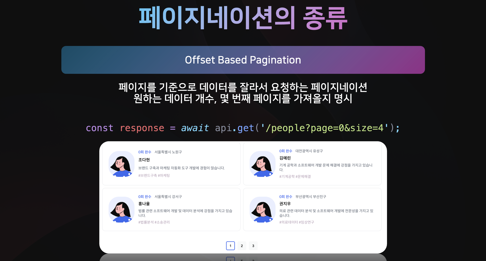
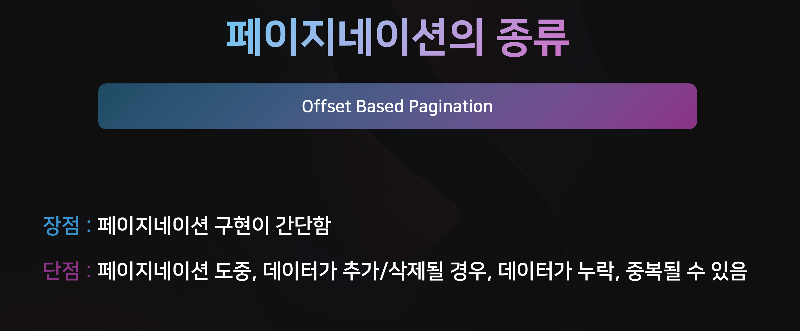
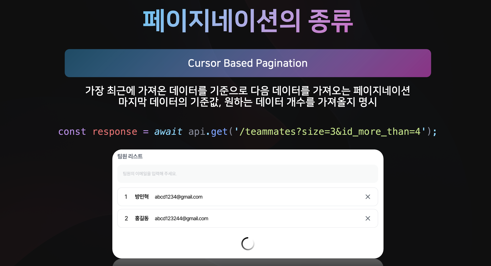
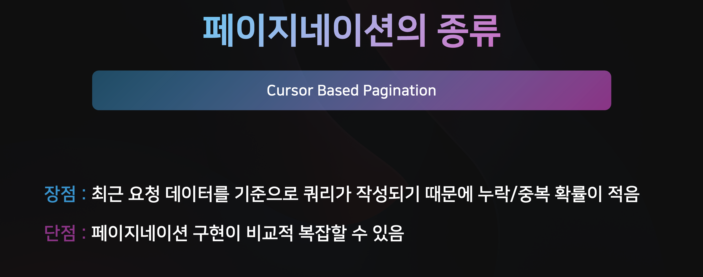
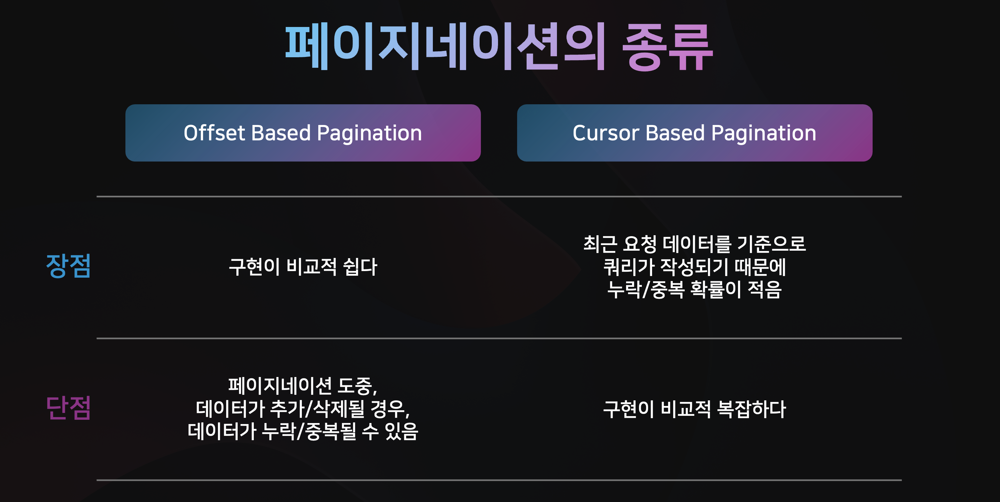
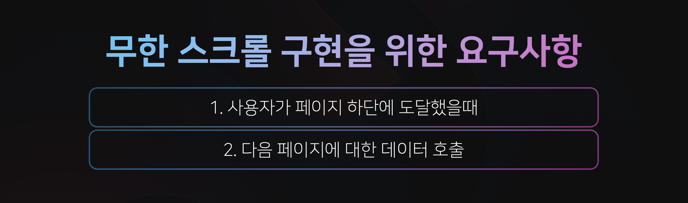
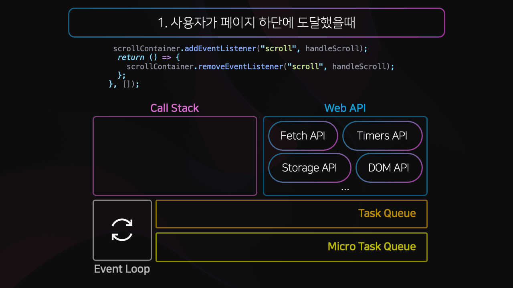

# IntersectionObserver 로 무한 스크롤 구현하기 (with. Cursor Based Pagination)

현대의 모바일 웹이나 앱에서 흔이 볼 수 있는 기능 중 하나가 바로 '무한 스크롤' 입니다.
하지만, 무한 스크롤을 이해하기 위해선 먼저 '페이지네이션'을 알아볼 필요가 있습니다.
그렇다면 Pagination 페이지네이션 이란 무엇일까요 ?

## 📖 Pagination 페이지네이션이란?

페이지네이션이란? 많은 데이터를 부분적으로 나눠서 불러오는 기술을 말합니다.

서버와의 통신에는 항상 비용이 따르는데, 대량의 데이터를 한꺼번에 전송할 경우,

> 1. 네트워크 오버헤드가 발생할 뿐만 아니라,  
> 2. 서버에 많은 부하가 발생하고,

이는 곧 성능 저하로 이어질 수 있습니다.

또한, 사용자는

> 1. 데이터를 로드 하는데 많은 시간이 발생하고  
> 2. 데이터 가독성 또한 떨어지며,

이는 나쁜 사용자 경험을 초래합니다.

페이지네이션을 사용하면, 위의 단점들을 해결 할 수 있습니다.

## 📖 페이지네이션의 종류

페이지네이션에는 크게 Offset 기반 페이지네이션과 Cursor 기반 페이지네이션 두가지 종류가 있습니다.

### ✏️ Offset Based Pagination 오프셋 기반 페이지네이션

오프셋 기반 페이지네이션은 페이지를 기준으로 데이터를 잘라서 요청하는 페이지네이션 입니다.

주로, 페이지 버튼이 있는 UI 에서 사용되며, API 호출시, 원하는 데이터 개수와, 몇 번째 페이지를 가져올지 명시합니다.

오프셋 기반의 페이지네이션은 커서 기반 페이지네이션보다 비교적 구현이 간단하다는 장점이 있지만,  
페이지네이션 도중, 데이터가 추가/삭제 될 경우, 데이터가 누락/중복 될 수 있다는 단점이 있습니다.

### ✏️ Offset Based Pagination 오프셋 기반 페이지네이션의 동작

10개의 데이터를 4개씩 나눠 오프셋 기반의 페이지네이션으로 가져오는 상황을 가정해 보겠습니다.

다음과 같이 페이지네이션 도중 데이터가 추가되는 경우, 3 번 데이터가 중복되어 불러와지는 것을 확인 할 수 있습니다.  
또한, 페이지네이션 도중 데이터가 삭제되는 경우, 4 번 데이터가 누락되어 불러와지는 것을 확인 할 수 있습니다.

이를 보완하기 위한 페이지네이션 방식이 Cursor Based Pagination 입니다.

### ✏️ Cursor Based Pagination 커서 기반 페이지네이션

커서 기반의 페이지네이션은 가장 최근에 가져온 데이터를 기준으로, 다음 데이터를 불러옵니다.

주로, 무한 스크롤과 같은 UI 에서 사용되며, API 호출시, 마지막 데이터의 기준값, 원하는 데이터 개수를 명시합니다.

커서 기반 페이지네이션은 최근 요청된 데이터를 기준으로 쿼리가 작성되기 때문에, 누락되거나 중복될 확률이 적다는 장점이 있지만,  
페이지네이션 구현이 비교적 복잡할 수 있다는 단점이 있습니다

### ✏️ Offset Based Pagination 오프셋 기반 페이지네이션의 동작

이전과 동일한 10개의 데이터를 페이징하는 상황에서,  
응답에 들어있는 커서를 다음 요청의 query 로 전송하면, 서버에서는 해당 커서 이후의 데이터를 응답으로 보내줍니다.

그렇기 때문에, 데이터가 추가되거나 삭제 되더라도 데이터가 누락되거나 중복되지 않습니다.

### ✏️ 정리

## 📖 Infinite Scroll 무한 스크롤

그렇다면 커서 기반의 페이지네이션을 사용한 무한 스크롤은 어떻게 구현할 수 있을까요?

무한 스크롤을 구현하기 위한 요구사항을 정리하면 다음과 같습니다.

다음 페이지에 대한 데이터는 이전 응답에서의 커서를 요청 쿼리 파라미터에 넣으면 되고,  
우리는 사용자가 페이지 하단에 도달했을때를 감지할 수 있어야 합니다.

### ✏️ Scroll Event

ScrollEventListener 를 사용하면, 사용자가 얼만큼 스크롤을 내렸는지 확인 할 수 있습니다.

브라우저에서는 스크롤이 가능한 컨테이너에 대해 `scrollTop` , `clientHeight` , `scrollHeight` 프로퍼티를 제공합니다.

> `scrollTop + clientHeight >= scrollHeight` 이면,  
> 사용자가 스크롤을 하단까지 내렸다고 판단할 수 있습니다.

### ✏️ Scroll Event 의 단점

하지만, 스크롤 이벤트 핸들러를 사용하면,  
스크롤이 발생 할 때 마다 콜백함수가 Task Queue 에 등록되게 됩니다.

JS 는 싱글 스레드로 동작하기 때문에, 스크롤 이벤트와 같은 작업이 자주 발생하면  
메인 스레드가 다른 중요한 UI 작업을 처리 할 수 없게 됩니다.

이는 네트워크 요청이나 다른 UI 업데이트가 늦어지거나 멈추는 현상이 발생 할 수 있습니다.

### ✏️ Intersection Observer

다행이도 DOM API 에서는 Element 의 가시성을 판단해주는  
IntersectionObserver API 를 제공합니다

우리는 단순히 intersectionObserver 인스턴스를 생성하고,  
감시할 요소를 intersectionObserver.observe(target) 으로 관찰할 수 있습니다.

이후, intersectionObserver 의 콜백함수에서 isIntersecting 프로퍼티 값을 통해,  
해당 요소가 현재 보이는지 여부를 판단 할 수 있습니다.

### ✏️ Intersection Observer 로 무한 스크롤 구현하기

> 1. 먼저 감시할 요소, 스크롤 컨테이너 요소, Intersection Observer 의 인스턴스를 저장할 ref 를 선언합니다  
> 2. 이후, observerOptions 와 observerCallback 을 설정해 주고,  
> 3. 컴포넌트가 마운트 되었을 때 observe 하도록 설정해 줍니다.  
> 4. 마지막으로, 컴포넌트 하단에 Spinner 컴포넌트를 추가하고 감시할 요소의 ref 로 설정합니다

### 🔗 소스코드

전체 소스코드는 하단 링크를 참고해 주세요!
