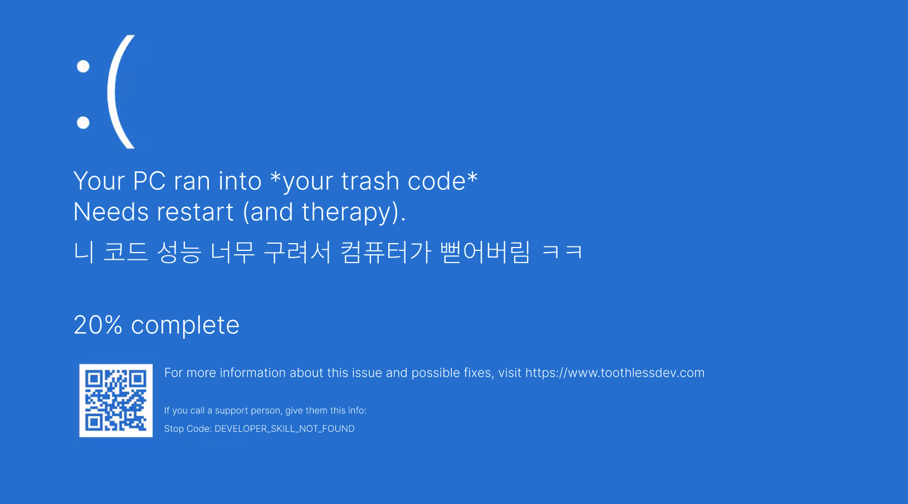
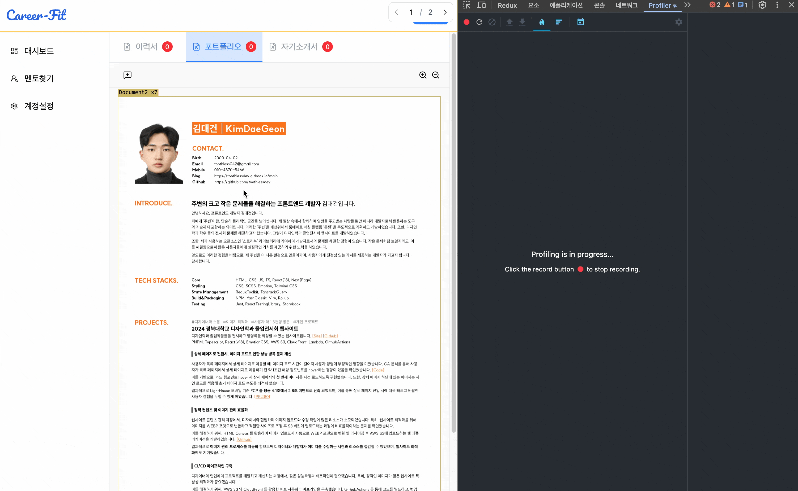
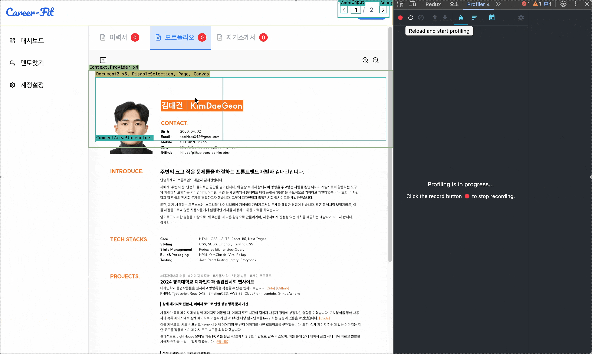
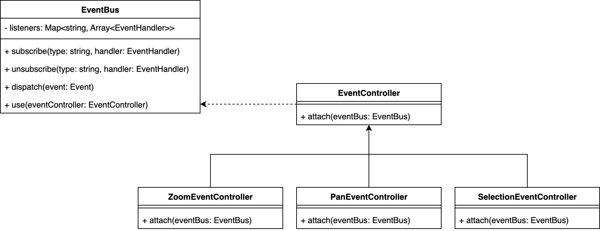
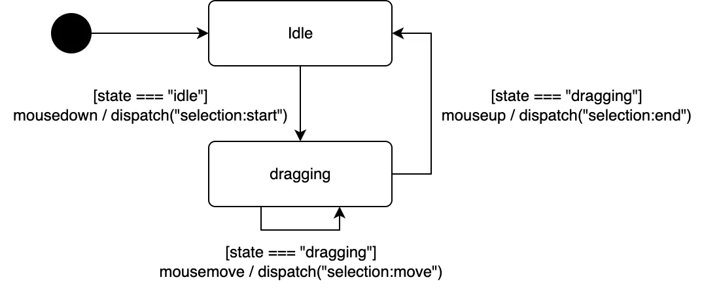

# React 렌더링 최적화 분투기 (useState 에서 useRef, 그리고 EventBus 아키텍쳐까지)

:::warning
아직 작성중이거나 검토중인 글입니다. 내용이 부정확하거나 변경될 수 있습니다
:::

## 🤔 가장 React스러운 방법이 항상 정답일까?

React 개발자라면 재렌더링을 위해 `useState`를 사용해 상태를 UI에 반영하는 '선언적인' 방식에 익숙하다

> 나 역시도 그랬다.. 미친 재렌더링으로 고생하기 전까지는...🥲

최근 PDF 문서 위에 사용자가 드래그로 영역을 선택해 피드백을 남기는 기능을 개발하게 되었다.
당연하게도 `useState` 로 드래그 영역의 좌표를 관리했다. 잘 동작했지만, 결과는 처참했다. <br/>



마우스를 조금만 빠르게 움직여도 이벤트가 씹히는 현상이 발생했다. `onMouseMove` 이벤트가 발생할 때마다 `setState`가 호출되면서 초당 수십 번의 리렌더링이 일어났기 때문이다. ([PR - Feature#31](https://github.com/kakao-tech-campus-3rd-step3/Team7_FE/pull/38))



이처럼 간단해 보이는 기능에서, 어떻게 성능과 멋찐 아키텍쳐를 모두 잡을 수 있을까?

## 🛠️ 1차시도: useRef로 불필요한 리렌더링 최소화하기

### 1️⃣ 문제인식: 불필요한 리렌더링

문제의 핵심은 '불필요한 리렌더링'이었다. <br/>
드래그 중인 좌표는 최종 결과가 아니므로, 매번 React 의 생명주기에 포함할 필요가 없었다

### 2️⃣ 해결책: useRef로 상태 관리하기

`useRef`는 컴포넌트가 리렌더링 되더라도 값이 유지되며, 값이 변경되어도 리렌더링을 발생시키지 않는다. <br/>
따라서 드래그 중인 좌표를 `useRef`로 관리하면 불필요한 리렌더링을 피할 수 있다.



또, `useRef`를 사용해 DOM 엘리먼트를 직접 참조하고 `style` 속성을 직접 변경했다. <br/>
리렌더링은 0회. 성능 문제는 해결되었따!

## 🛠️ 2차시도: 관심사 분리를 향하여 (EventBus 의 등장)

### 1️⃣ 문제인식: 컴포넌트의 비대화

하지만 새로운 문제가 생겼다.<br/>
모든 상태와 로직이 `PortfolioFeedbackWidget` 이라는 하나의 컴포넌트에 집중되기 시작했다

앞으로 추가될 줌(Zoom), 패닝(Panning) 기능은 어떻게 처리해야 하지? <br/>
모든 로직이 한 곳에 섞여 유지보수가 어려워질 것이 뻔했다

> View 로직과 Business 로직을 어떻게 분리할 수 있을까?

### 2️⃣ 해결책: EventBus 아키텍쳐 도입하기

> `이벤트 버스(EventBus)` 는 소프트웨어 컴포넌트들이 서로 직접적으로 통신하지 않고, 중앙의 이벤트 버스를 통해 **이벤트(Event)** 라는 메시지를 주고 받게 하는 디자인 패턴이다.
> Publish-Subscribe 모델의 한 형태로, 시스템의 각 부분을 독립적인 모듈로 만들어 결합도를 낮추는데 도움을 준다.

<center>
    
</center>

쉽게 말해! 인스타 팔로우 라고 생각하면된다! <br/>

1. 내(`subscriber`)가 A 라는 사람(`publisher`)을 팔로우 한다
2. A 가 게시글을 올리면(`dispatch`) 내 피드(`subscriber`)에 게시글이 뜬다
3. 게시글은 인스타그램 서버(`EventBus`)가 중간에서 전달해준다

```ts
export class EventBus {
    public listeners = new Map<keyof EventTypes, Array<EventHandlerOf<keyof EventTypes>>>();

    public subscribe<K extends keyof EventTypes>(eventType: K, handler: EventHandlerOf<K>) {
        if (!this.listeners.has(eventType)) {
            this.listeners.set(eventType, []);
        }
        this.listeners.get(eventType)?.push(handler as EventHandlerOf<keyof EventTypes>);
    }

    public unsubscribe<K extends keyof EventTypes>(eventType: K, handler: EventHandlerOf<K>) {
        const handlers = this.listeners.get(eventType);
        if (!handlers) return;

        this.listeners.set(
            eventType,
            handlers.filter((h) => h !== handler),
        );
    }

    public dispatch(event: EventTypeOf<keyof EventTypes>) {
        const handlers = this.listeners.get(event.type);
        if (!handlers) return;

        handlers.forEach((handler) => handler(event));
    }
}
```

## 🛠️ 3차 시도: EventController로 책임 분리하기

### 1️⃣ 문제인식: 그냥 MouseEvent 를 EventBus 에 던져?

`onMouseMove` 같은 원시 마우스 이벤트를 EventBus에 던져주기만 하면 될까? <br/>

인스타그램 서버(`EventBus`)가 게시물(`Event`)을 중간에서 전달(`dispatch`)할때 JSON 값을 그대로 전달하지는 않는다. <br/>
게시물의 내용, 작성자, 작성시간 등 필요한 정보만 담긴 객체를 전달한다!

따라서 원시 마우스 이벤트를 그대로 던져주기보다는, 드래그 제스처를 해석해 '고수준 이벤트'로 변환하는 중간 다리 역할이 필요했다.

### 2️⃣ 해결책: 저수준 이벤트를 고수준 이벤트로 변환하는 EventController

그렇다면 저수준 이벤트를 고수준 이벤트로 변환하면되겠구나? <br/>
그럼 이벤트 변환은 어디서 일어나야 할까? 세 가지 방법을 고민해봤다

1. View 컴포넌트에서 직접 관리하기
    - `react-pdf` 의 `<Page/>` 컴포넌트의 `onMouseDown`, `onMouseMove`, `onMouseUp` 핸들러 내부에서 `isDragging` 과 같은 상태를 직접 관리하는 방법
        - 장점 : 단순함
        - 단점 : View 와 Business 로직이 섞임, 컴포넌트가 담당하는 역할이 커짐 (SRP 위반)

2. EventBus 내부에서 관리하기
    - `eventBus.dispatch` 메서드가 `document:mousedown` 같은 특정 이벤트를 받으면, 버스 내부에서 상태를 관리하다가 `document:mouseup`이 들어왔을 때 area-selected 이벤트를 추가로 발행하는 방법
        - 장점 : View 컴포넌트가 단순해짐
        - 단점 : EventBus가 너무 많은 책임을 짐, 유지보수 어려움

3. EventController에서 관리하기 ✅
    - Page는 저수준 이벤트를 발행하고, EventController가 이를 구독해서 그 결과를 고수준 이벤트로 다시 발행하는 방법
        - 장점 : 관심사 분리, 유지보수 용이, 확장성 높음
        - 단점 : 구조가 복잡해짐

여러가지 고민 끝에 3번 방법을 선택했다.

### 3️⃣ 구현: EventController

```ts
// EventController.ts
export abstract class EventController {
    public abstract attach(eventBus: EventBus): void;
}

// EventBus.ts
export class EventBus {
    // ...
    public use(eventController: EventController) {
        eventController.attach(this);
        return this;
    }
}

// usage
const eventBus = new EventBus()
    .use(new SelectionEventController())
    .use(new ZoomEventController())
    .use(new PanEventController());
```

이제 EventBus에 EventController를 '플러그인'처럼 장착할 수 있고, <br/>
새로운 기능을 추가할 때마다 새로운 Controller를 만들어 붙이기만 하면 된다!

또, 각각의 플러그인은 독립적으로 개발 및 테스트할 수 있어 유지보수도 용이하다.



SelectionEventController는 단순히 `attach` 로 부터 받은 `eventBus` 를 통해 이벤트를 구독하고, 상태머신을 이용해 고수준 이벤트로 변환해 발행하는 역할만 한다.



```ts
export type SelectionState = "idle" | "dragging";

export class SelectionEventController extends EventController {
    private eventBus: Nullable<EventBus> = null;

    public state: SelectionState = "idle";
    public startPosition: Vector2d = { x: 0, y: 0 };

    public override attach(eventBus: EventBus): void {
        this.eventBus = eventBus;

        this.eventBus.subscribe("document:mousedown", this.handleMouseDown);
        this.eventBus.subscribe("document:mousemove", this.handleMouseMove);
        this.eventBus.subscribe("document:mouseup", this.handleMouseUp);
    }

    private handleMouseDown: EventHandlerOf<"document:mousedown"> = (event) => {
        if (this.state !== "idle") return;

        this.state = "dragging";
        this.startPosition = event.payload;

        this.eventBus?.dispatch({
            type: "selection:start",
            payload: this.startPosition,
        });
    };

    private handleMouseMove: EventHandlerOf<"document:mousemove"> = (event) => {
        if (this.state !== "dragging") return;

        this.eventBus?.dispatch({
            type: "selection:move",
            payload: { start: this.startPosition, current: event.payload },
        });
    };

    private handleMouseUp: EventHandlerOf<"document:mouseup"> = (event) => {
        if (this.state !== "dragging") return;

        this.state = "idle";

        this.eventBus?.dispatch({
            type: "selection:end",
            payload: { start: this.startPosition, end: event.payload },
        });
    };
}
```

## 🏁 마무리하며

지금까지의 여정을 통해 성능과 확장성을 모두 만족하는 다음과 같은 구조를 만들 수 있었다.

### 교훈1. 모든 데이터가 React state 일 필요는 없다

애플리케이션의 핵심 로직에 영향을 주는 `'진짜 상태(State)'`(예: 최종 선택된 영역 좌표)와, 화면에 잠시 나타났다 사라지는 `'시각적 표현(View)'`(예: 드래그 중인 임시 박스)을 구분하는 것이 얼마나 중요한지 깨달았다.

- 시각적 표현: useRef를 사용한 명령형 DOM 조작으로 리렌더링 없이 성능을 확보한다
- 진짜 상태: 최종 결과값은 `useState`나 `useSyncExternalStore`를 통해 React의 생명주기에 포함시켜 선언적으로 관리한다

### 교훈2. 좋은 아키텍처는 '관심사의 분리'에서 시작된다

처음에는 하나의 컴포넌트에서 모든 것을 해결하려 했다. 하지만 기능이 복잡해질수록 각자의 역할에만 충실한 작은 모듈들(`EventBus`, `EventController`)로 나누는 것이 오히려 전체 시스템을 더 단순하고 예측 가능하게 만든다는 것을 배웠습니다.

> "이것이 정말 상태여야만 하는가?" <br/>
> "이 로직은 정말 이 컴포넌트가 책임져야 하는가?"

다음번에 복잡한 UI 인터랙션과 성능 문제에 부딪힌다면, 이번 경험을 떠올리며 '관심사의 분리'와 '적절한 상태 관리'를 고민해보려 한다. <br/>
