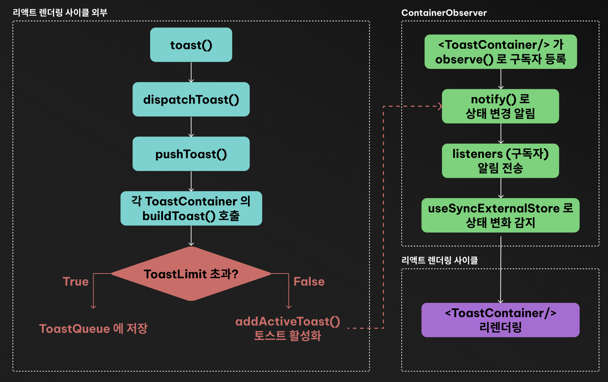
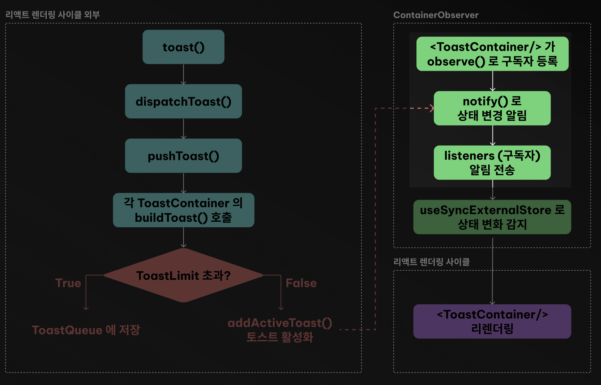
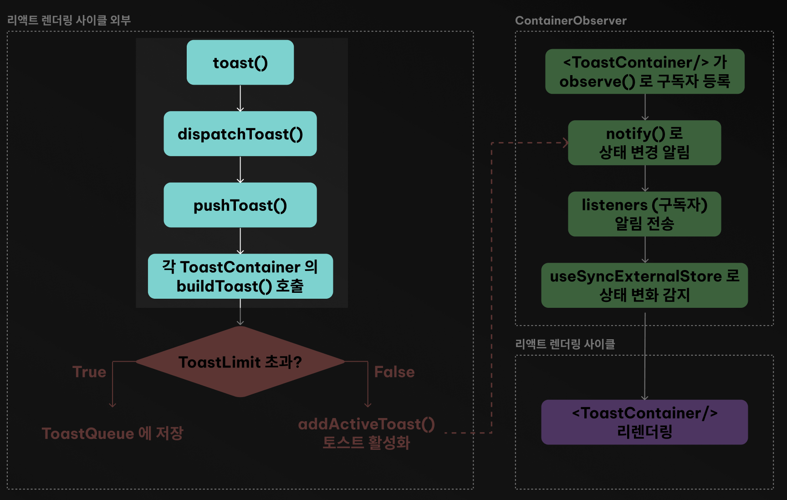

# react-toastify 는 어떻게 리액트 렌더링사이클 밖에서도 토스트를 띄울수 있을까?

리액트에서 상태 관리와 렌더링은 보통 컴포넌트 내부의 state, props를 통해 이루어집니다

그런데 `react-toastify` 와 같은 라이브러리를 보면, "리액트 컴포넌트 바깥"에서, 즉 비동기 로직이나 이벤트 핸들러, API 응답 등 어디서든 토스트(알림)를 띄우는 기능이 존재합니다. 어떻게 그게 가능할까요?

예시를 한번 보겠습니다

```js
toast("로그인 성공!");
setTimeout(() => toast("잠깐 후에 다시 알려줌!"), 5000);
```

이런 코드가 정말 동작한다

어떻게 리액트 컴포넌트 바깥에서 toast()를 호출해도, 화면에는 토스트가 "짠!" 하고 나타나는 걸까요?

> 결론부터 말하자면, 내부적으로 <br/>
> `useSyncExternalStore` 와 `Observer 패턴`을 사용한다

## 🤔 리액트의 일반적인 상태 흐름

먼저, 리액트의 일반적인 렌더링은 다음과 같이 동작합니다

> 1.  컴포넌트 내부의 상태(state)가 바뀌면
> 2.  컴포넌트가 리렌더링되고, 새로운 가상 DOM (Virtual DOM) 이 생성된다
> 3.  새로만든 가상 DOM과 이전 가상 DOM 을 비교한다 (Reconciliation)
> 4.  변경된 사항을 DOM 에 반영한다

즉, `상태 변화 → 렌더링 → UI 반영` 이라는 단방향 흐름이 기본적으로 리액트가 동작하는 방식입니다

하지만 `toast()` 는 리액트 컴포넌트가 아닌 일반 함수입니다.
이 함수가 상태를 바꾼다고 해서, 리액트가 "알아서" 리렌더링해주지는 않습니다

## ✅ Observer 패턴!

### Observer 패턴이란?

> "상태가 바뀌면, 그걸 구독(관찰)하고 있는 객체들에게 자동으로 알림을 보내고, 각 객체가 알아서 처리하게 한다" ([Refactoring Guru - 옵저버 패턴](https://refactoring.guru/ko/design-patterns/observer))

쉽게 말해, "내가 상태가 바뀌면, 구독자들에게 알림을 쏴준다!" 는 개념입니다
`react-toastify` 는 이 디자인패턴을 사용해 `<ToastContainer/>` 를 구독자로 만들고, `toast()` 함수 호출을 통해 알림을 전달합니다

## `react-toastify` 의 전체 흐름을 따라가보자

`react-toastify` 는 아래와 같은 흐름으로 동작합니다 <br/>



옆에 `react-toastify` 코드를 함께 보고 흐름을따라가면 이해하기가 쉽습니다! (https://github.com/fkhadra/react-toastify)

<br/>

### 1. `<ToastContainer/>` 의 마운트 및 subscribe



`react-toastify` 를 사용하기 위해서는 가장 먼저 `<ToastContainer/>` 를 리액트 앱에 마운트 해야 합니다.

```tsx
export default function App() {
    return (
        <Fragment>
            {/* [!code focus] */}
            <ToastContainer />
        </Fragment>
    );
}
```

[`<ToastContainer/>`](https://github.com/fkhadra/react-toastify/blob/main/src/components/ToastContainer.tsx#L28) 의 내부를 보면, `getToastToRender` 를 호출하고, 해당 콜백함수에서 `toastList` 를 받아와 `<Toast/>` 컴포넌트를 렌더링하는것을 볼 수 있습니다

```tsx
export function ToastContainer(props: ToastContainerProps) {
    const { getToastToRender, isToastActive, count } = useToastContainer(containerProps); // [!code focus]
    // ...
    // [!code focus]
    return getToastToRender((position, toastList) => {
        return (
            <div>
                {/* [!code focus] */}
                {toastList.map(({ content, props: toastProps }) => {
                    // [!code focus]
                    return <Toast>{content}</Toast>;
                    // [!code focus]
                })}
            </div>
        );
    });
}
```

이 컴포넌트가 렌더링되면, 내부에 있는 `useToastContainer` 훅을 호출하고, 토스트 알림 컨테이너로 등록됩니다

```ts
export function registerContainer(props: ToastContainerProps) {
    const id = props.containerId || Default.CONTAINER_ID;
    return {
        subscribe(notify: () => void) {
            // [!code focus]
            const container = createContainerObserver(id, props, dispatchChanges);
            // ...
        },
        setProps(p: ToastContainerProps) {
            containers.get(id)?.setProps(p);
        },
        getSnapshot() {
            return containers.get(id)?.getSnapshot();
        },
    };
}
```

<br/>

### 2. `createContainerObserver` - Observer 패턴의 본체

`react-toastify` 의 store 는 `createContainerObserver` 라는 팩토리 함수로 만들어집니다

여기서 토스트 상태(`toasts`), 스냅샷(`snapshot`), 그리고 구독자(`listeners`) 등이 클로저로 관리되고,
`observe()` 와 `notify()` 로 구독자 등록 및 알림전송을 합니다

```ts
export function createContainerObserver(
    id: Id,
    containerProps: ToastContainerProps,
    dispatchChanges: OnChangeCallback,
) {
    let snapshot: Toast[] = []; // [!code focus]
    const toasts = new Map<Id, Toast>(); // [!code focus]
    const listeners = new Set<Notify>(); // [!code focus]

    // [!code focus]
    const observe = (notify: Notify) => {
        listeners.add(notify); // [!code focus]
        return () => listeners.delete(notify); // [!code focus]
    }; // [!code focus]

    // [!code focus]
    const notify = () => {
        snapshot = Array.from(toasts.values()); // [!code focus]
        listeners.forEach((cb) => cb()); // [!code focus]
    }; // [!code focus]

    const addActiveToast = (toast: Toast) => {
        // ...
        notify(); // [!code focus]
        dispatchChanges(toToastItem(toast, isNew ? "added" : "updated")); // [!code focus]
    };

    return {
        observe,
        buildToast,
        getSnapshot: () => snapshot, // [!code focus]
    };
}
```

<br/>

### 3. `useSyncExternalStore()` 로 외부 상태 구독

`getToastToRender` 는 [`useToastContainer`](https://github.com/fkhadra/react-toastify/blob/e1fa4760cea8adf28d5cf93cd14067a852b1f5c8/src/hooks/useToastContainer.ts#L8) 에서 가져오는데, [`registerContainer()`](https://github.com/fkhadra/react-toastify/blob/main/src/core/store.ts#L113) 에서 `subscribe`, `getSnapshot` 을 가져와 [`useSyncExternalStore`](https://github.com/fkhadra/react-toastify/blob/e1fa4760cea8adf28d5cf93cd14067a852b1f5c8/src/hooks/useToastContainer.ts#L8) 로 전달합니다

```tsx
export function useToastContainer(props: ToastContainerProps) {
    const { subscribe, getSnapshot, setProps } = useRef(registerContainer(props)).current; // [!code focus]
    setProps(props);
    const snapshot = useSyncExternalStore(subscribe, getSnapshot, getSnapshot)?.slice(); // [!code focus]
    // ...
}
```

- `subscribe` : 토스트 목록이 변경될 때 마다 알림(notify) 를 받겠다고 등록합니다
- `getSnapShot` : 현재 토스트 목록의 스냅샷을 리턴해서 `useSyncExternalStore` 를 통해 리액트가 안정적인 값을 읽을 수 있게 합니다

### 💥 왜 `useSyncExternalStore` 이 필요할까 ?

<details>
    <summary>
    React의 렌더링 시점과 `toast()` 함수가 호출되어 내부 상태가 바뀌는 시점은 항상 동일하지 않습니다. 이 두 순간이 다르기 때문에, React 가 상태를 읽으려는 시점에 변경중인 값을 읽을 위험이 있습니다
    </summary>

> 예를들어,
>
> 1. 사용자가 버튼을 클릭해 `toast()` 를 호출하면
> 2. `toast()` 는 toastList 에 새 알림을 추가하고, `notify()` 를 호출해서 바뀌었다고 신호를 보냅니다
> 3. 이때 리액트가 신호를 받았지만 Concurrent 렌더링을 위해 렌더링을 미루거나 (Scheduling) 상태 업데이트를 배치 (Batch) 처리하는 중이라면, `toast()` 호출 시점의 스냅샷과 실제 렌더링 시점 사이 불일치가 발생할 수 있습니다
> 4. 그 사이에 다른 `toast()` 가 호출되면 어떤 상태를 참조해야할지 불분명하게 됩니다

React 18 의 Concurrent Rendering 과 함께 도입한 [`useSyncExternalStore`](https://ko.react.dev/reference/react/useSyncExternalStore) 를 사용하면 위와 같은 참사를 막을수 있습니다

내부적으로 `1. 렌더링 전`, `2. 커밋 전` 두번의 `getSnapShot()` 을 호출해서, 두 스냅샷 값이 다르면 **렌더링 중 외부 상태가 변경되었다**고 판단하고 렌더링을 처음부터 다시 시작합니다

</details>

<br/>

### 4. `toast()` 함수 호출과 알림 전달, `notify()` 를 통한 구독자 알림 전달

이제 `toast()` 함수가 호출되는 순간의 흐름을 보면,



`toast()` 함수는 내부적으로 `dispatchToast()` 를 호출하고,

```ts
function createToastByType(type: string) {
    return <TData = unknown>(content: ToastContent<TData>, options?: ToastOptions<TData>) =>
        dispatchToast(content, mergeOptions(type, options));
}
// ...
toast.success = createToastByType(Type.SUCCESS);
toast.info = createToastByType(Type.INFO);
toast.error = createToastByType(Type.ERROR);
toast.warning = createToastByType(Type.WARNING);
```

[`dispatchToast()`](https://github.com/fkhadra/react-toastify/blob/main/src/core/toast.ts#L27) 는 `pushToast()` 를 호출하고 `pushToast()` 는 다시 `buildToast()` 를 호출합니다

```ts
function dispatchToast<TData>(content: ToastContent<TData>, options: NotValidatedToastProps): Id {
    pushToast(content, options);
    return options.toastId;
}
```

```ts
export function pushToast<TData>(content: ToastContent<TData>, options: NotValidatedToastProps) {
    if (!canBeRendered(content)) return;
    if (!hasContainers()) renderQueue.push({ content, options });

    containers.forEach((c) => {
        c.buildToast(content, options); // [!code focus]
    });
}
```

`buildToast()` 는 토스트 객체를 생성하고, Observer 패턴의 핵심인 `notify()` 를 호출합니다

`notify()` 가 호출되면 알림 컨테이너에 등록된 모든 구독자에게 상태가 바뀌었다고 신호를 보냅니다.
`useSyncExternalStore` 에 전달된 subscribe 콜백이 실행되고, `<ToastContainer/>` 가 재렌더링됩니다

<br/>

## ✍️ 정리하면...

`react-toastify` 가 리액트 렌더링 사이클 밖에서 작동하는 비밀은 `useSyncExternalStore` 훅과 `옵저버 패턴`의 조합에 있습니다

### 1. 옵저버 패턴

`toast()` 함수가 호출되면, 리액트 컴포넌트 외부에 있는 `toasts` 라는 Map에 새로운 알림이 추가됩니다
이 `toasts` Map이 바로 외부 상태고, 이 상태가 변경될 때마다 `notify()` 함수가 실행되어 `<ToastContainer/>`에게 상태가 바뀌었다는 신호를 보냅니다

### 2. useSyncExternalStore

`<ToastContainer/>` 는 useSyncExternalStore를 통해 toasts의 변화를 구독합니다
이 훅은 `notify()` 신호를 받으면 `getSnapshot` 함수를 호출하여 toasts의 현재 상태를 복사한 snapshot을 가져와 변경이된경우 재렌더링을 트리거합니다
