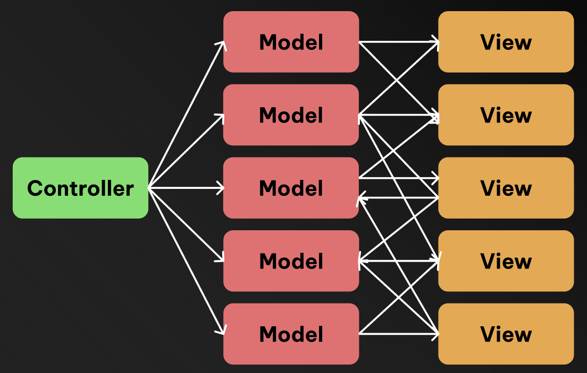
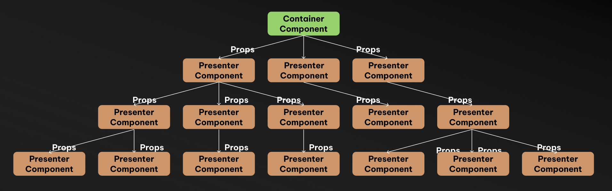
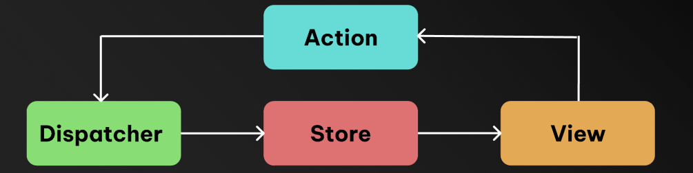

Redux 와 Flux 아키텍쳐에 대해 공부하던 중

> Redux 가 MVC 아키텍쳐의 한계를 없애기위해 Flux 단방향 흐름의 아키텍쳐를 사용하는데 그렇다면 Redux 도입 이전 React 는 MVC 아키텍쳐 인가? <br/>
> 근데 React 는 양방향 바인딩을 하지 않는데? props 로 단방향으로 데이터를 내려주지 않음?

라는 의문이 들었고,
MVC, MVVM, Flux 아키텍쳐와 관련된 내용을 찾아보면서 정리한 포스트입니다

## 🤔 Redux 는 왜 만들어졌을까 ?

Redux 가 왜 만들어졌는지 알아보기 전에,
React 가 왜 / 어떻게 발전하며 만들어졌는지에 대해 알고 있으면 좋습니다.

### ✍️ MVC 아키텍쳐의 한계

Meta (Facebook) 에서는 기존에 PHP 를 이용해 웹 애플리케이션을 개발했었습니다.

PHP 기반의 웹 프레임워크는 기본적으로 MVC (Model - View - Controller) 아키텍쳐를 따르고 있는데, MVC 아키텍쳐는 소프트웨어를 Model / View / Controller 세 가지 구성요소로 분리하여 개발하는 아키텍쳐입니다.

> `모델 (Model)` : 데이터 / 비즈니스 로직을 나타내고, 데이터베이스에서 데이터를 가져오거나, 갱신하는 역할을 합니다. <br />
> `뷰 (View)` : 사용자에게 보이는 인터페이스로, HTML, CSS 이나 템플릿엔진을 활용해 화면을 구성합니다. <br />
> `컨트롤러 (Controller)` : Model 과 View 사이의 상호작용을 관리합니다. 사용자의 요청 / 입력을 받아 Model 을 업데이트하고, 그에 따른 View 를 갱신하는 작업을 합니다.


하지만, 애플리케이션의 규모가 커지면서, MVC 구조는 점점 더 복잡해져 갔습니다.

하나의 View 가 여러 개의 Model 을 업데이트하고, 변경된 Model 은 다시 Controller 에 의해 View 에 반영되고 ...

이 문제는 크게

> 1. 양방향 데이터 바인딩 <br/>
> 2. 복잡한 의존성

때문에 발생하는 것이었고, 이로 인해 MVC 아키텍쳐는

> 1. 확장에 용이하지 않다 <br/>
> 2. 깨지기 쉽고 예측 불가능하다

라는 단점으로 다가왔습니다.



### ✍️ MVVM 아키텍쳐과 Component 패턴

이 문제는 MVVM 아키텍쳐 (Model - View - ViewModel, DOM 을 템플릿과 바인딩을 통해 선언적으로 조작하는 아키텍쳐) 를 거쳐, 작게 재사용 할 수 있는 단위로 만들어 조립하는 Component 패턴으로 발전되었습니다.

> ReactJS 는 Component 패턴을 사용하는 단방향 흐름으로 설계된 Single Page Application 라이브러리 라고 할 수 있습니다.

### ✍️ Container Presenter 패턴

하지만 Component 패턴도 한계가 존재했습니다.

컴포넌트에 비즈니스 로직이 들어가게 되면 컴포넌트의 재사용성이 떨어지는 경험이 한번씩 있을겁니다.

이때문에, 컴포넌트는 재사용이 가능해야 한다는 원칙에 따라 가급적 비즈니스 로직을 포함시키지 않으려고 개발을 진행하게 되었습니다.

이는, 최상단 / 페이지 단위로 `Container` 컴포넌트를 두고 비즈니스 로직을 관리하고,
비즈니스 로직을 가지고 있지 않은 데이터만 뿌려주는 형태의 Presenter 컴포넌트로 분리하여 작성하는
`Container - Presenter 패턴`으로 발전하게 되었습니다.

하지만, Container-Presenter 패턴을 이용해 만들었을때, 컴포넌트 구조가 복잡해짐에 따라, 하위 컴포넌트에 값을 전달하기 위해, `Props Drilling Problem` 이 발생하게 됩니다.



### ✍️ Flux 아키텍쳐

Container-Presenter 패턴에서 발생한 Prop Drilling 을 통해 데이터를 전달하는 문제는, Model (state, 데이터) 의 파편화를 불러 일으켰습니다.

그래서 단방향 데이터 흐름을 활용한 리액트용 애플리케이션 아키텍쳐인 Flux 아키텍쳐가 탄생했습니다.



데이터를 변화시키려는 동작(Action) 이 발생하면
Dispatcher 는 Action 을 받아 Redux 에 Action 이 발생했음을 알리고,
변화된 데이터가 Store에 저장되면 View 에서 데이터를 가져와서 보여줍니다

### ✍️ Flux 아키텍쳐를 구현한 Redux

Redux 는 Flux 아키텍쳐를 구현한 것으로, 예측가능하고 중앙화된 디버깅이 쉽고 유연한 상태관리 라이브러리 라고 Redux 공식 홈페이지에 설명되어 있습니다

> A Predictable State Container for JS Apps <br/>
> **Predictable & Centralized & Debuggable & Flexible**

이런 예측가능하고 중앙화된, 디버깅이 쉽고 유연함을 유지하기 위해서 Redux 는 3가지 원칙을 정했습니다

#### 1. 단일 진실의 근원 (Single Source of Truth)

Redux에서 애플리케이션의 상태는 Redux Store 에 저장하게 되는데, 이 Store 는 단 하나여야 한다는 제약 조건입니다.

Store 가 한개가 되면, 상태의 변경내역을 단 하나의 Store 에서 어떻게 변하는지 확인하여 알 수 있고, 상태의 변화를 직렬화 시켜 디버깅이 쉬워집니다.

#### 2. 상태는 읽기 전용 (State is Read-Only)

State 상태값은 읽기 전용이어야 한다는 제약조건입니다.

상태는 직접 변경할 수 없고, 사전에 정의해 둔 상황(Action) 이 발생했을 경우, 정해진 대로(Reducer)로만 상태를 변경 할수 있습니다.

이를 통해 상태를 변경할 때 마다 어떤 목적과 값으로 상태를 변경하는지 파악 할 수 있습니다.

#### 3. 변경은 순수 함수로 작성 (Changes are made with Pure Functions)

상태의 변화는 순수함수를 통해 일어나야한다는 제약조건입니다.

Pure Function, 순수함수는 동일 입력값에 대해 항상 같은 출력을 반환하는 함수입니다.
여기서 말하는 상태변화를 만들어내는 순수함수는 Reducer 로, Reducer 는 이전 상태에 변화를 주고 다음 상태를 리턴하는데,
입력으로 받은 이전 상태를 직접 변경하지 않고, 새로운 상태 객체를 만들어 리턴한다는 것입니다.

> 👉 `Immutability` (불변성) <br/>
> 참고로, Redux Toolkit 에서는 ImmerJS 를 통해 불변성을 유지하며, <br/>
> 내부에서 새로운 상태를 생성하고 관리해주기 때문에 가독성이 올라가고 코드 작성이 쉽습니다.

## ⚛️ Redux 의 구성요소와 데이터 흐름

### ✏️ Redux 의 구성요소

Redux 는 다음과 같은 요소로 구성되어 있습니다.

> Store : Redux 의 상태를 저장하기 위한 저장소 <br/>
> State : Redux Store 에 저장되어있는 데이터 <br/>
> Action : Redux Store 에 저장된 State 에 변화를 주기 위한 행동으로 JS 객체로 존재 <br/>
> Action Creator : Action 객체를 생성하는 역할을 하는 함수 <br/>
> Reducer : Action 발생시 Action 을 처리하는 함수로 Redux State 를 변경

### ✏️ Redux 의 데이터 흐름

Redux 의 구성요소와 함께 Flux 아키텍쳐가 어떻게 적용되어 Redux 의 상태가 변화하고, View 에 반영되는지 이전에 봤던 그림과 함께 알아보겠습니다.


실제 Counter 예제를 통해 Redux의 데이터 흐름이 어떻게 동작하는지 단계별로 살펴보겠습니다.

#### `1단계` : View에서 Action이 만들어지고 Dispatch 됩니다

먼저 사용자가 View (React 컴포넌트)에서 버튼을 클릭하면, Action이 생성되고 dispatch됩니다.

```tsx
// Counter.tsx
import React from "react";
import { useSelector, useDispatch } from "react-redux";
import { increment, decrement, incrementByAmount } from "./counterActions";

interface RootState {
    counter: { value: number };
}

function Counter() {
    const count = useSelector((state: RootState) => state.counter.value);
    const dispatch = useDispatch();

    return (
        <div>
            <h2>Count: {count}</h2>
            {/* 1단계: 버튼 클릭 시 Action이 생성되고 dispatch됨 */}
            <button onClick={() => dispatch(increment())}>+1</button>
            <button onClick={() => dispatch(decrement())}>-1</button>
            <button onClick={() => dispatch(incrementByAmount(5))}>+5</button>
        </div>
    );
}

export default Counter;
```

Action Creator 함수들이 Action 객체를 생성합니다:

```ts
// counterActions.ts - Action Types 정의
export const INCREMENT = "INCREMENT";
export const DECREMENT = "DECREMENT";
export const INCREMENT_BY_AMOUNT = "INCREMENT_BY_AMOUNT";

// Action Creator 함수들이 생성하는 Action 객체
export const increment = () => ({ type: INCREMENT });

export const decrement = () => ({ type: DECREMENT });

export const incrementByAmount = (amount: number) => ({
    type: INCREMENT_BY_AMOUNT,
    payload: amount,
});
```

#### `2단계`: Dispatch된 Action은 현재 State와 함께 Reducer로 전달됩니다

dispatch된 Action 객체는 Redux Store로 전달되어, 현재 state와 함께 Reducer 함수로 전달됩니다.

이 단계에서 Redux Store는 다음과 같이 동작합니다:

```
1. 사용자가 dispatch(increment()) 실행
2. Redux Store가 Action 객체 { type: 'INCREMENT' }를 받음
3. Store가 현재 state { value: 0 }과 Action을 counterReducer에 전달
4. counterReducer(state, action) 함수 호출

// Redux Store 내부에서 일어나는 과정
counterReducer(
  { value: 0 },           // 현재 state
  { type: 'INCREMENT' }   // dispatch된 Action
);
```

#### `3단계`: Reducer에서는 변경된 State가 리턴됩니다

Reducer는 현재 state를 직접 수정하지 않고, 새로운 state 객체를 생성하여 반환합니다.

```ts
// counterReducer.ts - 완전한 Reducer 구현
import { INCREMENT, DECREMENT, INCREMENT_BY_AMOUNT } from "./counterActions";

interface CounterState {
    value: number;
}

const initialState: CounterState = {
    value: 0,
};

const counterReducer = (state = initialState, action: any): CounterState => {
    switch (action.type) {
        // 3단계: 이전 state를 수정하지 않고 새로운 state 객체를 반환
        case INCREMENT:
            return { ...state, value: state.value + 1 };

        case DECREMENT:
            return { ...state, value: state.value - 1 };

        case INCREMENT_BY_AMOUNT:
            return { ...state, value: state.value + action.payload };

        default:
            return state;
    }
};

export default counterReducer;
```

#### `4단계`: 변경된 State는 View에 나타납니다

새로운 state가 Store에 저장되면, 해당 state를 구독하고 있던 React 컴포넌트들이 자동으로 리렌더링되어 변경된 상태를 화면에 표시합니다.

```tsx
// Counter.tsx
import React from "react";
import { useSelector, useDispatch } from "react-redux";

function Counter() {
    // 4단계: useSelector Hook이 Store의 state 변경을 감지하고 컴포넌트 리렌더링
    const count = useSelector((state: RootState) => state.counter.value);
    const dispatch = useDispatch();

    // State 변경 감지 과정:
    // 1. 버튼 클릭 → dispatch(increment()) → Action 객체 { type: 'INCREMENT' } 생성
    // 2. Redux Store가 현재 state { value: 0 }과 Action을 counterReducer에 전달
    // 3. counterReducer가 새로운 state { value: 1 } 반환
    // 4. Store의 state가 업데이트됨
    // 5. useSelector가 state 변경을 감지하고 Counter 컴포넌트 리렌더링 트리거
    // 6. 화면에 "Count: 1"이 표시됨

    return (
        <div>
            <h2>Count: {count}</h2> {/* 변경된 값이 화면에 표시 */}
            <button onClick={() => dispatch(increment())}>+1</button>
            <button onClick={() => dispatch(decrement())}>-1</button>
            <button onClick={() => dispatch(incrementByAmount(5))}>+5</button>
        </div>
    );
}

export default Counter;
```

#### Redux Store 설정

마지막으로 Redux Store를 설정하고 React 앱에 연결하는 코드입니다:

```ts
// store.ts
import { createStore, combineReducers } from "redux";
import counterReducer from "./counterReducer";

// 여러 reducer를 결합 (현재는 counter만 있지만 확장 가능)
const rootReducer = combineReducers({
    counter: counterReducer,
});

// Redux Store 생성 (순수 Redux 방식)
export const store = createStore(rootReducer);

// TypeScript 타입 정의
export type RootState = ReturnType<typeof rootReducer>;
export type AppDispatch = typeof store.dispatch;
```

```tsx
// index.tsx 또는 App.tsx
import React from "react";
import ReactDOM from "react-dom";
import { Provider } from "react-redux";
import { store } from "./store";
import Counter from "./Counter";

// React 앱을 Redux Store와 연결
ReactDOM.render(
    <Provider store={store}>
        <Counter />
    </Provider>,
    document.getElementById("root"),
);
```

### 📊 Redux 데이터 흐름 요약

1. **Action 생성 및 Dispatch**: 사용자가 버튼을 클릭하면 `dispatch(increment())`가 실행되어 `{ type: 'counter/increment' }` Action 객체가 Store로 전달됩니다.

2. **Reducer 실행**: Store가 현재 state `{ value: 0 }`과 Action `{ type: 'counter/increment' }`을 counter reducer에 전달합니다.

3. **새로운 State 생성**: Reducer가 불변성을 지키며 새로운 state `{ value: 1 }`을 반환합니다.

4. **UI 업데이트**: `useSelector`가 state 변경을 감지하고 Counter 컴포넌트가 리렌더링되어 화면에 "Count: 1"이 표시됩니다.

이처럼 Redux는 예측 가능한 단방향 데이터 흐름을 통해 애플리케이션의 상태를 체계적으로 관리합니다.

## 참고 자료

- [페이스북의 결정: MVC는 확장에 용이하지 않다. 그렇다면 Flux다](https://blog.coderifleman.com/2015/06/19/mvc-does-not-scale-use-flux-instead/)
- [What, Why and When Should You Use ReactJS: A Complete Guide](https://weblineindia.com/blog/everything-you-should-know-about-reactjs/)
- [React is MVC or MVVM? - Reddit](https://www.reddit.com/r/reactjs/comments/hbvy47/react_is_mvc_or_mvvm/)
- [JavaScript Technical Interview Question : is React MVC or MVVM](https://medium.com/developers-tomorrow/javascript-interview-question-is-react-an-mvc-or-mvvm-ac2ea2a5127d)
- [presentational and container 패턴이란 무엇인가](https://tecoble.techcourse.co.kr/post/2021-04-26-presentational-and-container/)
- [patterns.dev - Container / Presenter Pattern](https://www.patterns.dev/react/presentational-container-pattern)
- [Flux Concepts - Facebook Archive](https://github.com/facebookarchive/flux/tree/main/examples/flux-concepts)
- [Three Principles - Redux](https://redux.js.org/understanding/thinking-in-redux/three-principles)
