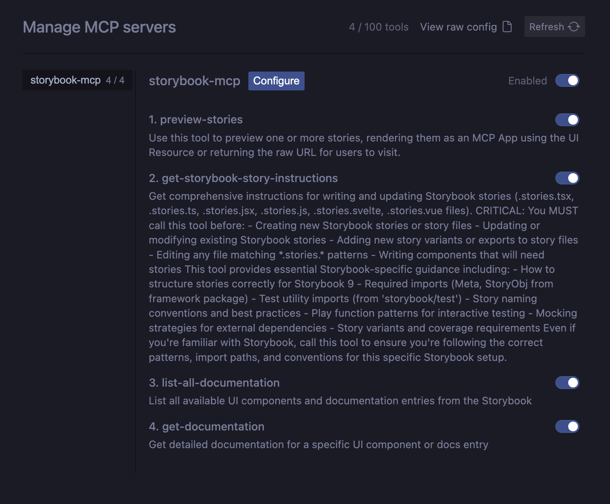
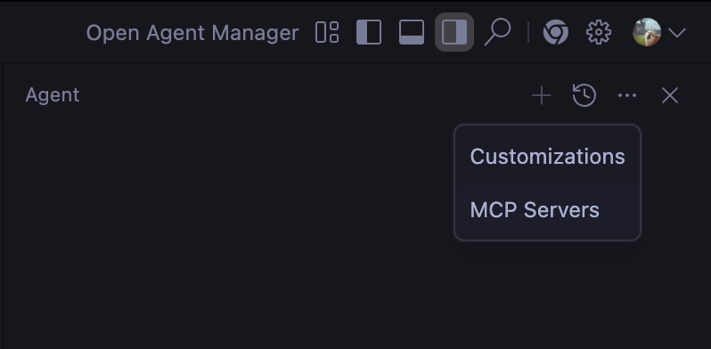
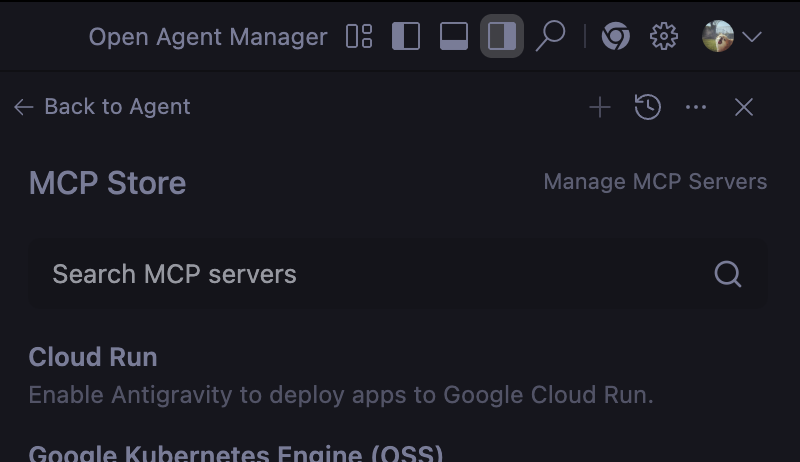

사내에서 컴포넌트들이 점점 늘어나지만, 문서화가 잘 되지않아 어떤 공통 컴포넌트가 있고 어떻게 생겼는지 파악하기가 어려웠습니다.

하지만, 빠른 스프린트 주기와 잦은 요구사항 변경으로 인해 문서화 작업은 자주 누락되었고, <br>
결국 컴포넌트 사용법을 제대로 알지 못하고 무작정 코드를 복사해서 쓰는 일이 빈번해졌습니다.

이번 글에서는 Storybook MCP(Model Context Protocol) 를 활용하여 <br>
컴포넌트 문서화를 자동화하고, AI 코딩 도구가 컴포넌트를 이해하게 만드는 방법을 소개합니다.

:::tip
Storybook MCP 설정법에 대해서만 빠르게 읽고 싶다면<br>하단 ["Storybook MCP 설정하기" 섹션](#storybook-mcp-설정하기) 로 바로 이동하세요.
:::

<br><br>

# AI 코딩 도구가 컴포넌트를 이해하게 만드는 방법

요즘 Cursor, Claude Code 같은 AI 코딩 도구를 쓰다 보면 이런 순간이 자주 옵니다.

> "이 컴포넌트 구조를 이미 알고 있으면 훨씬 잘 만들어줄 텐데..."

문제는 AI가 우리 프로젝트의 컴포넌트 문맥을 모른다는 것입니다. <br>
Props, 사용 의도, 변형 케이스, 디자인 가이드 같은 정보는 이미 Storybook에 다 있는데, 그동안은 사람이 읽는 문서에 가까웠습니다.

Storybook 10.1 부터 제공된 [Component Manifest](https://github.com/storybookjs/storybook/pull/32751) 와 MCP(Model Context Protocol) 덕분에 AI 도구가 Storybook 에서 컴포넌트 정보를 쉽게 가져올 수 있게 되었습니다.

이번 글에서는 Storybook MCP 를 직접 붙여보면서 정리한 설정방법과, 실제로 Storybook MCP 를 사용해서 어떤 기능을 활용할 수 있을지 기록해보았습니다.

<br><br>

# Storybook MCP 로 가능한 것들

Storybook MCP를 활성화하면, AI 코딩 도구는 Storybook을 문서 사이트가 아니라 <br>
도구를 가진 서버로 인식하게 됩니다.

즉, "스토리북을 읽는다"가 아니라 <br>
정해진 MCP 도구를 호출해서 정보를 가져온다에 가깝습니다.

현재 2026년 2월을 기준으로 Storybook MCP 가 제공하는 주요 도구는 다음과 같습니다.



## 1. 전체 컴포넌트 / 문서 목록 조회 (`list-all-documentation`)

- Storybook에 등록된 모든 UI 컴포넌트
- Docs 페이지
- Story 기반 문서 엔트리

의 전체 목록을 구조화된 데이터로 가져올 수 있습니다.

덕분에 AI는 <br>
"이 프로젝트에는 어떤 컴포넌트들이 있는지" 를 추측이 아니라 실제 데이터 기반으로 파악할 수 있습니다.

## 2. 특정 컴포넌트의 상세 문서 조회 (`get-documentation`)

- 특정 컴포넌트에 대한 Props 정의
- 각 Prop의 설명, 기본값 / 타입, 사용 예시
- 문서화된 스토리 정보

를 한 번에 가져올 수 있습니다.

즉,

- "이 컴포넌트는 어떤 Props를 받지?"
- "이 옵션은 언제 쓰는 거지?"

와같은 질문에 대해 AI가 Storybook 기준의 정답으로 응답하게 됩니다.

## 3. 스토리 미리보기 렌더링 (`preview-stories`)

- 하나 또는 여러 개의 Story를 지정하고
- 해당 스토리를 Storybook UI에서 직접 렌더링하거나
- 미리보기 URL을 반환받을 수 있습니다

이 덕분에 AI는

"이 상태의 컴포넌트를 실제로 보여줘", "이 Variant가 어떻게 생겼는지 확인하고 수정해줘" <br>
와같은 요청을 시각적 맥락을 가진 상태로 처리할 수 있게 됩니다.

## 4. Story 작성 규칙을 강제 (`get-storybook-story-instructions`)

이게 생각보다 핵심이었습니다.

Storybook MCP는 AI가 스토리를 생성하거나 수정하기 전에 <br>
반드시 이 도구를 먼저 호출하도록 설계되어 있습니다.

- 해당 프로젝트에서 사용하는 Story 구조
- Meta / StoryObj import 규칙
- 파일 네이밍 패턴 (`\*.stories.tsx` 등)
- Play function, 테스트 유틸 사용 규칙
- Storybook 버전에 맞는 권장 패턴

즉, AI가 "대충 아는 Storybook 방식" 으로 코드를 쓰는 게 아니라
이 프로젝트의 Storybook 규칙을 먼저 학습한 뒤 작업하게 됩니다.

<br><br>

# Storybook MCP 설정하기 {#storybook-mcp-설정하기}

## 요구사항

- Storybook 10.1+ 이상
- Storybook 을 로컬에서 실행할 수 있는 환경

## 1. `@storybook/addon-mcp` 설치

```bash
npm install -D @storybook/addon-mcp
```

설치 후, Storybook 관련 패키지들의 메이저, 마이너 버전을 10.1+ 이상으로 맞춰주는게 중요합니다.

```json
{
    "devDependencies": {
        "@storybook/addon-docs": "^10.2.3",
        "@storybook/addon-mcp": "^0.2.2",
        "@storybook/nextjs": "^10.2.3",
        "storybook": "^10.2.3"
    }
}
```

## 2. `.storybook/main.ts` 에 MCP addon 추가 및 실험적 기능 활성화

```ts
import type { StorybookConfig } from "@storybook/nextjs";

const config: StorybookConfig = {
    stories: ["../src/**/*.stories.@(js|jsx|mjs|ts|tsx)"],
    addons: [
        "@storybook/addon-mcp", // storybook mcp 애드온 추가
        "@storybook/addon-docs",
    ],
    framework: {
        name: "@storybook/nextjs",
        options: {},
    },
    features: {
        // @ts-ignore storybook 10.1+ 실험적 기능 활성화
        experimentalComponentsManifest: true,
        experimentalCodeExamples: true,
    },
};

export default config;
```

여기서 중요한 포인트는 `@storybook/addon-mcp` 에드온을 추가하고, <br>
`experimentalComponentsManifest`를 활성화함으로써 컴포넌트 메타데이터를 MCP 로 노출할 수 있습니다.

## 3. MCP Client 연결

Storybook을 실행하면 `http://localhost:6006/mcp` 로 MCP 서버가 자동으로 활성화됩니다. <br>
이제 생성형 AI 도구에서 이 URL을 MCP 엔드포인트로 지정하여 연결할 수 있습니다.

### Antigravity (Gemini)

`~/.gemini/antigravity/mcp_config.json` 경로에

```json
{
    "mcpServers": {
        "storybook-mcp": {
            "serverUrl": "http://localhost:6006/mcp"
        }
    }
}
```

와 같이 설정합니다.

또는 Antigravity UI 에서 MCP Servers 설정으로 들어가서 `mcp_config.json` 을 찾을수도 있습니다

<div style="display: flex; gap: 12px; margin-top: 10px; margin-bottom: 10px;">


</div>

### Claude Code

프로젝트 루트의 `.mcp.json` 또는 `~/.claude.json`

```json
{
    "mcpServers": {
        "storybook-mcp": {
            "url": "http://localhost:6006/mcp"
        }
    }
}
```

### Cursor

`.cursor/mcp.json` (프로젝트) 또는 `~/.cursor/mcp.json` (글로벌)

```json
{
    "mcpServers": {
        "storybook-mcp": {
            "url": "http://localhost:6006/mcp"
        }
    }
}
```

<br><br>

# 마치며

Storybook MCP를 써보면서 가장 크게 느낀 점은, <br>
Storybook의 역할이 단순한 컴포넌트 문서에서 AI가 참조하는 공식 컨텍스트 소스로 확장됐다는 점이었습니다.

이전까지는 AI에게 컴포넌트 사용법을 설명하려면

- Props 구조를 따로 설명하고
- 디자인 의도를 문장으로 풀어서 쓰고
- 이 프로젝트에서는 이렇게 써 같은 맥락을 계속 반복해야 했습니다

Storybook MCP를 붙인 이후에는 그 설명의 상당 부분을 Storybook 자체에 위임할 수 있게 됩니다

AI는 더 이상 추측으로 코드를 생성하지 않고, 실제 프로젝트에 등록된 컴포넌트 목록을 기준으로 사고하고, Storybook에 정의된 Props와 규칙을 따르며 기존 스토리 패턴을 깨지 않는 방향으로 작업합니다.

특히 다음과 같은 상황에서 체감이 컸습니다.

- 컴포넌트 수가 많아질수록
- 디자인 시스템 / 공통 UI 레이어가 존재할수록
- Storybook 규칙이 어느 정도 정립된 프로젝트일수록

아직은 실험적인 기능도 많고, 모든 AI 도구가 동일하게 지원하는 단계는 아니지만,
Storybook이 MCP를 공식적으로 밀고 있다는 점에서 앞으로의 활용 가능성은 충분히 열려 있다고 느꼈습니다.
