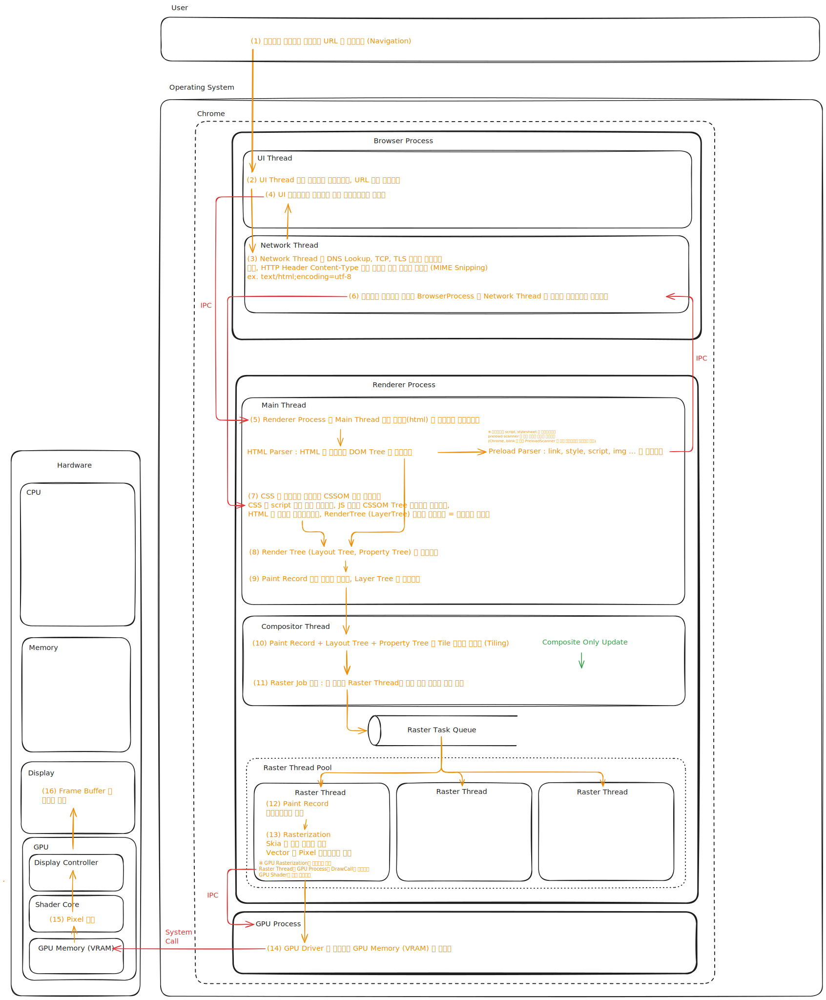

## 🎨 그림으로 한눈에 보는 브라우저 렌더링과정

## ✍️ 참고자료

- [최신 브라우저의 내부 살펴보기 1 - CPU, GPU, 메모리 그리고 다중 프로세스 아키텍처](https://d2.naver.com/helloworld/2922312)
- [최신 브라우저의 내부 살펴보기 2 - 내비게이션 과정에서 일어나는 일](https://d2.naver.com/helloworld/9274593)
- [최신 브라우저의 내부 살펴보기 3 - 렌더러 프로세스의 내부 동작](https://d2.naver.com/helloworld/5237120)
- [최신 브라우저의 내부 살펴보기 4 - 컴포지터가 사용자 입력을 받았을때](https://d2.naver.com/helloworld/6204533)
- [Chrome for Developers - 최신 웹브라우저 자세히 살펴보기 (1부)](https://developer.chrome.com/blog/inside-browser-part1?hl=ko)
- [Chrome for Developers - 최신 웹브라우저 자세히 살펴보기 (2부)](https://developer.chrome.com/blog/inside-browser-part2?hl=ko)
- [Chrome for Developers - 최신 웹브라우저 자세히 살펴보기 (3부)](https://developer.chrome.com/blog/inside-browser-part3?hl=ko)
- [Chrome for Developers - 최신 웹브라우저 자세히 살펴보기 (4부)](https://developer.chrome.com/blog/inside-browser-part4?hl=ko)
