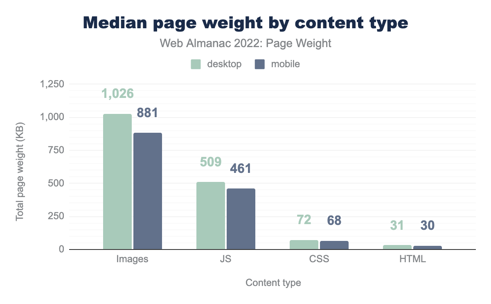
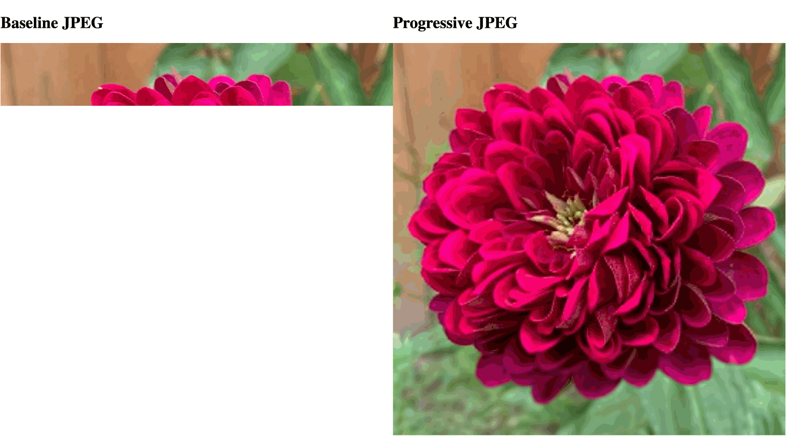
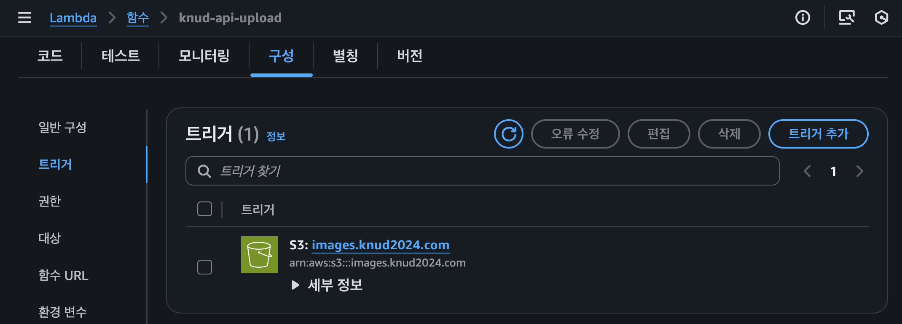

# 🤡 응~ 이미지 키워봐~ 최적화 하면 그만이야 (pt1. 이미지 포맷)

<br/>

## 들어가며

[2024년 경북대학교 디자인학과 졸업전시 웹사이트](https://www.knud2024.com/) 개발을 맡게 됐습니다.
전시 웹사이트이기도 하고 디자인학과 학생들의 작품을 소개하는 사이트이기도 하다 보니, 이미지가 미친 듯이 많고 컸습니다

**_"작품 퀄리티는 원본 그대로 보여줘야지!"_** 하는 욕심에
그냥 풀사이즈 이미지를 그대로 때려박았습니다
**_"에이, 요즘 브라우저 성능 좋잖아? 이 정도면 버티겠지~"_** 라고 생각했죠

그리고 그 결과는?

<center>
    
</center>

웬 삐에로가 나타나서 **_"응~ 이미지 그딴식으로 처리해봐~ 브라우저 뻗으면 그만이야"_** 라고 말하는게 아니겠습니까?

결국 실제로 모바일 크롬이 먹통이 되어버렸습니다.
이미지가 가장 중요한 웹사이트가 정작 이미지를 못 보여주는 상황이 되어버린 것이죠

그래서 이번 글에서는 해당 프로젝트에서 삽질한 경험을 바탕으로 이미지 포맷의 종류와 웹사이트에서 이미지 최적화 방법에 대해 알아보겠습니다

<br/>

## 최신 이미지 포맷

<center>
    <figure>
        
        <figcaption>출처 : <a href="https://almanac.httparchive.org/en/2022/page-weight">https://almanac.httparchive.org/en/2022/page-weight</a></figcaption>
    </figure>
</center>

웹 성능을 결정짓는 최대 빌런 중 하나는 이미지입니다. <br/>
[almanac.httparchive.org 의 2022년 보고서](https://almanac.httparchive.org/en/2022/page-weight)에 따르면, 이미지가 하나 이상 포함된 페이지는 99.9%에 달하며, LCP 에 가장 큰 영향을 미치는 요소이기도 합니다.

저는 졸업전시 웹사이트에서 이걸 무시했다가 모바일 크롬이 뻗어버리는 참사를 겪었습니다

<center>
    
</center>

이미지 포맷 하나만 잘 골라도, 로딩속도, UX 심지어 Core Web Vitals 점수까지 확 달라집니다

그럼 바로 프론트엔드 개발자라면 반드시 알아야 하는 JPEG (Baseline vs Progressive), WebP, 그리고 최근 주목받는 AVIF 까지 기술적 특성과 렌더링 방식, 성능차이에 대해 알아보겠습니다

<br/>

### 1. JPEG (Joint Photographic Experts Group)

JPEG는 웹에서 수십년간 사골처럼 우려먹은 이미지 포맷입니다.
근데 JPEG 안에서도 **Baseline** 과 **Progressive** 두 가지 방식이 있다는 거 아셨나요?

저는 몰랐습니다. 그래서 그냥 기본 옵션인 Baseline 으로 뽑았고, 모바일과 같은 느린 네트워크에서 사이트 열던 사람들은 초딩때 ppt 발표했을때 슬라이드가 한 줄씩 타자기처럼 찍혀나오는 것 마냥 위에서 아래로 한 줄씩 이미지가 로드되었습니다.

두 방식은 **렌더링 방식** 에 차이가 있습니다.

<center>
    <figure>
        
        <figcaption>출처 : <a href="https://web.dev/learn/images/jpeg?hl=ko">https://web.dev/learn/images/jpeg?hl=ko</a></figcaption>
    </figure>
</center>

<br/>

#### (1) Baseline JPEG

Baseline JPEG 는 이미지가 위에서 아래로 한 줄 (Scanline 단위)씩 순차적으로 렌더링 됩니다.

데이터 전송이 완료된 부분은 완벽한 품질로 표시되지만, 아직 로드되지 않은 하단 부분은 빈 공간으로 남습니다.

느린 네트워크에서는 사용자가 이미지의 윗 부분만 본 채로 나머지 부분이 채워지기를 기다려야하기 때문에 페이지가 깨져 보인다거나 로딩이 오래 걸린다는 인상을 줄 수 있습니다.

<br/>

#### (2) Progressive JPEG

Progressive JPEG 는 이미지를 여러 번의 Scan (Pass) 를 통해 점진적으로 선명하게 렌더링합니다.

첫 번째 스캔에서는 전체 이미지의 저해상도 버전을 표시하고, 이후 데이터가 추가로 전송됨에 따라, 이미지가 점점 더 선명해집니다.

"아 여기 무슨 그림이 있구나" 라는 걸 빠르게 인지할 수 있기 때문에, 사용자는 페이지가 로드되는 동안에도 이미지의 내용을 어느 정도 파악할 수 있습니다

물론 Progressive 는 디코딩할 때 브라우저가 좀 더 많은 CPU 자원을 쓴다는 단점도 있지만, 대부분의 환경에선 이 오버헤드보다 UX 향상 효과가 더 큽니다

<br/>

### 그래서 큰 이미지에 대해서는 Progressive JPEG 쓰라는건 알겠고 어케쓰라는건데

브라우저가 알아서 Progressive JPEG 로 변환해주지는 않고, 직접 이미지를 Progressive JPEG 로 변환해줘야 합니다

보통 이미지 편집 툴에서 JPEG 저장 옵션을 제공하는데, 여기서 Progressive 옵션을 선택해주면 됩니다

근데 너무 귀찮기 때문에 CLI 도구나 빌드, 파이프라인에 통합하는게 좋습니다

<br/>

#### (1) AWS Lambda (Node.js) + Sharp 로 이미지 업로드 시점에 변환하기



AWS Lambda 에서 S3 트리거 이벤트를 사용하면 이미지 업로드 시점에 자동으로 Progressive JPEG 로 변환할 수 있습니다
([관련 글 : AWS Lambda & S3 트리거로 이미지 최적화 자동화하기](../Aws/lambda-image-optimization.md))

<br/>

#### (2) prebuild 스크립트로 빌드 시점에 변환하기

public 폴더에 이미지가 들어있는 경우, package.json의 prebuild 스크립트를 사용해서 Progressive JPEG 변환 스크립트를 실행할 수 있습니다

```ts
// scripts/jpeg-progressive.ts
import fg from "fast-glob";
import sharp from "sharp";
import fs from "node:fs/promises";
import path from "node:path";
import minimist from "minimist";

const args = minimist(process.argv.slice(2));
const SRC = args.src;
const DEST = args.dest || SRC;
const QUALITY = args.quality || 90;

async function convertToProgressiveJpeg() {
    const files = await fg(`${SRC}/**/*.{jpg,jpeg,JPG,JPEG}`, { absolute: true });

    for (const file of files) {
        const relativePath = path.relative(SRC, file);
        const destPath = path.join(DEST, relativePath);
        await fs.mkdir(path.dirname(destPath), { recursive: true });
        await sharp(file).jpeg({ quality: QUALITY, progressive: true }).toFile(destPath);

        console.log(`Converted: ${file} > ${destPath}`);
    }
}

convertToProgressiveJpeg().catch(console.error);
```

```json
// package.json
{
    "scripts": {
        "prebuild": "ts-node scripts/jpeg-progressive.ts --src=public/images --dest=public/images --quality=85"
    }
}
```

이렇게 하면 빌드 시점에 public/images 폴더 내의 모든 JPEG 이미지를 Progressive JPEG 로 변환해줍니다

`public/` 안에 있는 이미지들은 그냥 복사되기 때문에 플러그인이 적용되지않아 prebuild 스크립트에서 덮어쓰는 방식으로 처리하면 됩니다

<br/>

#### (3) 번들러(Vite) 플러그인으로 변환하기

Vite 와 같은 번들러의 빌드 파이프라인에서 이미지 최적화를 걸어두면, 코드에 `import` 된 이미지도 Progressive JPEG 로 변환할 수 있습니다

저는 `unplugin-imagemin/vite`를 사용했는데, 다른 다양한 플러그인도 있으니 취향껏 골라쓰면 됩니다

```ts
// vite.config.ts
import { defineConfig } from "vite";
import ImageMin from "unplugin-imagemin/vite";

export default defineConfig({
    plugins: [
        ImageMin({
            mozjpeg: {
                quality: 80,
                progressive: true,
            },
        }),
    ],
});
```

이렇게 하면 번들 그래프에 들어온 이미지 (`import img from "./image.jpg"` 또는 CSS 의 `url()`, HTML 의 `src=""`) 들이 Progressive JPEG 로 변환되어 `dist/assets` 폴더에 저장됩니다

<br/>

### 2. WebP (Web Picture format)

WebP 는 구글이 개발한 이미지 포맷으로, JPEG 나 PNG 보다 더 나은 압축률과 품질을 제공합니다

주변 픽셀 값을 분석해서 예측하고, 실제 값과의 차이를 저장하는 방식으로 압축하기 때문에, 동일한 품질의 이미지를 더 작은 파일 크기로 저장할 수 있습니다

덕분에 WebP 는 JPEG 대비 약 25-34% 더 작은 파일 크기로 압축할 수 있습니다

WebP 는 손실 압축, 무손실 압축, 투명도, 애니메이션 등 다양한 기능을 지원합니다

단, Jpeg 와 달리 Progressive 렌더링을 지원하지 않습니다.
이때문에 Baseline JPEG 처럼 위에서 아래로 한 줄씩 렌더링 됩니다

때문에 느린 네트워크 환경에서 Progressive JPEG 와 WebP 중 타켓하는 사용자 환경에 맞게 선택하는 것이 좋습니다

<br/>

### 3. AVIF (AV1 Image File Format)

AVIF 는 구글, 넷플릭스 모질라에서 만든 최신 이미지 포맷으로 AV1 비디오 코덱을 기반으로 WebP 보다도 더 나은 압축률과 품질을 제공합니다.

JPEG 대비 50% 이상, WebP 대비 20~30% 더 작은 파일 크기로 압축할 수 있습니다

단, 인코딩시 자원을 많이 잡아먹어 속도가 느리다는 단점이 있습니다

<br/>

### 엥? 그럼 무지성 AVIF, WebP 쓰면 되는거 아님?

2024년 기준으로 AVIF, WebP 는 대부분의 최신 브라우저에서 지원되지만, 몇몇 구닥다리 브라우저는 [AVIF](https://caniuse.com/avif), [WebP](https://caniuse.com/webp) 를 지원하지 않습니다

특히 Internet Explorer (IE) 는 AVIF/WebP 를 전혀 지원하지 않기 때문에, AVIF/WebP 만 사용하는 것은 위험할 수 있습니다


그래서, AVIF/WebP 를 사용하되, 브라우저가 WebP 를 지원하지 않는 경우에는 JPEG 나 PNG 같은 대체 포맷을 제공하는 것이 좋습니다

<br/>

#### (1) HTML 의 `<picture>` 태그로 WebP 와 대체 포맷 제공하기

가장 표준적이고 호환성이 높은 방법은 HTML 의 `<picture>` 태그를 사용하는 것입니다

```html
<picture>
    <source srcset="/images/work.avif" type="image/avif" />
    <source srcset="/images/work.webp" type="image/webp" />
    <source srcset="/images/work.jpg" type="image/jpeg" />
    
</picture>
```

최신 브라우저와 같이 `image/avif` 또는 `image/webp` 를 지원하는 경우에는 AVIF/WebP 이미지를 로드하고, 그렇지 않은 경우에는 JPEG 이미지를 로드합니다

<br/>

#### (2) React 환경에서 재사용 컴포넌트로 만들기

React 에서도 `<picture>`를 그대로 쓸 수 있습니다.
반복적으로 쓰이는 패턴이므로, 재사용 가능한 컴포넌트로 감싸두면 더 편리합니다.

```tsx
import React from "react";

export interface PictureProps extends React.ComponentProps<"img"> {
    srcAvif: string;
    srcWebp: string;
    srcFallback: string; // JPEG
    alt: string;
}

export const Picture = ({ srcAvif, srcWebp, srcFallback, alt, ...imgProps }: PictureProps) => {
    return (
        <picture>
            <source srcSet={srcAvif} type="image/avif" />
            <source srcSet={srcWebp} type="image/webp" />
            <source srcSet={srcFallback} type="image/jpeg" />
            
        </picture>
    );
};
```

<br/>

## 이미지 포맷별 특징 및 성능 비교

| 특성                                | Baseline JPEG        | Progressive JPEG               | WebP (손실)                    | WebP (무손실)               | AVIF                                         |
| ----------------------------------- | -------------------- | ------------------------------ | ------------------------------ | --------------------------- | -------------------------------------------- |
| 파일 크기 절감 (Baseline JPEG 대비) | 기준                 | 1–10% (10KB 이상 이미지)       | 25–34% (동일 품질)             | PNG 대비 26%                | JPEG 대비 50% 이상, WebP 대비 20–30% 더 작음 |
| 인식 로딩 경험                      | 위에서 아래로 렌더링 | 흐릿한 전체 이미지 후 선명해짐 | 위에서 아래로 점진적 렌더링    | 위에서 아래로 점진적 렌더링 | Progressive 미지원, 단일 패스 디코딩         |
| 디코딩 비용 (CPU)                   | 낮음                 | 중간 (Baseline의 약 3배)       | 낮음–중간 (JPEG보다 약간 높음) | 중간                        | 중간–높음 (압축 효율 높지만 디코딩 무거움)   |
| 브라우저 지원                       | 보편적               | 보편적                         | 높음 (97% 이상)                | 높음 (97% 이상)             | 최신 브라우저 대부분, 일부 구형 환경 미지원  |
| 투명도 지원                         | 아니요               | 아니요                         | 예                             | 예                          | 예                                           |
| 애니메이션 지원                     | 아니요               | 아니요                         | 예                             | 예                          | 예                                           |

## 마치며

이미지 포맷 선택은 단순히 파일 크기 문제를 넘어 UX, 네트워크 환경, 디바이스 성능까지 직결되는 중요한 결정입니다.

- JPEG (Baseline/Progressive): 여전히 안정적이고 보편적
- WebP: 차세대 표준으로 자리잡은 실무용 기본 옵션
- AVIF: 가장 효율적인 차세대 포맷, 아직은 WebP/JPEG와 함께 다단계 폴백으로 사용 권장

결국

> "가능하면 단일 포맷에 올인하지 말고, 사용자 환경에 맞는 최적의 조합을 제공하자!" 입니다.

[다음 편에서는 실제 React 환경에서 이미지 지연로딩과 같은 최적화 기법을 적용하는 방법에 대해 알아보겠습니다](./image-optimization.md)

## 참고 자료

- https://web.dev/learn/images/jpeg?hl=ko
- https://web.dev/learn/images/webp?hl=ko
- https://web.dev/learn/images/avif?hl=ko
- https://www.iostream.co/article/r-x1gVy5
- https://www.thewebmaster.com/progressive-jpegs/
- https://uploadcare.com/blog/the-what-why-and-how-of-progressive-jpeg/
- https://www.hostinger.com/tutorials/what-is-progressive-jpeg-images
- https://cloudinary.com/guides/front-end-development/webp-format-technology-pros-cons-and-alternatives
- https://medium.com/@duhroach/how-webp-works-lossly-mode-33bd2b1d0670
- https://developer.mozilla.org/ko/docs/Learn_web_development/Extensions/Performance/Multimedia
- https://cloudinary.com/blog/progressive_jpegs_and_green_martians
- https://suyeon96.tistory.com/15
