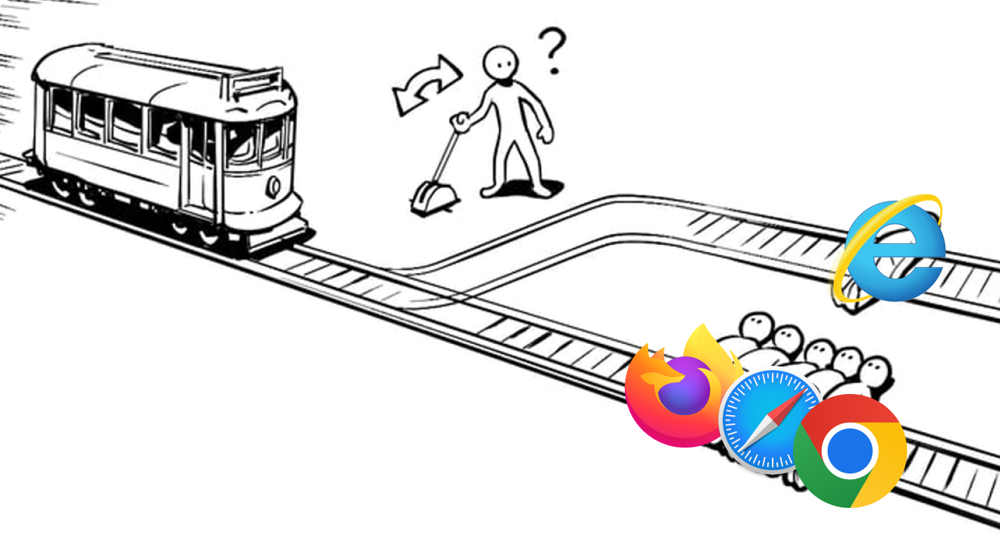

# 🚋 철로 위에 묶여 있는 IE 사용자를 구할 것인가 (웹 호환성과 크로스 브라우징)

:::warning
아직 작성중이거나 검토중인 글입니다. 내용이 부정확하거나 변경될 수 있습니다
:::

## 1. 트롤리 딜레마로 빌드업

철학에서 자주 등장하는 **트롤리 딜레마**는 다수와 소수 중 누구를 살릴지 선택해야 하는 상황을 말함 ㅇㅇ

웹 개발도 마찬가지

[Can I Use](https://caniuse.com/) 같은 사이트를 보면 대부분 브라우저는 최신 기능을 지원하지만, 소수의 **IE나 Safari 구버전**은 지원하지 않는 경우가 많음

과연 이들을 갖다 버릴까? 아니면 추가 비용을 들여 지원할까?

---

## 2. TC39와 ECMAScript 프로포절

자바스크립트 표준은 **TC39 위원회**에서 결정함

제안(Proposal)은 다음 단계를 거쳐 표준으로 채택됨

- **Stage 0**: 아이디어
- **Stage 1**: 제안
- **Stage 2**: 초안 (Draft)
- **Stage 3**: 후보 (Candidate, 브라우저 엔진 구현 시작)
- **Stage 4**: 확정 (Finished, 다음 ECMAScript 버전에 포함)

예를 들어 **Optional Chaining(?.)** 은 오랫동안 Stage 3에 머물렀다가 **ES2020**에 정식으로 포함됨

---

## 3. 크로스 브라우징 이슈의 세 가지 원인

크로스 브라우징 이슈는 크게 **세 가지 카테고리**로 정리할 수 있음

### 3-1. 표준화 차이

- ECMAScript, DOM, CSS 같은 **웹 표준**이 브라우저마다 언제 구현되는지 다름
- 예:
    - `Optional Chaining` → Chrome은 지원, Safari 구버전은 SyntaxError 발생
    - CSS `grid` → Chrome/Firefox는 빠르게 지원, IE는 미지원

### 3-2. 포맷/코덱 차이

- 이미지·비디오·폰트 같은 **포맷 지원 여부는 각 벤더 정책**에 달려 있음
- 예:
    - **WebP**: Chrome은 초기에 지원, Safari는 2020년 이후 지원
    - **AV1**: 일부 브라우저/플랫폼만 지원, H.264는 어디서나 동작
    - **WOFF2 폰트**: 구형 브라우저는 미지원

### 3-3. 엔진 구현 차이 (버그/최적화)

- 같은 표준을 지켜도 **엔진 구현 방식이나 버그 차이**로 결과가 달라질 수 있음
- 예:
    - Safari에서 `position: sticky` 버그
    - 초기 flexbox 구현 차이로 브라우저별 레이아웃 깨짐
    - 애니메이션에서 GPU 최적화 차이로 성능 격차 발생

---

## 4. 크로스 브라우징 이슈 해결 방법

| 방법                  | 설명                                           | 도구                    |
| --------------------- | ---------------------------------------------- | ----------------------- |
| **Polyfill**          | 없는 API를 JS 코드로 흉내냄                    | core-js, polyfill.io    |
| **Transpile**         | 최신 문법 → 구문 변환                          | Babel, SWC, TypeScript  |
| **Autoprefixer**      | CSS 접두사 자동화                              | PostCSS                 |
| **Feature Detection** | 기능 지원 여부 감지 후 분기 처리               | Modernizr               |
| **전략**              | Progressive Enhancement / Graceful Degradation | 기획/설계 레벨          |
| **테스트**            | 실제 다브라우저 환경에서 테스트                | BrowserStack, SauceLabs |

---

## 5. 정리

트롤리 딜레마처럼, 우리는 **다수(최신 브라우저 사용자)** 와 **소수(구형 브라우저 사용자)** 사이에서 선택해야 함

표준(TC39)은 하나지만, 브라우저별 반영 시점 차이와 **포맷 지원 여부**, 그리고 **엔진 구현 차이** 때문에 호환성 문제가 생김

정답은 “소수 버리기”도 “무조건 다 살리기”도 아님
**목표 사용자층에 맞춰 전략적으로 호환성을 확보하는 것**이 크로스 브라우징의 핵심
