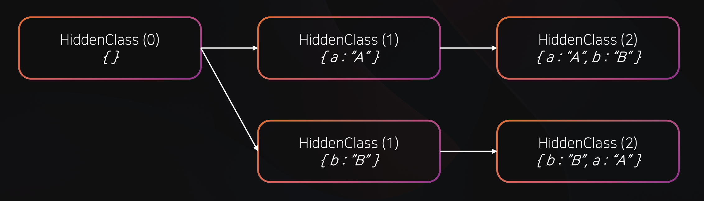

::: danger
작성중인 게시글 또는 초안입니다.
:::

# 🤔 객체리터럴 vs 정적메서드 vs 클래스 인스턴스 vs 클로저함수

자바스크립트는 객체리터럴, 정적메서드, 클래스 인스턴스, 클로저함수를 사용하여 객체를 생성할 수 있습니다. <br/>
각각의 방식은 V8 엔진에서 최적화 되는 방식 (Ignition 인터프리터, TurboFan JIT 컴파일러 등) 과, 동작방식이 다릅니다. <br/>
그렇다면 각각의 방식은 내부적으로 어떻게 동작하며, 성능적으로는 어떤 차이가 있을까요 ?

## 🚘 V8 엔진의 최적화 방식 Inline Caching 과 Hidden Class

각각의 객체 방식의 차이점을 알아보기 전에, V8 엔진이 JavaScript 코드를 어떻게 최적화 하는지 알아보겠습니다. <br/>

### 1. Inline Caching

V8 엔진은 JavaScript 코드를 바이트코드 형태로 변환하고, 실행하는 **Ignition 인터프리터** 를 먼저 거칩니다.

함수가 반복적으로 호출될때, Ignition 인터프리터는 해당 함수의 타입 정보를 수집합니다. <br/>
함수가 일정 횟수 이상 호출되면, V8 엔진은 **TurboFan JIT 컴파일러** 를 사용하여 수집된 타입을 기반으로 최적화된 머신코드를 생성합니다 <br/>

V8 엔진의 핵심 최적화 중 하나는 **Inline Caching** 입니다. <br/>
동일한 연산이 반복될때, 동일한 타입이 사용된다고 가정하고 최적화 하는 방식입니다.

```js
function add(a, b) {
    return a + b;
}
```

예를 들어, 다음과 같은 함수가 있고, 함수가 호출될 때 `a`, `b` 타입이 숫자 타입으로 호출된다고 가정할때 <br/>
V8 엔진은 `a`와 `b`의 타입을 숫자 타입으로 가정하고, 최적화된 머신코드를 생성합니다. <br/>

### 2. Hidden Class

V8 엔진은 객체를 실행 중 빠르게 접근하고 속성을 바꾸기 위해서, 객체를 내부적으로 하나의 클래스처럼 저장합니다. <br/>

```js
let obj1 = {};
obj1.a = "A";
obj1.b = "B";

let obj2 = {};
obj2.b = "B";
obj2.a = "A";
```

예를 들어, 다음과 같은 코드가 있을때 <br/>
`obj1` 과 `obj2` 는 서로 같은 프로퍼티 이름을 가지고 있지만, 순서가 다르기 때문에 <br/>
서로 다른 **Hidden Class** 를 생성합니다. <br/>

<center>
    
</center>

```js
let obj3 = {};
obj3.a = 1;
obj3.b = 2;
```

반면, `obj3`는 `obj1` 과 동일한 프로퍼티 이름과 순서를 가지고 있기 때문에 <br/>
캐싱된 **Hidden Class** 를 사용하여, 성능을 최적화 합니다. <br/>

## 😎 객체 생성 방식 비교

### 1. 객체 리터럴 (Object Literal)

```js
const me = {
    name: "DaeGeon",
    age: 26,
    greet: function () {
        console.log(`Hello, my name is ${this.name}`);
    },
};
```

객체 리터럴 (Object Literal)은 `{}` 중괄호를 사용하여 객체를 생성하고 <br/>
이 방식은 지정된 프로퍼티와 메서드를 한번에 정의하고 **런타임**에 새로운 객체를 생성합니다.

코드 내부에서 객체 리터럴(Object Literal)을 사용하면, **새로운 객체가 할당** 되며, **각각의 프로퍼티와 메서드가 초기화** 됩니다. <br/>

앞서 말했던것과 같이, V8 엔진은 이런 객체에 대해 프로퍼티 구성에 따라 **Hidden Class** 를 생성합니다.

같은 프로퍼티 이름과 순서로 정의된 객체 리터럴은, 첫번째 생성 이후 동일한 (캐싱된) **Hidden Class** 를 사용합니다. <br/>

하지만, 나중에 새로운 프로퍼티를 추가하거나, 객체 생성시 프로퍼티의 구성이 조금이라도 다르면 Hidden Class 가 달라지고, 성능이 저하될 수 있습니다.

특히 객체 리터럴 내부에 **메서드** 가 포함되어 있는 경우, 객체를 생성할 때 마다 **새로운 함수 객체** 가 생성됩니다.

이런 반복적인 함수 객체 생성을 피하기 위해서는, 메서드를 공유하는 방식인 **Prototype 또는 Class** 를 사용하는 것이 좋습니다. <br/>

### 💻 객체 리터럴 사용 사례

1️⃣ 유틸리티 함수

유틸리티 함수를 통해 객체 리터럴을 반복해서 생성하는 경우는 드물지만, 하나의 객체 리터럴을 모듈화 하여 사용하는 경우는 많습니다. <br/>

```js
const MathUtils = {
    add: function (a, b) {
        return a + b;
    },
    subtract: function (a, b) {
        return a - b;
    },
};
```

이런 경우 객체는 한번만 생성되고, 그 안의 함수 프로퍼티들은 유틸리티 메서드로 사용됩니다 <br/>
성능은 독립적인 함수 호출과 동일합니다 (객체는 한번만 생성되고, 메서드 호출시 정적인 객체에서 프로퍼티 조회만 하기 때문)

2️⃣ 간단한 데이터를 담는 객체

```js
const person = {
    name: "DaeGeon",
    age: 26,
};
```

객체 리터럴은 간단한 데이터를 담는 객체를 생성할 때 유용합니다. <br/>
코드가 간단하고 객체가 몇개 안되는경우 성능상의 문제는 없습니다.

비슷한 구조의 객체를 많이 사용하는 경우, 각 객체는 독립적이지만 **프로퍼티 이름과 순서가 같다면** Hidden Class 를 공유하고 V8 엔진의 최적화를 받을 수 있습니다.

하지만, 객체 리터럴에 **메서드**를 포함시키는 경우, 객체가 만들어질 때 마다 새로운 함수 객체가 생성되므로, **메모리 사용량이 증가하고, 메서드 호출시 CPU 사용량이 증가** 할 가능성이 있습니다 <br/>
이런 경우는 앞서 말했던것과 같이 Prototype 또는 Class 를 사용하는 것이 좋습니다. <br/>

### 💡 정리

| ✅ 장점            | 내용                                                                               |
| ------------------ | ---------------------------------------------------------------------------------- |
| 단순한 문법        | 클래스나 생성자 없이 `{}`만으로 객체 생성 가능                                     |
| 빠른 생성 성능     | 속성이 적은 경우 V8에서 매우 빠르게 생성됨                                         |
| 유연한 구조        | 런타임에 속성 추가/삭제가 쉬움 (단, 히든 클래스 변경시 성능 고려해야함)            |
| 단기 데이터에 적합 | 짧게 쓰이고 폐기되는 데이터 구조에 효율적 (설정객체, 단순데이터, 일회성 객체 등..) |

<br />

| ❌ 단점                 | 내용                                                                        |
| ----------------------- | --------------------------------------------------------------------------- |
| 메서드 중복 생성        | 객체마다 메서드가 새로 만들어져 메모리/CPU 낭비 발생 가능성 있음            |
| 성능 저하 가능          | 구조가 일관되지 않으면 히든 클래스가 분기되어 Inline Caching 비효율         |
| 공유 로직 어렵고 반복됨 | 프로토타입 체이닝이 없어 로직 재사용이 불편함                               |
| 인라인 캐싱 저하 가능성 | 다양한 구조의 객체를 전달할 경우 Inline Caching 최적화가 불가능해질 수 있음 |

## 2. 정적 메서드 (Static Method)

```js
class Math {
    static add(a, b) {
        return a + b;
    }
    static subtract(a, b) {
        return a - b;
    }
}
```

정적 메서드는 클래스 내부에 static member 로 함수를 정의하는 방식입니다. <br/>
해당함수는 클래스의 인스턴스가 아닌, 클래스 자체에 속합니다.

정적 메서드는 Execution Context 의 **Execution Phase 에서 한번만 생성**됩니다. <br/>
(Creation Phase 에서는 `class` 는 호이스팅되어 **Lexical Environment** 에 등록되고, TDZ 상태)<br/>

static member 들은 **생성자 함수의 객체 자체 프로퍼티**로 저장됩니다. <br/>

> ‼️ static member 는 클래스의 인스턴스가 아닌, 클래스 자체에 속한다?
>
> 위 코드에서, `Math.add` 와 같이 클래스 이름을 통해 접근할 수 있는 반면, <br/> `Math.prototype.add` 와 같이 프로토타입 체인을 통해 인스턴스에서 접근할 수 없습니다. <br/>
> 이는 static member 가 클래스의 인스턴스가 아닌, 클래스 자체에 속하기 때문입니다. <br/>

V8 엔진 내부적으로 위 예제에서 `Math` 객체는 `add` 와 `subtract` 를 고정된 순서, 위치로 포함하는 **Hidden Class** 를 생성합니다. <br/>
이를 통해 Inline Caching 최적화가 가능합니다
